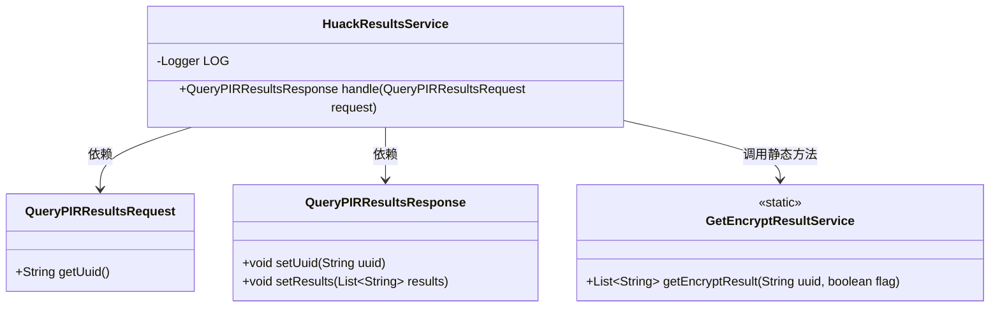
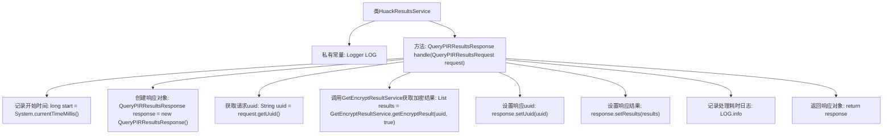

# 基础信息

|      |      |
|------|------|
| 名称 | HuackResultsService |
| 编码语言 | .java |
| 代码路径 | WeFe/mpc/mpc-pir/mpc-pir-server/src/main/java/com/welab/wefe/mpc/pir/server/service/HuackResultsService.java |
| 包名 | com.welab.wefe.mpc.pir.server.service |
| 依赖项 | ['com.welab.wefe.mpc.pir.request.QueryPIRResultsRequest', 'com.welab.wefe.mpc.pir.request.QueryPIRResultsResponse', 'org.slf4j.Logger', 'org.slf4j.LoggerFactory', 'java.util.List'] |
| 概述说明 | HuackResultsService类处理查询请求，获取加密结果并记录耗时，返回包含UUID和结果的响应。 |

# 说明

HuackResultsService类是一个处理查询PIR结果的Java服务类。它包含一个handle方法，接收QueryPIRResultsRequest请求对象，返回QueryPIRResultsResponse响应对象。方法首先记录开始时间，创建响应对象，从请求中获取uuid参数，调用GetEncryptResultService获取加密结果列表，将uuid和结果设置到响应对象中，最后记录处理耗时并返回响应。整个过程通过LOG记录uuid和处理时间。

# 类列表 Class Summary

| 名称   | 类型  | 说明 |
|-------|------|-------------|
| HuackResultsService | class | HuackResultsService类处理查询请求，获取加密结果并记录耗时，返回包含UUID和结果的响应。 |

## 类 HuackResultsService

|      |      |
|------|------|
| 访问范围 | public |
| 类型 | class |
| 名称 | HuackResultsService |
| 说明 | HuackResultsService类处理查询请求，获取加密结果并记录耗时，返回包含UUID和结果的响应。 |

### UML类图

这段代码展示了一个处理PIR查询结果的服务类HuackResultsService，它接收QueryPIRResultsRequest请求，通过GetEncryptResultService获取加密结果，填充到QueryPIRResultsResponse响应对象中，并记录处理耗时。类图清晰地呈现了核心类及其关系，包括请求/响应对象的结构和静态工具类的调用方式，体现了典型的服务层处理流程。

### 内部方法调用关系图

这段代码流程图展示了HuackResultsService类的核心处理流程。该类通过handle方法接收查询请求，获取加密结果并构建响应对象，最后记录处理耗时。主要步骤包括：初始化计时器、创建响应对象、获取请求参数、调用外部服务获取加密数据、填充响应内容、记录性能日志并返回结果。整个过程体现了典型的请求-响应模式，并包含性能监控功能。

### 字段列表 Field List

| 名称  | 类型  | 说明 |
|-------|-------|------|
| LOG = LoggerFactory.getLogger(HuackResultsService.class) | Logger | 类HuackResultsService中定义的私有静态常量LOG，用于记录日志。 |

### 方法列表

| 名称  | 类型  | 说明 |
|-------|-------|------|
| handle | QueryPIRResultsResponse | 处理查询请求，获取加密结果并返回响应，记录耗时。 |

