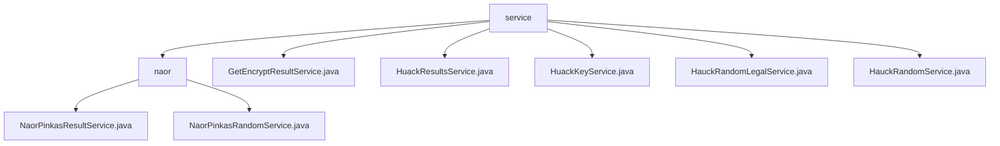

# 基础信息

|      |      |
|------|------|
| 名称 | service |
| 编码语言 | .java |
| 代码路径 | WeFe/mpc/mpc-pir/mpc-pir-server/src/main/java/com/welab/wefe/mpc/pir/server/service |
| 包名 | docs.mpc.mpc-pir.mpc-pir-server.src.main.java.com.welab.wefe.mpc.pir.server.service |
| 概述说明 | 该模块基于Naor-Pinkas协议实现安全多方计算查询，包含随机数生成和结果加密服务，采用异步处理和UUID跟踪，依赖JCE加密库和线程池，支持密钥生成、多层AES加密及缓存操作。 |

# 说明

## 概述  
该模块实现基于Naor-Pinkas协议的安全多方计算查询服务，核心职责包括生成加密随机数和处理加密查询结果。采用异步处理模式和UUID跟踪机制，关键数据结构包含Diffie-Hellman密钥对、随机数列表及AES加密密钥。依赖JCE加密库和线程池，例如NaorPinkasRandomService并行生成随机数，类似密钥分发中心；NaorPinkasResultService则组合DH密钥交换与对称加密，类似混合加密网关。

## 主要业务场景  
典型流程分生成阶段和查询阶段：首先生成DH参数和随机数池并缓存，例如处理QueryKeysRequest生成十六进制随机数；查询阶段派生密钥并加密结果，例如用k0和随机数密钥链进行多层AES加密。交互模式采用"预生成-消费"机制，类似一次性密码本。API涵盖密钥生成和结果加密接口，例如HuackKeyService通过线程池异步处理密钥任务，HauckRandomService通过缓存循环获取结果。

### 包内部结构视图

该流程图展示了MPC-PIR服务模块的层级结构，根节点为service目录，包含naor子目录和5个服务类文件。naor目录下又包含NaorPinkasResultService和NaorPinkasRandomService两个具体实现类，整体呈现清晰的树状服务架构。

# 文件列表

| 名称   | 类型  | 说明 |
|-------|------|-------------|
| [GetEncryptResultService.java](GetEncryptResultService.md) | file | 获取加密结果的静态方法，支持超时和是否必须返回数据的参数，通过缓存操作查询结果。 |
| [HuackResultsService.java](HuackResultsService.md) | file | HuackResultsService类处理查询请求，获取加密结果并记录耗时，返回包含UUID和结果的响应。 |
| [HuackKeyService.java](HuackKeyService.md) | file | HuackKeyService类处理密钥查询请求，生成UUID并验证请求ID非空，通过PrivateInformationRetrievalFlowServer处理请求，记录耗时并返回响应。 |
| [HauckRandomLegalService.java](HauckRandomLegalService.md) | file | HauckRandomLegalService处理随机合法请求，保存UUID和尝试次数到缓存，获取加密结果并返回响应。 |
| [HauckRandomService.java](HauckRandomService.md) | file | HauckRandomService类处理随机查询请求，通过缓存操作获取结果，若结果为空则循环等待，最终返回包含UUID和结果的响应。 |
| [naor](naor/_module.md) | package | NaorPinkasResultService处理查询，生成加密结果，使用Diffie-Hellman和AES加密。NaorPinkasRandomService实现Naor-Pinkas协议，生成随机数和DH密钥，异步处理并缓存。 |

