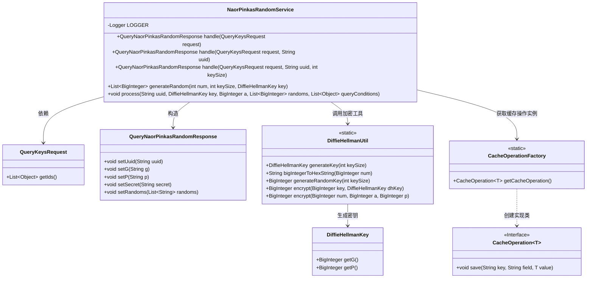

# 基础信息

|      |      |
|------|------|
| 名称 | NaorPinkasRandomService |
| 编码语言 | .java |
| 代码路径 | WeFe/mpc/mpc-pir/mpc-pir-server/src/main/java/com/welab/wefe/mpc/pir/server/service/naor/NaorPinkasRandomService.java |
| 包名 | com.welab.wefe.mpc.pir.server.service.naor |
| 依赖项 | ['com.welab.wefe.mpc.cache.intermediate.CacheOperation', 'com.welab.wefe.mpc.cache.intermediate.CacheOperationFactory', 'com.welab.wefe.mpc.commom.Constants', 'com.welab.wefe.mpc.key.DiffieHellmanKey', 'com.welab.wefe.mpc.pir.request.QueryKeysRequest', 'com.welab.wefe.mpc.pir.request.naor.QueryNaorPinkasRandomResponse', 'com.welab.wefe.mpc.util.DiffieHellmanUtil', 'org.slf4j.Logger', 'org.slf4j.LoggerFactory', 'java.math.BigInteger', 'java.util.ArrayList', 'java.util.List', 'java.util.UUID', 'java.util.concurrent.CompletableFuture', 'java.util.stream.Collectors', 'java.util.stream.IntStream'] |
| 概述说明 | NaorPinkasRandomService类处理密钥请求，生成UUID和Diffie-Hellman密钥，返回包含随机数和加密结果的响应，并异步处理数据存入缓存。 |

# 说明

NaorPinkasRandomService类实现了基于Naor-Pinkas协议的随机数生成和处理功能。主要包含三个重载的handle方法，用于处理QueryKeysRequest请求，生成UUID、Diffie-Hellman密钥和随机数。核心逻辑包括：验证查询条件非空、生成DH密钥对、创建随机密钥和秘密值、生成多个随机数并转换为十六进制字符串。处理过程通过新线程异步执行，将参数保存到缓存中。generateRandom方法并行生成指定数量的随机BigInteger。process方法将生成的随机数加密后与查询条件一起存入缓存。整个流程通过UUID进行跟踪，并记录详细日志。

# 类列表 Class Summary

| 名称   | 类型  | 说明 |
|-------|------|-------------|
| NaorPinkasRandomService | class | NaorPinkasRandomService类处理密钥请求，生成Diffie-Hellman密钥和随机数，异步处理并缓存结果。包含UUID生成、参数校验、密钥加密和线程处理逻辑。 |

## 类 NaorPinkasRandomService

|      |      |
|------|------|
| 访问范围 | public |
| 类型 | class |
| 名称 | NaorPinkasRandomService |
| 说明 | NaorPinkasRandomService类处理密钥请求，生成Diffie-Hellman密钥和随机数，异步处理并缓存结果。包含UUID生成、参数校验、密钥加密和线程处理逻辑。 |

### UML类图

类图描述：
NaorPinkasRandomService 是一个处理Naor-Pinkas加密协议的核心服务类，通过重载的handle方法处理不同参数组合的请求，生成包含UUID、密钥参数和随机数的响应对象。该类依赖DiffieHellmanUtil进行密钥生成和加密操作，使用CacheOperationFactory获取缓存接口实例来异步保存中间数据。流程涉及多线程并发生成随机数、Diffie-Hellman密钥交换协议实现，以及结果缓存等操作，体现了密码学协议实现与高性能异步处理的结合。

### 内部方法调用关系图

流程图描述了NaorPinkasRandomService类的核心处理流程。入口方法handle经过三次重载调用，最终在第三个重载方法中完成Diffie-Hellman密钥生成、随机数加密和异步处理。generateRandom方法通过并行计算生成加密随机数列表，process方法则异步保存加密参数到缓存。整个流程涉及密钥操作、十六进制转换和多线程处理，最后返回包含加密参数的响应对象。

### 字段列表 Field List

| 名称  | 类型  | 说明 |
|-------|-------|------|
| LOGGER = LoggerFactory.getLogger(NaorPinkasRandomService.class) | Logger | NaorPinkasRandomService类中定义了一个静态不可变的日志记录器实例。 |

### 方法列表

| 名称  | 类型  | 说明 |
|-------|-------|------|
| handle | QueryNaorPinkasRandomResponse | 该方法处理查询密钥请求，生成随机UUID并去除连字符后，调用另一个处理方法并返回响应。 |
| generateRandom | List<BigInteger> | 生成指定数量的随机大整数，使用异步方式加密后返回列表。处理异常并记录错误日志。 |
| handle | QueryNaorPinkasRandomResponse | 处理查询请求，生成Diffie-Hellman密钥和随机数，返回包含UUID、G、P、密钥和随机数的响应，并启动新线程处理后续流程。 |
| handle | QueryNaorPinkasRandomResponse | 处理查询请求，调用带默认参数1024的方法。 |
| process | void | 方法处理NaorPinkas协议数据：保存密钥参数，异步加密随机数列表，存储加密结果和查询条件。 |

