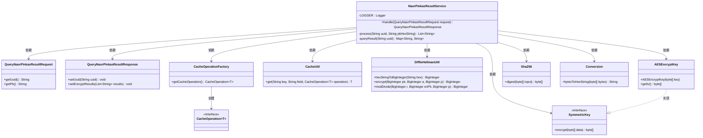
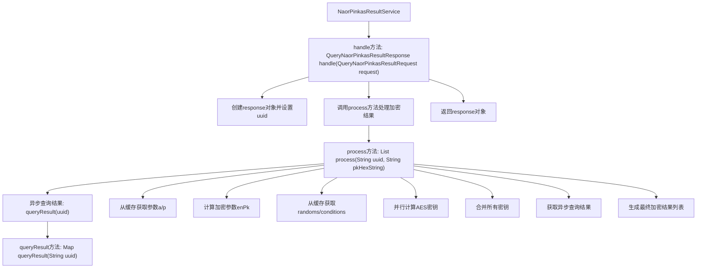

# 基础信息

|      |      |
|------|------|
| 名称 | NaorPinkasResultService |
| 编码语言 | .java |
| 代码路径 | WeFe/mpc/mpc-pir/mpc-pir-server/src/main/java/com/welab/wefe/mpc/pir/server/service/naor/NaorPinkasResultService.java |
| 包名 | com.welab.wefe.mpc.pir.server.service.naor |
| 依赖项 | ['java.math.BigInteger', 'java.util.ArrayList', 'java.util.List', 'java.util.Map', 'java.util.concurrent.CompletableFuture', 'org.slf4j.Logger', 'org.slf4j.LoggerFactory', 'com.welab.wefe.mpc.cache.intermediate.CacheOperation', 'com.welab.wefe.mpc.cache.intermediate.CacheOperationFactory', 'com.welab.wefe.mpc.cache.intermediate.CacheUtil', 'com.welab.wefe.mpc.commom.Constants', 'com.welab.wefe.mpc.commom.Conversion', 'com.welab.wefe.mpc.pir.protocol.ro.hf.HashFunction', 'com.welab.wefe.mpc.pir.protocol.ro.hf.Sha256', 'com.welab.wefe.mpc.pir.protocol.se.SymmetricKey', 'com.welab.wefe.mpc.pir.protocol.se.aes.AESEncryptKey', 'com.welab.wefe.mpc.pir.request.naor.QueryNaorPinkasResultRequest', 'com.welab.wefe.mpc.pir.request.naor.QueryNaorPinkasResultResponse', 'com.welab.wefe.mpc.util.DiffieHellmanUtil'] |
| 概述说明 | NaorPinkasResultService处理查询请求，通过异步查询和加密操作生成响应。使用DiffieHellman和AES加密，结合缓存数据，最终返回加密结果列表。 |

# 说明

NaorPinkasResultService类处理查询请求，生成加密结果。通过UUID获取缓存中的参数a、p和随机数，使用Diffie-Hellman加密公钥pk。生成多个对称密钥，包括基于加密pk的k0和基于随机数的密钥列表。查询结果数据后，使用生成的密钥对结果进行AES加密，最终返回加密后的结果列表。过程中使用CompletableFuture异步处理任务，并记录错误日志。

# 类列表 Class Summary

| 名称   | 类型  | 说明 |
|-------|------|-------------|
| NaorPinkasResultService | class | NaorPinkasResultService处理查询请求，通过UUID获取缓存数据，使用Diffie-Hellman和AES加密生成响应结果。 |

## 类 NaorPinkasResultService

|      |      |
|------|------|
| 访问范围 | public |
| 类型 | class |
| 名称 | NaorPinkasResultService |
| 说明 | NaorPinkasResultService处理查询请求，通过UUID获取缓存数据，使用Diffie-Hellman和AES加密生成响应结果。 |

### UML类图

类图描述：
该图展示了NaorPinkasResultService的核心结构及其依赖关系。服务类通过CacheOperationFactory获取缓存操作接口，使用CacheUtil进行缓存读写，依赖DiffieHellmanUtil进行加密运算，并生成AESEncryptKey实现SymmetricKey接口。同时集成了Sha256哈希算法和字节转换工具Conversion，处理请求时与QueryNaorPinkasResultRequest/Response交互，整体实现了基于Naor-Pinkas协议的异步加密查询流程。

### 内部方法调用关系图

这段代码流程图展示了NaorPinkasResultService的核心处理流程。主要包含三个关键方法：handle作为入口方法接收请求并返回响应；process方法负责核心加密逻辑，包括异步查询结果、参数获取、密钥计算和结果加密；queryResult方法异步获取缓存数据。流程图中清晰展示了方法调用关系和数据流转路径，特别是process方法中复杂的并行计算和结果合并过程。整个流程涉及多种加密操作和缓存交互，最终生成加密的结果列表。

### 字段列表 Field List

| 名称  | 类型  | 说明 |
|-------|-------|------|
| LOGGER = LoggerFactory.getLogger(NaorPinkasResultService.class) | Logger | NaorPinkasResultService类中定义了一个静态不可变的日志记录器实例LOGGER。 |

### 方法列表

| 名称  | 类型  | 说明 |
|-------|-------|------|
| handle | QueryNaorPinkasResultResponse | 处理查询请求，生成包含UUID和加密结果的响应。 |
| process | List<String> | 该方法通过异步查询和缓存操作获取参数，使用Diffie-Hellman加密和AES密钥生成技术处理数据，最终返回加密结果列表。 |
| queryResult | Map<String, String> | 方法queryResult通过uuid从缓存获取结果，使用CacheOperation和CacheUtil操作，完成后记录日志并返回结果。 |

