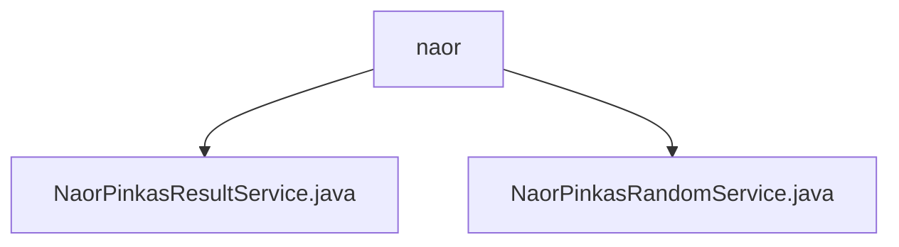

# 基础信息

|      |      |
|------|------|
| 名称 | naor |
| 编码语言 | .java |
| 代码路径 | WeFe/mpc/mpc-pir/mpc-pir-server/src/main/java/com/welab/wefe/mpc/pir/server/service/naor |
| 包名 | docs.mpc.mpc-pir.mpc-pir-server.src.main.java.com.welab.wefe.mpc.pir.server.service.naor |
| 概述说明 | NaorPinkasResultService处理查询，生成加密结果，使用Diffie-Hellman和AES加密。NaorPinkasRandomService实现Naor-Pinkas协议，生成随机数和DH密钥，异步处理并缓存。 |

# 说明

## 概述  
该模块实现基于Naor-Pinkas协议的安全多方计算查询服务，核心职责包括生成加密随机数（NaorPinkasRandomService）和处理加密查询结果（NaorPinkasResultService）。接口规范采用异步处理模式（如CompletableFuture）和UUID跟踪机制，关键数据结构包含Diffie-Hellman密钥对、随机数列表及AES加密密钥。外部依赖涉及JCE加密库和线程池。例如NaorPinkasRandomService通过并行生成BigInteger随机数，类似密钥分发中心；NaorPinkasResultService则类似混合加密网关，组合DH密钥交换与对称加密。

## 主要业务场景  
典型流程分两阶段：首先生成阶段（NaorPinkasRandomService）创建DH参数和随机数池并缓存，例如处理QueryKeysRequest时生成十六进制随机数；查询阶段（NaorPinkasResultService）基于缓存参数派生密钥并加密结果，例如用k0和随机数密钥链进行多层AES加密。交互模式采用"预生成-消费"机制，类似一次性密码本。API类型涵盖密钥生成和结果加密接口，集成案例包括异步线程池处理和加密日志跟踪。

### 包内部结构视图

该流程图展示了WeFe项目中mpc-pir-server模块下naor服务目录的层级结构。naor作为父节点包含两个服务类：NaorPinkasResultService和NaorPinkasRandomService，这两个Java文件实现了Naor-Pinkas协议相关的服务功能，用于安全多方计算中的私有信息检索场景。

# 文件列表

| 名称   | 类型  | 说明 |
|-------|------|-------------|
| [NaorPinkasResultService.java](NaorPinkasResultService.md) | file | NaorPinkasResultService处理查询请求，通过异步查询和加密操作生成响应。使用DiffieHellman和AES加密，结合缓存数据，最终返回加密结果列表。 |
| [NaorPinkasRandomService.java](NaorPinkasRandomService.md) | file | NaorPinkasRandomService类处理密钥请求，生成UUID和Diffie-Hellman密钥，返回包含随机数和加密结果的响应，并异步处理数据存入缓存。 |

