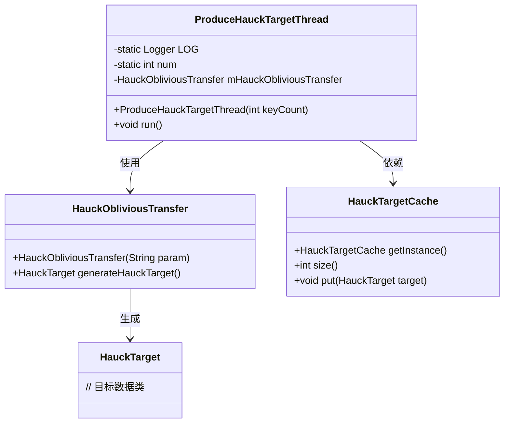
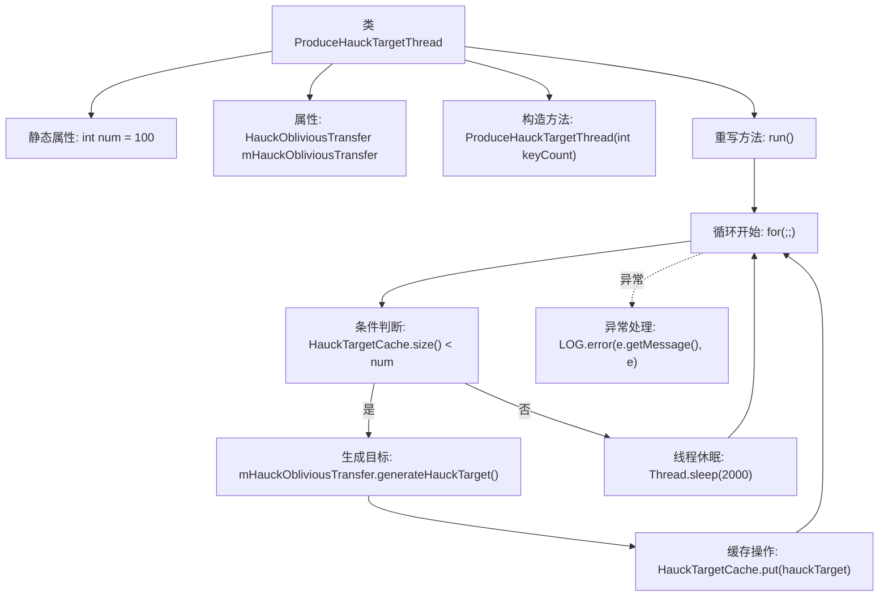

# 基础信息

|      |      |
|------|------|
| 名称 | ProduceHauckTargetThread |
| 编码语言 | .java |
| 代码路径 | WeFe/mpc/mpc-pir/mpc-pir-server/src/main/java/com/welab/wefe/mpc/pir/server/thread/ProduceHauckTargetThread.java |
| 包名 | com.welab.wefe.mpc.pir.server.thread |
| 依赖项 | ['com.welab.wefe.mpc.pir.protocol.ot.hauck.HauckObliviousTransfer', 'com.welab.wefe.mpc.pir.protocol.ot.hauck.HauckTarget', 'com.welab.wefe.mpc.pir.server.cache.HauckTargetCache', 'org.slf4j.Logger', 'org.slf4j.LoggerFactory'] |
| 概述说明 | ProduceHauckTargetThread线程类，用于生成HauckTarget对象并缓存。当缓存数量不足时持续生成，否则休眠2秒。异常时记录日志。 |

# 说明

这是一个名为ProduceHauckTargetThread的线程类，用于持续生成HauckTarget对象并缓存。类中包含一个静态日志记录器、可配置的缓存数量num和HauckObliviousTransfer实例。构造函数接收keyCount参数设置缓存阈值，并将线程命名为produce-hauck-target。run方法实现无限循环逻辑：当缓存未满时生成新HauckTarget并存入缓存，已满则休眠2秒。异常处理会记录InterruptedException错误日志。

# 类列表 Class Summary

| 名称   | 类型  | 说明 |
|-------|------|-------------|
| ProduceHauckTargetThread | class | ProduceHauckTargetThread线程类，用于持续生成HauckTarget对象并缓存。当缓存数量不足时生成新对象，否则休眠2秒。使用HauckObliviousTransfer生成目标对象。 |

## 类 ProduceHauckTargetThread

|      |      |
|------|------|
| 访问范围 | public |
| 类型 | class |
| 名称 | ProduceHauckTargetThread |
| 说明 | ProduceHauckTargetThread线程类，用于持续生成HauckTarget对象并缓存。当缓存数量不足时生成新对象，否则休眠2秒。使用HauckObliviousTransfer生成目标对象。 |

### UML类图

这段代码描述了一个生产HauckTarget的线程类，该线程持续检查缓存容量并在不足时生成新目标数据。类图展示了四个核心组件：线程类通过HauckObliviousTransfer生成目标数据，并存入HauckTargetCache单例缓存。线程包含静态配置参数num控制缓存阈值，采用无限循环和休眠机制实现生产消费平衡，异常处理通过日志记录。整体实现了一个异步的、带流量控制的目标数据生产流水线。

### 内部方法调用关系图

该流程图描述了ProduceHauckTargetThread线程的核心逻辑。线程启动后进入无限循环，首先检查缓存大小是否小于预设值num。若缓存未满，则通过HauckObliviousTransfer生成新目标并存入缓存；若已满则休眠2秒。整个过程捕获InterruptedException异常并记录日志。该设计实现了按需生成目标的持续生产机制，通过缓存控制和休眠策略平衡资源消耗。

### 字段列表 Field List

| 名称  | 类型  | 说明 |
|-------|-------|------|
| LOG = LoggerFactory.getLogger(ProduceHauckTargetThread.class) | Logger | 定义私有静态常量LOG，使用LoggerFactory获取ProduceHauckTargetThread类的日志记录器。 |
| num = 100 | int | 静态整型变量num初始值为100。 |
| mHauckObliviousTransfer = new HauckObliviousTransfer("") | HauckObliviousTransfer | 创建HauckObliviousTransfer类的私有实例mHauckObliviousTransfer，构造函数参数为空字符串。 |

### 方法列表

| 名称  | 类型  | 说明 |
|-------|-------|------|
| run | void | 循环检查缓存大小，不足时生成并存入新目标，否则休眠2秒；异常时记录日志。 |

