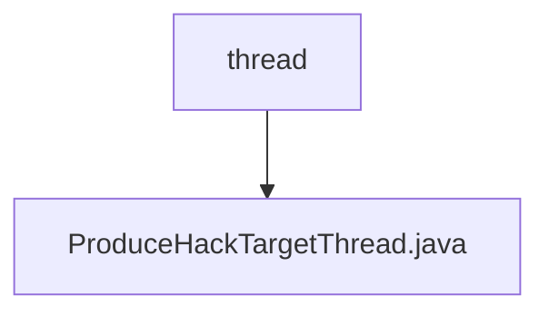

# 基础信息

|      |      |
|------|------|
| 名称 | thread |
| 编码语言 | .java |
| 代码路径 | WeFe/mpc/mpc-pir/mpc-pir-server/src/main/java/com/welab/wefe/mpc/pir/server/thread |
| 包名 | docs.mpc.mpc-pir.mpc-pir-server.src.main.java.com.welab.wefe.mpc.pir.server.thread |
| 概述说明 | ProduceHauckTargetThread线程类，用于生成HauckTarget对象并缓存。当缓存数量不足时持续生成，否则休眠2秒。异常时记录日志。 |

# 说明

这是一个名为ProduceHauckTargetThread的线程类，用于持续生成HauckTarget对象并缓存。类中包含一个静态日志记录器、可配置的缓存数量num和HauckObliviousTransfer实例。构造函数接收keyCount参数设置缓存阈值，并将线程命名为produce-hauck-target。run方法实现无限循环逻辑：当缓存未满时生成新HauckTarget并存入缓存，已满则休眠2秒。异常处理会记录InterruptedException错误日志。

### 包内部结构视图

该流程图展示了WeFe项目中MPC-PIR服务端的线程模块结构。根节点为thread目录，其下级仅包含一个具体的线程实现类ProduceHackTargetThread.java。这种简洁的层级关系表明该模块功能聚焦，当前仅需通过单一线程类来实现特定功能，符合隐私信息检索服务端对线程管理的典型设计模式。

# 文件列表

| 名称   | 类型  | 说明 |
|-------|------|-------------|
| [ProduceHauckTargetThread.java](ProduceHauckTargetThread.md) | file | ProduceHauckTargetThread线程类，用于生成HauckTarget对象并缓存。当缓存数量不足时持续生成，否则休眠2秒。异常时记录日志。 |

