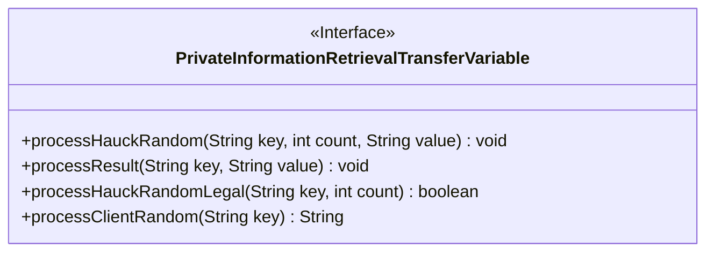
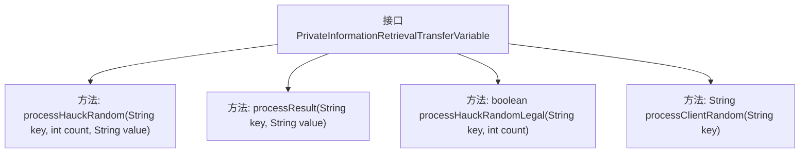

# 基础信息

|      |      |
|------|------|
| 名称 | PrivateInformationRetrievalTransferVariable |
| 编码语言 | .java |
| 代码路径 | WeFe/mpc/mpc-pir/mpc-pir-server/src/main/java/com/welab/wefe/mpc/pir/server/trasfer/PrivateInformationRetrievalTransferVariable.java |
| 包名 | com.welab.wefe.mpc.pir.server.trasfer |
| 依赖项 | [] |
| 概述说明 | 接口PrivateInformationRetrievalTransferVariable定义PIR协议数据传输方法，包括发送随机数、加密结果、验证随机数合法性及获取客户端转换结果。 |

# 说明

该接口定义了私有信息检索（PIR）传输过程中的关键操作方法，包含四个核心功能：发送PIR随机数（需提供请求ID、次数和数量参数），发送加密结果（需请求ID和结果字符串），验证客户端PIR随机数合法性（需请求ID和次数参数并返回布尔值），以及获取客户端对PIR随机数的转换结果（需请求ID参数并返回字符串）。这些方法共同构成了PIR协议中数据传输与验证的基础框架。

# 类列表 Class Summary

| 名称   | 类型  | 说明 |
|-------|------|-------------|
| PrivateInformationRetrievalTransferVariable | interface | 接口PrivateInformationRetrievalTransferVariable定义了PIR（私有信息检索）传输的四个方法：发送随机数、发送加密结果、验证随机数合法性、获取客户端随机数转换结果。 |

## 类 PrivateInformationRetrievalTransferVariable

|      |      |
|------|------|
| 访问范围 | public |
| 类型 | interface |
| 名称 | PrivateInformationRetrievalTransferVariable |
| 说明 | 接口PrivateInformationRetrievalTransferVariable定义了PIR（私有信息检索）传输的四个方法：发送随机数、发送加密结果、验证随机数合法性、获取客户端随机数转换结果。 |

### UML类图

该类图展示了一个名为`PrivateInformationRetrievalTransferVariable`的接口，定义了私有信息检索(PIR)过程中的数据传输方法。接口包含四个方法：`processHauckRandom`用于发送PIR随机数，`processResult`用于发送加密结果，`processHauckRandomLegal`验证客户端随机数合法性，`processClientRandom`获取客户端转换结果。这些方法共同构成了PIR协议中客户端与服务端交互的核心数据传输接口。

### 内部方法调用关系图

这段流程图展示了一个名为PrivateInformationRetrievalTransferVariable的接口结构，该接口定义了四个核心方法：processHauckRandom用于发送PIR随机数，processResult用于发送加密结果，processHauckRandomLegal用于验证随机数合法性，processClientRandom用于获取客户端转换结果。每个方法都通过独立节点表示，清晰地展现了接口的方法签名和返回类型，体现了PIR（私有信息检索）协议中数据传输和验证的关键操作流程。

### 字段列表 Field List

| 名称  | 类型  | 说明 |
|-------|-------|------|

### 方法列表

| 名称  | 类型  | 说明 |
|-------|-------|------|
| processResult | void | 处理键值对结果的方法，参数为key和value。 |
| processHauckRandom | void | 处理Hauck随机数据：输入键、计数和值，执行相关操作。 |
| processHauckRandomLegal | boolean | 处理Hauck随机合法性的布尔方法，参数为字符串key和整数count。 |
| processClientRandom | String | 处理客户端随机字符串的方法，输入为密钥，返回处理后的字符串。 |

