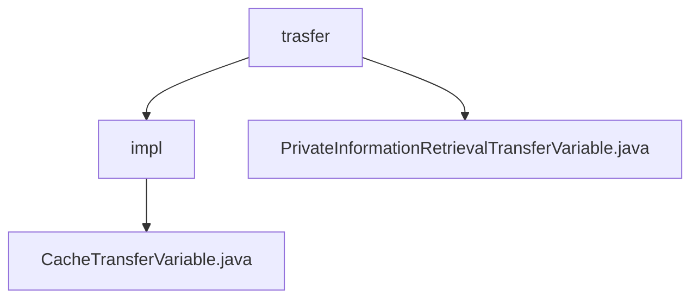

# 基础信息

|      |      |
|------|------|
| 名称 | trasfer |
| 编码语言 | .java |
| 代码路径 | WeFe/mpc/mpc-pir/mpc-pir-server/src/main/java/com/welab/wefe/mpc/pir/server/trasfer |
| 包名 | docs.mpc.mpc-pir.mpc-pir-server.src.main.java.com.welab.wefe.mpc.pir.server.trasfer |
| 概述说明 | CacheTransferVariable类实现PIR数据传输接口，含四个方法处理随机数、加密结果及合法性检查，缓存操作带120秒超时。 |

# 说明

## 概述  
该模块核心职责是实现隐私信息检索(PIR)协议中的数据传输与验证，通过缓存机制管理随机数和加密结果等敏感数据。接口规范包含四个关键操作：发送/验证PIR随机数、处理加密结果及获取客户端转换结果，类似安全中间件模式。关键数据结构包括请求ID、时间戳和加密字符串。外部依赖仅涉及单例缓存操作实例。例如processHauckRandomLegal通过请求ID验证随机数合法性。

## 主要业务场景  
典型应用模式为多方安全计算场景下的隐私数据查询，完整流程包含随机数生成、合法性校验和结果加密传输。交互模式采用请求-响应机制，例如processClientRandom通过请求ID获取客户端随机数。功能完整性体现在120秒超时控制、缓存持久化等细节。API类型均为同步调用，集成案例包括PIR协议中的安全参数交换。

### 包内部结构视图

该流程图展示了WeFe项目中MPC-PIR服务器的文件结构关系。trasfer目录下包含impl子目录和PrivateInformationRetrievalTransferVariable.java文件，而impl子目录中又包含CacheTransferVariable.java实现文件。这种层级结构清晰地反映了服务器传输模块的代码组织方式。

# 文件列表

| 名称   | 类型  | 说明 |
|-------|------|-------------|
| [PrivateInformationRetrievalTransferVariable.java](PrivateInformationRetrievalTransferVariable.md) | file | 接口PrivateInformationRetrievalTransferVariable定义PIR协议数据传输方法，包括发送随机数、加密结果、验证随机数合法性及获取客户端转换结果。 |
| [impl](impl/_module.md) | package | CacheTransferVariable类实现私有信息检索传输接口，提供缓存操作功能，包括处理随机数、结果和合法性检查，支持超时等待获取缓存值。 |

