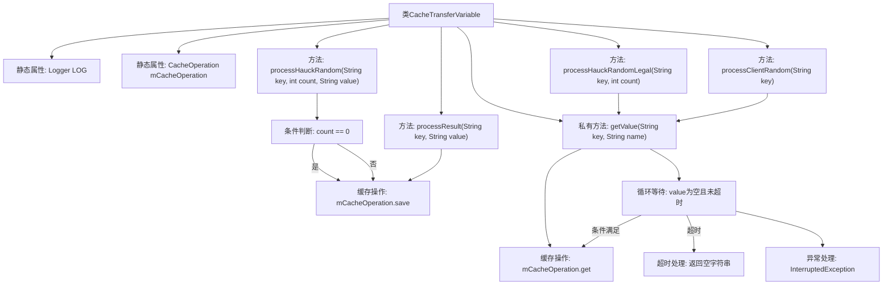

# 基础信息

|      |      |
|------|------|
| 名称 | CacheTransferVariable |
| 编码语言 | .java |
| 代码路径 | WeFe/mpc/mpc-pir/mpc-pir-server/src/main/java/com/welab/wefe/mpc/pir/server/trasfer/impl/CacheTransferVariable.java |
| 包名 | com.welab.wefe.mpc.pir.server.trasfer.impl |
| 依赖项 | ['com.welab.wefe.mpc.cache.intermediate.CacheOperation', 'com.welab.wefe.mpc.cache.intermediate.CacheOperationFactory', 'com.welab.wefe.mpc.commom.Constants', 'com.welab.wefe.mpc.pir.server.trasfer.PrivateInformationRetrievalTransferVariable', 'org.slf4j.Logger', 'org.slf4j.LoggerFactory', 'java.util.concurrent.TimeUnit'] |
| 概述说明 | CacheTransferVariable类实现私有信息检索传输接口，提供缓存操作功能，包括处理随机数、结果和合法性检查，支持超时等待获取缓存值。 |

# 说明

该代码定义了一个名为CacheTransferVariable的类，实现了PrivateInformationRetrievalTransferVariable接口。主要功能是通过缓存操作处理与隐私信息检索相关的数据传输。类中包含四个主要方法：processHauckRandom用于保存随机数和首次访问时间戳；processResult用于保存加密结果；processHauckRandomLegal检查随机数合法性；processClientRandom获取客户端随机数。内部方法getValue实现了带超时机制的缓存值获取逻辑，若120秒内未获取到值则返回空字符串。所有操作均通过mCacheOperation实例执行，该类使用单例模式获取缓存操作实例。

# 类列表 Class Summary

| 名称   | 类型  | 说明 |
|-------|------|-------------|
| CacheTransferVariable | class | CacheTransferVariable类实现私有信息检索传输接口，提供缓存操作功能，包括保存随机数、结果及合法性检查，支持超时等待获取值。 |


## 类 CacheTransferVariable

|      |      |
|------|------|
| 访问范围 | public |
| 类型 | class |
| 名称 | CacheTransferVariable |
| 说明 | CacheTransferVariable类实现私有信息检索传输接口，提供缓存操作功能，包括保存随机数、结果及合法性检查，支持超时等待获取值。 |


### UML类图

```mermaid
classDiagram
    class CacheTransferVariable {
        -Logger LOG
        +CacheOperation~String~ mCacheOperation
        +processHauckRandom(String key, int count, String value) void
        +processResult(String key, String value) void
        +processHauckRandomLegal(String key, int count) boolean
        +processClientRandom(String key) String
        -getValue(String key, String name) String
    }

    <<Interface>> PrivateInformationRetrievalTransferVariable {
        +processHauckRandom(String key, int count, String value) void
        +processResult(String key, String value) void
        +processHauckRandomLegal(String key, int count) boolean
        +processClientRandom(String key) String
    }

    class CacheOperation~T~ {
        <<Interface>>
        +save(String key, String name, T value) void
        +get(String key, String name) T
    }

    class Constants {
        // 常量类
    }

    PrivateInformationRetrievalTransferVariable <|-- CacheTransferVariable
    CacheTransferVariable --> CacheOperation~String~ : 依赖
    CacheTransferVariable --> Constants : 依赖
```

该类图展示了CacheTransferVariable类实现了PrivateInformationRetrievalTransferVariable接口，并依赖CacheOperation泛型接口和Constants常量类。主要功能包括处理Hauck随机数、结果数据以及客户端随机数，通过缓存操作实现数据存储和检索。其中getValue方法实现了带超时机制的轮询获取逻辑，确保数据可靠性。整体设计体现了信息检索场景下的缓存管理和数据传输功能。


### 内部方法调用关系图



这段代码实现了一个缓存传输变量类，主要用于处理隐私信息检索过程中的数据缓存操作。核心逻辑包含四个公开方法：处理Hauck随机数、处理结果、验证Hauck随机数合法性以及获取客户端随机数，均依赖底层的缓存操作。特别值得注意的是getValue方法实现了带超时机制的轮询逻辑，当缓存值为空时会持续尝试获取，最长等待120秒，期间每10毫秒检查一次，若超时则返回空字符串。类中还包含对首次操作的特殊处理，会记录时间戳到UUID_FIRST_TIME键中。

### 字段列表 Field List

| 名称  | 类型  | 说明 |
|-------|-------|------|
| mCacheOperation = CacheOperationFactory.getCacheOperation() | CacheOperation<String> | 获取字符串缓存操作实例。 |
| LOG = LoggerFactory.getLogger(CacheTransferVariable.class) | Logger | 声明一个静态不可变日志对象LOG，用于CacheTransferVariable类的日志记录。 |

### 方法列表

| 名称  | 类型  | 说明 |
|-------|-------|------|
| getValue | String | 该方法通过键和名称从缓存获取值，若值为空则循环等待最多2分钟，超时返回空字符串，否则返回获取到的值。 |
| processResult | void | 重写方法processResult，将键值对存入缓存，标记为加密结果。 |
| processHauckRandom | void | 方法processHauckRandom处理随机数据：若count为0，保存首次时间戳；否则保存带计数的随机值。 |
| processHauckRandomLegal | boolean | 该方法根据键和计数参数获取值，并返回对应的布尔值。 |
| processClientRandom | String | 该方法重写processClientRandom，通过key和常量PIR.R调用getValue并返回结果。 |


