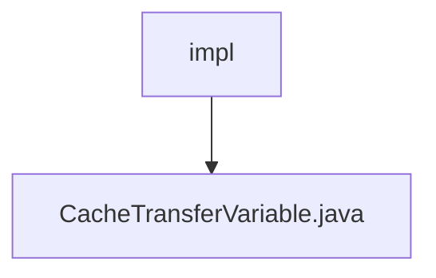

# 基础信息

|      |      |
|------|------|
| 名称 | impl |
| 编码语言 | .java |
| 代码路径 | WeFe/mpc/mpc-pir/mpc-pir-server/src/main/java/com/welab/wefe/mpc/pir/server/trasfer/impl |
| 包名 | docs.mpc.mpc-pir.mpc-pir-server.src.main.java.com.welab.wefe.mpc.pir.server.trasfer.impl |
| 概述说明 | CacheTransferVariable类实现私有信息检索传输接口，提供缓存操作功能，包括处理随机数、结果和合法性检查，支持超时等待获取缓存值。 |

# 说明

该代码定义了一个名为CacheTransferVariable的类，实现了PrivateInformationRetrievalTransferVariable接口。主要功能是通过缓存操作处理与隐私信息检索相关的数据传输。类中包含四个主要方法：processHauckRandom用于保存随机数和首次访问时间戳；processResult用于保存加密结果；processHauckRandomLegal检查随机数合法性；processClientRandom获取客户端随机数。内部方法getValue实现了带超时机制的缓存值获取逻辑，若120秒内未获取到值则返回空字符串。所有操作均通过mCacheOperation实例执行，该类使用单例模式获取缓存操作实例。

### 包内部结构视图

该流程图展示了路径2的层级关系，其中"impl"是trasfer目录下的子目录，包含一个名为"CacheTransferVariable.java"的Java文件。整个结构简洁明了，体现了文件在项目中的具体位置和所属关系。

# 文件列表

| 名称   | 类型  | 说明 |
|-------|------|-------------|
| [CacheTransferVariable.java](CacheTransferVariable.md) | file | CacheTransferVariable类实现私有信息检索传输接口，提供缓存操作功能，包括处理随机数、结果和合法性检查，支持超时等待获取缓存值。 |

