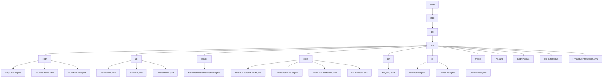

# 基础信息

|      |      |
|------|------|
| 名称 | wefe |
| 编码语言 | .java |
| 代码路径 | WeFe/mpc/mpc-psi/mpc-psi-sdk/src/main/java/com/welab/wefe |
| 包名 | docs.mpc.mpc-psi.mpc-psi-sdk.src.main.java.com.welab.wefe |
| 概述说明 | 该SDK实现多方隐私集合求交(PSI)功能，支持ECDH和DH加密协议，包含服务端/客户端组件、数据预处理工具和工厂模式。核心流程为密钥生成、数据加密和结果比对，通过多线程优化性能，适用于安全数据匹配场景。 |

# 说明

## 概述  
该模块是安全多方计算(MPC)中的隐私集合求交(PSI)工具集，核心职责包括基于椭圆曲线加密(ECDH)和Diffie-Hellman(DH)协议的私有数据匹配、数据预处理和结果查询。模块采用分层设计，底层提供密码学基础能力（如ECDH-PSI的点乘运算），中层实现数据分片/格式转换（如PartitionUtil分片），上层封装服务接口（如PrivateSetIntersectionService）。关键数据结构涵盖椭圆曲线参数、加密映射表、分片集合和混淆数据模型，依赖项仅限Java标准库和加密算法库。例如EcdhPsi通过hashToCurve实现数据加密，PsiFactory采用工厂模式创建协议实例。

## 主要业务场景  
模块支持三种典型场景：1)安全用户匹配（ECDH-PSI双向加密求交）；2)批量数据预处理（分片→转换→加密流水线）；3)隐私信息检索（Naor-Pinkas不经意传输）。完整流程遵循"密钥生成→数据加密→结果求交"模式，类似多方密钥协商。例如DhPsiServer使用并发哈希表加速密文比对，PirQuery通过Diffie-Hellman交换实现匿踪查询。交互模式包含客户端-服务端架构（如EcdhPsiClient）和工厂模式（PsiFactory），API覆盖密钥操作、数据集加密和分页结果合并，适用于跨机构数据安全计算场景。

### 包内部结构视图

该流程图展示了WeFe项目中MPC-PSI-SDK模块的完整目录结构，从根目录wefe开始，逐级展开到mpc、psi、sdk等子目录，最终显示所有Java文件。sdk目录下包含多个子模块如ecdh、util、service等，每个子模块又包含具体的实现类文件，形成清晰的层级关系。整个结构体现了模块化设计思想，便于维护和扩展。

# 文件列表

| 名称   | 类型  | 说明 |
|-------|------|-------------|
| [mpc](mpc/_module.md) | package | 该SDK实现多方隐私集合求交(PSI)功能，支持ECDH和DH加密协议，包含服务端/客户端组件、数据预处理工具和工厂模式。核心流程为密钥生成、数据加密和结果比对，通过多线程优化性能，适用于安全数据匹配场景。 |

