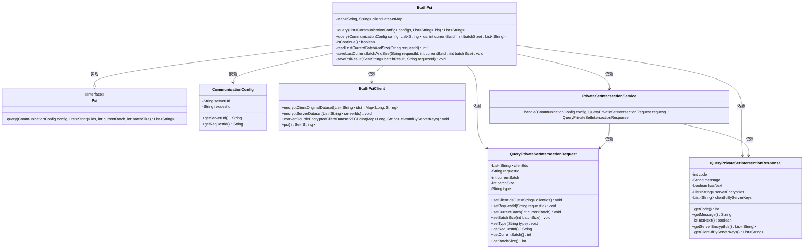
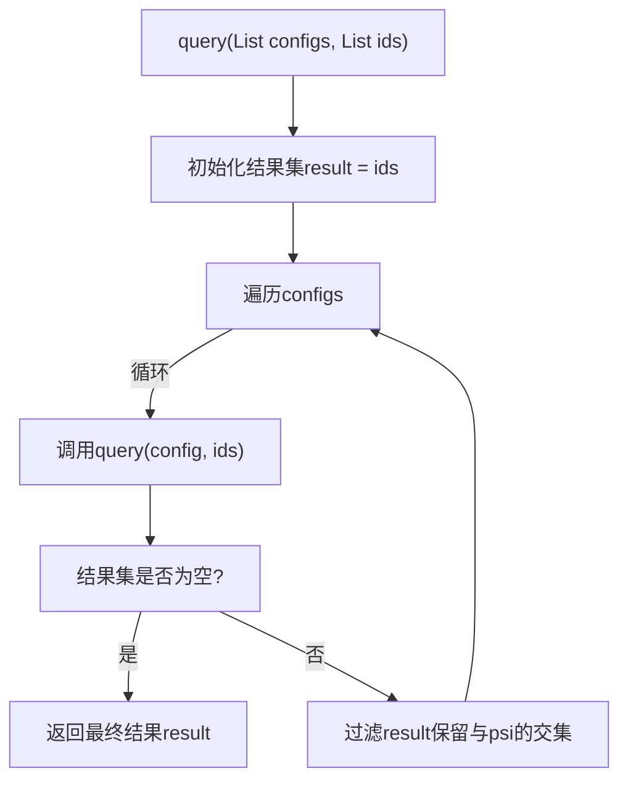
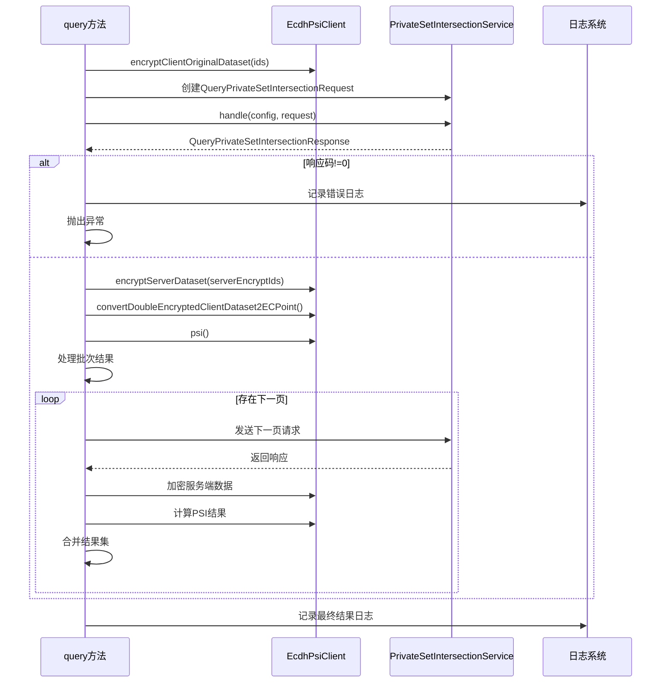

# 基础信息

|      |      |
|------|------|
| 名称 | EcdhPsi |
| 编码语言 | .java |
| 代码路径 | WeFe/mpc/mpc-psi/mpc-psi-sdk/src/main/java/com/welab/wefe/mpc/psi/sdk/EcdhPsi.java |
| 包名 | com.welab.wefe.mpc.psi.sdk |
| 依赖项 | ['java.util.ArrayList', 'java.util.List', 'java.util.Map', 'java.util.Set', 'java.util.stream.Collectors', 'org.apache.commons.collections4.CollectionUtils', 'com.alibaba.fastjson.JSONObject', 'com.welab.wefe.mpc.config.CommunicationConfig', 'com.welab.wefe.mpc.psi.request.QueryPrivateSetIntersectionRequest', 'com.welab.wefe.mpc.psi.request.QueryPrivateSetIntersectionResponse', 'com.welab.wefe.mpc.psi.sdk.ecdh.EcdhPsiClient', 'com.welab.wefe.mpc.psi.sdk.service.PrivateSetIntersectionService', 'com.welab.wefe.mpc.psi.sdk.util.EcdhUtil', 'cn.hutool.core.collection.CollectionUtil', 'cn.hutool.core.util.StrUtil'] |
| 概述说明 | EcdhPsi类实现多方隐私集合求交，通过ECDH加密本地ID并与服务器交互，分批处理数据并返回交集结果。 |

# 说明

EcdhPsi类实现了多方隐私集合求交集功能。主要提供两个方法：query方法支持与多个服务器进行ID集合求交，通过遍历配置列表逐步缩小结果集；另一个query方法实现与单个服务器的交互流程，包括数据加密、分批次请求处理、结果合并等。该方法使用ECDH加密方案保护数据隐私，支持断点续传，通过批次处理优化性能，并记录详细日志。核心流程包含客户端数据加密、服务端交互、双重加密数据转换、结果比对等步骤，最终返回双方ID集合的交集结果。

# 类列表 Class Summary

| 名称   | 类型  | 说明 |
|-------|------|-------------|
| EcdhPsi | class | EcdhPsi类实现多方隐私集合求交功能，通过ECDH加密算法保护数据隐私，支持分批处理大数据集，最终返回交集结果。 |

## 类 EcdhPsi

|      |      |
|------|------|
| 访问范围 | public |
| 类型 | class |
| 名称 | EcdhPsi |
| 说明 | EcdhPsi类实现多方隐私集合求交功能，通过ECDH加密算法保护数据隐私，支持分批处理大数据集，最终返回交集结果。 |

### UML类图

这段代码实现了一个基于ECDH（椭圆曲线迪菲-赫尔曼）的隐私集合求交（PSI）功能。EcdhPsi类继承自Psi接口，提供了多方求交集和单次查询两种方法。主要流程包括：客户端数据加密、与服务端交互获取加密结果、解密并计算交集。涉及的关键类包括通信配置、PSI客户端、请求/响应对象和服务处理类，通过多次批处理实现大数据集的高效处理。

### 内部方法调用关系图

流程图描述了EcdhPsi类的两个主要方法调用流程。query方法首先初始化结果集，然后遍历服务器配置列表，对每个配置调用单服务器查询并逐步过滤交集，最终返回多方ID交集结果。时序图详细展示了单服务器查询时的加密交互过程，包括客户端数据加密、服务端请求处理、响应验证和结果合并等关键步骤，体现了安全多方计算中基于ECDH的隐私集合求交协议实现流程。

### 字段列表 Field List

| 名称  | 类型  | 说明 |
|-------|-------|------|

### 方法列表

| 名称  | 类型  | 说明 |
|-------|-------|------|
| query | List<String> | 该方法接收配置列表和ID列表，遍历配置查询每个配置对应的ID，逐步过滤出所有配置共有的ID，最后返回交集结果。 |
| query | List<String> | 该方法实现基于ECDH的隐私集合求交（PSI）功能，处理客户端与服务端数据加密匹配，支持分批查询并合并结果。验证输入后加密数据，发送请求并处理响应，循环直至无后续批次，保存中间结果和最终匹配集合。 |

