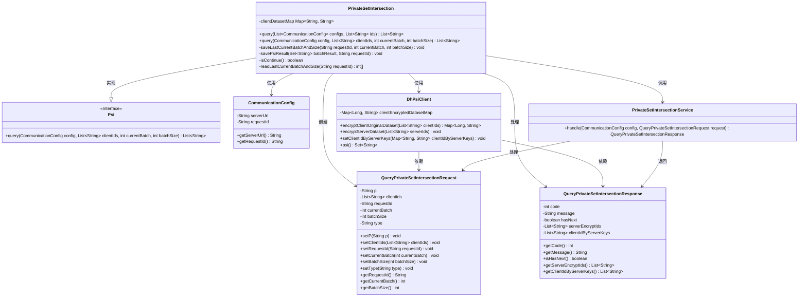
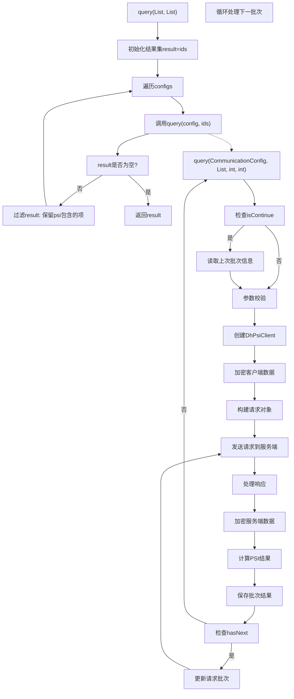

# 基础信息

|      |      |
|------|------|
| 名称 | PrivateSetIntersection |
| 编码语言 | .java |
| 代码路径 | WeFe/mpc/mpc-psi/mpc-psi-sdk/src/main/java/com/welab/wefe/mpc/psi/sdk/PrivateSetIntersection.java |
| 包名 | com.welab.wefe.mpc.psi.sdk |
| 依赖项 | ['java.util.ArrayList', 'java.util.List', 'java.util.Map', 'java.util.Set', 'java.util.stream.Collectors', 'org.apache.commons.collections4.CollectionUtils', 'com.welab.wefe.mpc.config.CommunicationConfig', 'com.welab.wefe.mpc.psi.request.QueryPrivateSetIntersectionRequest', 'com.welab.wefe.mpc.psi.request.QueryPrivateSetIntersectionResponse', 'com.welab.wefe.mpc.psi.sdk.dh.DhPsiClient', 'com.welab.wefe.mpc.psi.sdk.service.PrivateSetIntersectionService', 'com.welab.wefe.mpc.psi.sdk.util.EcdhUtil', 'cn.hutool.core.collection.CollectionUtil', 'cn.hutool.core.util.StrUtil'] |
| 概述说明 | PrivateSetIntersection类实现多方ID求交集功能，通过加密和分批处理确保数据隐私，支持断点续传和结果保存。 |

# 说明

PrivateSetIntersection类继承自Psi，实现了多方求交集功能。query方法接收服务器配置列表和本地ID集，通过迭代计算交集。具体流程包括：初始化结果集，遍历服务器配置，调用单服务器查询方法，逐步过滤交集。单服务器查询方法处理分批次请求，使用DH-PSI协议加密客户端数据，发送请求到服务端，处理响应并解密结果，保存批次结果。支持断点续传，记录批次信息和耗时日志。最终返回所有批次的交集结果。

# 类列表 Class Summary

| 名称   | 类型  | 说明 |
|-------|------|-------------|
| PrivateSetIntersection | class | PrivateSetIntersection类实现多方隐私集合求交，通过加密和分批处理确保数据安全，支持断点续传并返回交集结果。 |

## 类 PrivateSetIntersection

|      |      |
|------|------|
| 访问范围 | public |
| 类型 | class |
| 名称 | PrivateSetIntersection |
| 说明 | PrivateSetIntersection类实现多方隐私集合求交，通过加密和分批处理确保数据安全，支持断点续传并返回交集结果。 |

### UML类图

这段代码实现了一个多方隐私集合求交（PSI）的功能，通过Diffie-Hellman密钥交换协议实现安全的数据交集计算。PrivateSetIntersection类继承自Psi接口，主要包含两个查询方法：一个处理多方查询，另一个处理单次查询。在单次查询中，会创建DhPsiClient进行数据加密，通过PrivateSetIntersectionService与服务器交互，处理分批次查询并保存中间结果。整个流程涉及加密数据集处理、服务端通信、结果合并等步骤，确保在不暴露原始数据的情况下计算多方数据的交集。

### 内部方法调用关系图

流程图描述了PrivateSetIntersection类的两个核心方法。主query方法遍历配置列表，通过调用另一个query方法获取PSI结果并逐步过滤。详细query方法处理单次PSI请求：包括参数检查、数据加密、请求构建、服务端交互、结果解密和批次处理。整个过程实现了多方隐私集合求交集功能，支持分批处理大数据集，并保持中间状态。

### 字段列表 Field List

| 名称  | 类型  | 说明 |
|-------|-------|------|

### 方法列表

| 名称  | 类型  | 说明 |
|-------|-------|------|
| query | List<String> | 该方法接收通信配置列表和ID列表，通过遍历配置逐个查询匹配的ID，最终返回所有配置均匹配的ID交集。若中途结果集为空则提前终止。 |
| query | List<String> | 该方法实现基于DH算法的私有集合交集查询。主要流程：校验参数、加密客户端数据、发送请求至服务端、处理响应结果。若存在后续批次，循环处理直至完成。最终返回交集结果并保存批次信息。 |

