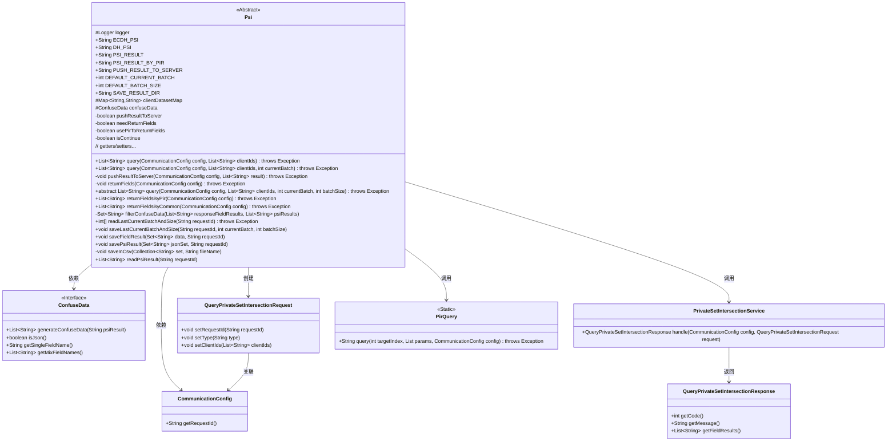
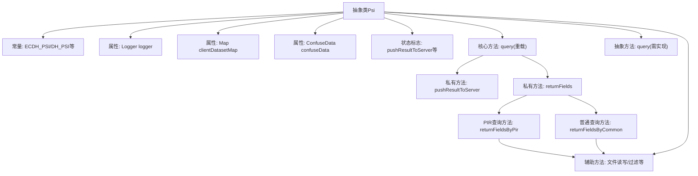
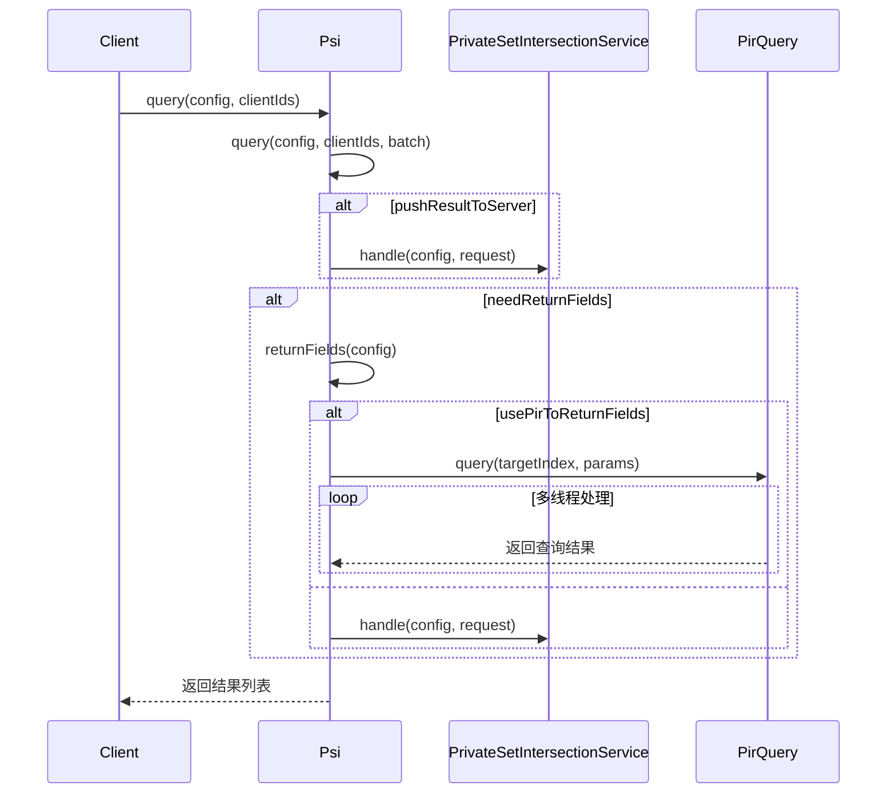

# 基础信息

|      |      |
|------|------|
| 名称 | Psi |
| 编码语言 | .java |
| 代码路径 | WeFe/mpc/mpc-psi/mpc-psi-sdk/src/main/java/com/welab/wefe/mpc/psi/sdk/Psi.java |
| 包名 | com.welab.wefe.mpc.psi.sdk |
| 依赖项 | ['java.nio.charset.Charset', 'java.nio.file.Paths', 'java.util.ArrayList', 'java.util.Collection', 'java.util.Collections', 'java.util.HashMap', 'java.util.HashSet', 'java.util.Iterator', 'java.util.LinkedHashMap', 'java.util.LinkedList', 'java.util.List', 'java.util.Map', 'java.util.Random', 'java.util.Set', 'java.util.concurrent.ConcurrentHashMap', 'java.util.concurrent.ExecutorService', 'java.util.concurrent.Executors', 'java.util.concurrent.TimeUnit', 'org.apache.commons.collections4.CollectionUtils', 'org.apache.commons.lang3.StringUtils', 'org.slf4j.Logger', 'org.slf4j.LoggerFactory', 'com.alibaba.fastjson.JSONObject', 'com.welab.wefe.mpc.config.CommunicationConfig', 'com.welab.wefe.mpc.psi.request.QueryPrivateSetIntersectionRequest', 'com.welab.wefe.mpc.psi.request.QueryPrivateSetIntersectionResponse', 'com.welab.wefe.mpc.psi.sdk.model.ConfuseData', 'com.welab.wefe.mpc.psi.sdk.pir.PirQuery', 'com.welab.wefe.mpc.psi.sdk.service.PrivateSetIntersectionService', 'cn.hutool.core.io.FileUtil'] |
| 概述说明 | 抽象类Psi实现私有集合交集(PSI)功能，支持ECDH和DH算法，提供查询、结果推送、混淆数据及多线程处理，可保存结果至本地文件。 |

# 说明

这是一个抽象类Psi，用于实现隐私集合求交（PSI）功能。类中定义了多种PSI操作类型常量，如ECDH_PSI、DH_PSI等，并包含默认配置参数如批处理大小和结果保存路径。主要功能包括查询客户端ID集与服务器ID集的交集，支持将结果推送至服务器，以及通过普通方式或匿踪查询（PIR）返回结果标签。类中提供了结果保存与读取方法，支持混淆数据处理和CSV格式导出。通过配置参数控制是否推送结果、返回标签及使用PIR等行为。

# 类列表 Class Summary

| 名称   | 类型  | 说明 |
|-------|------|-------------|
| Psi | class | 抽象类Psi实现隐私集合求交功能，支持ECDH和DH算法，可配置结果推送、字段返回及混淆数据，提供查询、结果保存和读取方法。 |

## 类 Psi

|      |      |
|------|------|
| 访问范围 | public abstract |
| 类型 | class |
| 名称 | Psi |
| 说明 | 抽象类Psi实现隐私集合求交功能，支持ECDH和DH算法，可配置结果推送、字段返回及混淆数据，提供查询、结果保存和读取方法。 |

### UML类图

该代码实现了一个抽象类Psi，用于处理私有集合交集(PSI)相关操作。主要功能包括查询处理、结果推送、字段返回（支持普通和PIR匿踪两种方式）、数据混淆处理以及结果文件读写。类通过CommunicationConfig与服务器交互，使用ConfuseData处理数据混淆，支持多线程PIR查询。整体设计采用模板方法模式，核心查询逻辑由子类实现，其余功能如结果处理、文件操作等由父类提供。

### 内部方法调用关系图

该流程图展示了PSI（私有集合交集）抽象类的核心结构，包含常量定义、状态标志、核心查询方法和辅助方法。时序图演示了完整的查询流程：客户端发起请求后，根据配置决定是否推送结果到服务端，并通过PIR或普通方式获取返回字段。关键点包括多线程PIR查询处理和结果过滤机制，体现了隐私保护集合交集计算的核心逻辑。文件操作模块负责持久化中间结果和最终数据。

### 字段列表 Field List

| 名称  | 类型  | 说明 |
|-------|-------|------|
| usePirToReturnFields = true | boolean | 代码定义了一个布尔变量usePirToReturnFields，初始值为true，用于控制是否使用PIR返回字段。 |
| pushResultToServer = false | boolean | 私有布尔变量pushResultToServer初始值为false，表示默认不推送结果到服务器。 |
| PSI_RESULT = "PSI_RESULT" | String | 定义静态常量字符串PSI_RESULT，值为"PSI_RESULT"。 |
| logger = LoggerFactory.getLogger(this.getClass()) | Logger | 声明一个受保护的final日志记录器，使用当前类名初始化。 |
| DEFAULT_CURRENT_BATCH = 0 | int | 定义静态常量DEFAULT_CURRENT_BATCH，默认值为0。 |
| PSI_RESULT_BY_PIR = "PSI_RESULT_BY_PIR" | String | 这是一个Java常量定义，名为PSI_RESULT_BY_PIR，值为字符串"PSI_RESULT_BY_PIR"。 |
| needReturnFields = false | boolean | 变量needReturnFields为布尔类型，默认值为false，用于控制是否需要返回字段。 |
| DEFAULT_BATCH_SIZE = -1 | int | 静态常量DEFAULT_BATCH_SIZE默认值为-1，表示未指定批量大小。 |
| ECDH_PSI = "ECDH_PSI" | String | 定义常量字符串ECDH_PSI，值为"ECDH_PSI"。 |
| confuseData | ConfuseData | 声明了一个受保护的ConfuseData类型变量confuseData。 |
| SAVE_RESULT_DIR = System.getProperty("user.dir") | String | 定义静态常量SAVE_RESULT_DIR，值为当前工作目录路径。 |
| isContinue | boolean | 布尔变量isContinue，用于控制流程是否继续。 |
| clientDatasetMap = new LinkedHashMap<>() | Map<String, String> | 定义一个受保护的LinkedHashMap变量clientDatasetMap，键值对类型均为String。 |
| DH_PSI = "DH_PSI" | String | 定义了一个公共静态常量字符串DH_PSI，值为"DH_PSI"。 |
| PUSH_RESULT_TO_SERVER = "PUSH_RESULT_TO_SERVER" | String | 定义静态常量字符串PUSH_RESULT_TO_SERVER，值为"PUSH_RESULT_TO_SERVER"。 |

### 方法列表

| 名称  | 类型  | 说明 |
|-------|-------|------|
| isNeedReturnFields | boolean | 这是一个Java方法，返回布尔值needReturnFields，用于判断是否需要返回字段。 |
| query | List<String> | 这是一个Java方法，通过传入配置和客户端ID列表进行查询，默认使用当前批次处理，可能抛出异常。 |
| query | List<String> | Java方法：根据配置查询客户端ID列表，支持分批处理，可选推送结果至服务器和返回字段，最终返回查询结果。 |
| readPsiResult | List<String> | 该方法读取指定请求ID的结果文件，去除重复行后返回字符串列表。使用UTF-8编码读取文件内容。 |
| setClientDatasetMap | void | 设置客户端数据集映射的方法，将输入的字符串键值对映射赋值给类变量clientDatasetMap。 |
| returnFieldsByPir | List<String> | 方法根据配置返回字段列表。若无需返回则返回空列表。读取PSI结果后，使用多线程生成混淆数据并执行PIR查询，最终保存结果并返回。记录执行时间。 |
| returnFieldsByCommon | List<String> | 废弃方法returnFieldsByCommon：检查是否需要返回字段，构建PSI请求，读取PSI结果并生成混淆数据，合并后打乱顺序，调用PSI服务处理请求，过滤混淆数据后保存结果并返回字段列表。 |
| readLastCurrentBatchAndSize | int[] | 读取指定请求ID的批次文件内容，解析为两个整数的数组。若文件为空或格式错误则抛出异常。 |
| savePsiResult | void | 该方法将jsonSet数据以UTF-8编码追加写入到指定目录下的requestId文件中，同时将相同数据保存为requestId.csv格式的CSV文件。 |
| getClientDatasetMap | Map<String, String> | 获取客户端数据集映射的方法，返回键值对集合。 |
| saveFieldResult | void | 方法saveFieldResult将字符串集合data和请求ID requestId作为输入，将数据追加到以requestId命名的文件中，并保存为CSV格式。使用UTF-8编码。 |
| getConfuseData | ConfuseData | 获取混淆数据的方法，返回confuseData对象。 |
| returnFields | void | 方法根据配置选择匿踪查询或普通方式返回字段。 |
| setConfuseData | void | 设置混淆数据的方法，将传入的confuseData赋值给当前对象的同名属性。 |
| filterConfuseData | Set<String> | 方法过滤混淆数据：若无混淆数据返回响应字段结果集；若为JSON格式，通过拼接字段值匹配响应与PSI结果；否则检查单字段值是否在PSI结果中，返回匹配项集合。 |
| setNeedReturnFields | void | 该方法用于设置是否需要返回字段，通过布尔参数控制。 |
| query | List<String> | 抽象方法query，接收配置、客户端ID列表、当前批次和批次大小，返回字符串列表，可能抛出异常。 |
| saveLastCurrentBatchAndSize | void | 方法saveLastCurrentBatchAndSize将当前批次和大小以"###"分隔写入文件，文件名包含requestId，编码为UTF-8。 |
| saveInCsv | void | 将集合数据保存为CSV文件，处理JSON或普通字符串，异常时记录日志。 |
| pushResultToServer | void | 私有方法pushResultToServer将结果推送到服务器。若配置不推送或结果为空则直接返回，否则构建请求并调用服务处理，失败时抛出异常。 |
| isContinue | boolean | 方法isContinue返回布尔值isContinue的状态。 |
| setContinue | void | 这是一个Java方法，用于设置布尔类型的成员变量isContinue的值。方法接受一个布尔参数isContinue，并将其赋值给当前对象的同名成员变量。 |
| isUsePirToReturnFields | boolean | 该方法返回布尔值，表示是否使用PIR返回字段。 |
| setUsePirToReturnFields | void | 设置是否使用PIR返回字段的方法，参数为布尔值。 |
| isPushResultToServer | boolean | 方法返回布尔值pushResultToServer的状态。 |
| setPushResultToServer | void | 设置是否将结果推送至服务器的布尔值方法。 |

