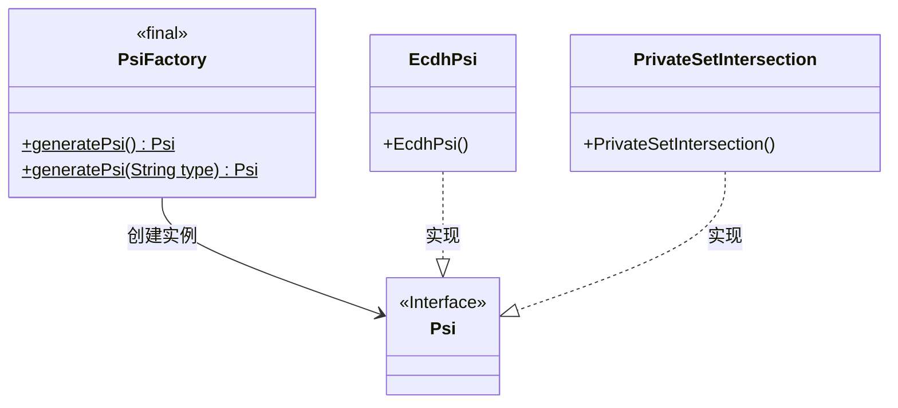
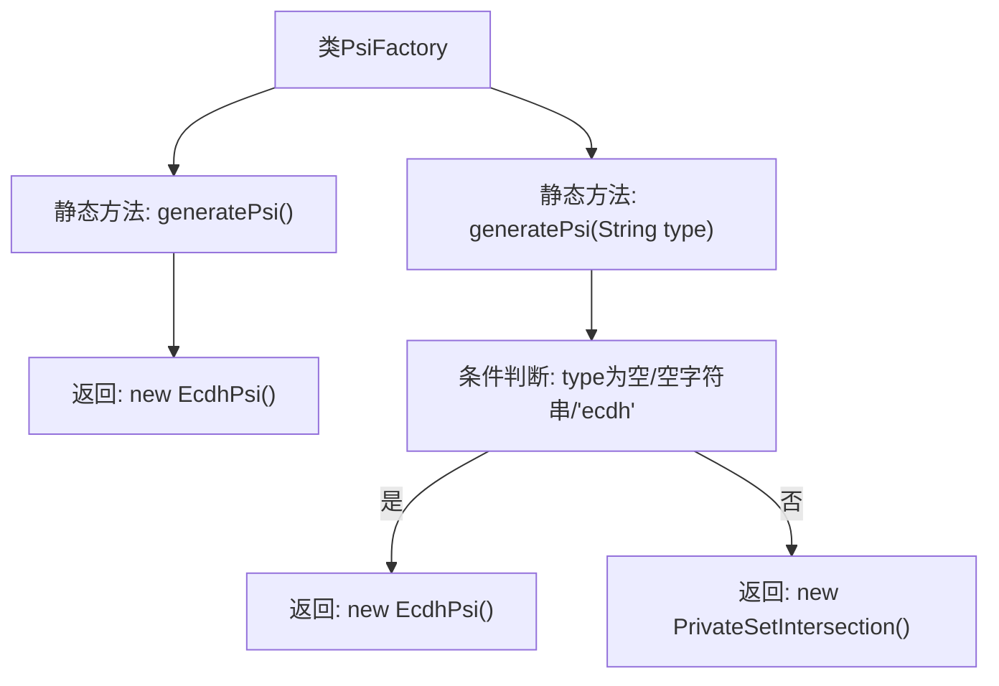

# 基础信息

|      |      |
|------|------|
| 名称 | PsiFactory |
| 编码语言 | .java |
| 代码路径 | WeFe/mpc/mpc-psi/mpc-psi-sdk/src/main/java/com/welab/wefe/mpc/psi/sdk/PsiFactory.java |
| 包名 | com.welab.wefe.mpc.psi.sdk |
| 依赖项 | [] |
| 概述说明 | PsiFactory类提供两个静态方法生成Psi实例：无参generatePsi()默认返回EcdhPsi；带参generatePsi(String type)根据参数返回EcdhPsi或PrivateSetIntersection实例。 |

# 说明

PsiFactory是一个工厂类，提供两种静态方法生成Psi对象。无参方法generatePsi()默认返回EcdhPsi实例。带参方法generatePsi(String type)根据输入参数决定返回类型：当参数为null、空字符串或"ecdh"时返回EcdhPsi，其他情况返回PrivateSetIntersection。该类实现了简单的工厂模式，封装了对象创建逻辑。

# 类列表 Class Summary

| 名称   | 类型  | 说明 |
|-------|------|-------------|
| PsiFactory | class | PsiFactory类提供两种生成Psi实例的静态方法：无参方法默认返回EcdhPsi实例；带参方法根据输入类型返回EcdhPsi或PrivateSetIntersection实例。 |

## 类 PsiFactory

|      |      |
|------|------|
| 访问范围 | public |
| 类型 | class |
| 名称 | PsiFactory |
| 说明 | PsiFactory类提供两种生成Psi实例的静态方法：无参方法默认返回EcdhPsi实例；带参方法根据输入类型返回EcdhPsi或PrivateSetIntersection实例。 |

### UML类图

这段类图展示了PSI（Private Set Intersection）工厂模式实现。PsiFactory作为工厂类，提供两个静态方法生成不同类型的PSI实例：默认生成EcdhPsi，或根据输入参数选择生成EcdhPsi或PrivateSetIntersection。两个具体实现类均遵循Psi接口，体现了工厂模式解耦创建逻辑与具体实现的特性。类图清晰呈现了工厂方法、接口与实现类之间的层级和依赖关系。

### 内部方法调用关系图

该流程图展示了PsiFactory类的两个静态方法逻辑。无参方法直接返回EcdhPsi实例；带参方法会先检查参数类型，若为空/空字符串或"ecdh"则返回EcdhPsi，否则返回PrivateSetIntersection实例。图形清晰呈现了条件分支和不同构造路径，体现了工厂模式根据输入动态生成不同实现类的特性。

### 字段列表 Field List

| 名称  | 类型  | 说明 |
|-------|-------|------|

### 方法列表

| 名称  | 类型  | 说明 |
|-------|-------|------|
| generatePsi | Psi | 静态方法根据输入类型生成PSI实例：若类型为空、空白或"ecdh"返回EcdhPsi，否则返回PrivateSetIntersection。 |
| generatePsi | Psi | 生成ECDH PSI实例的静态方法。 |

