# 基础信息

|      |      |
|------|------|
| 名称 | sdk |
| 编码语言 | .java |
| 代码路径 | WeFe/mpc/mpc-psi/mpc-psi-sdk/src/main/java/com/welab/wefe/mpc/psi/sdk |
| 包名 | docs.mpc.mpc-psi.mpc-psi-sdk.src.main.java.com.welab.wefe.mpc.psi.sdk |
| 概述说明 | 该SDK实现多方隐私集合求交(PSI)功能，支持ECDH和DH加密协议，包含服务端/客户端组件、数据预处理工具和工厂模式。核心流程为密钥生成、数据加密和结果比对，通过多线程优化性能，适用于安全数据匹配场景。 |

# 说明

## 概述  
该模块是安全多方计算(MPC)中的隐私集合求交(PSI)工具集，核心职责包括基于椭圆曲线加密(ECDH)和Diffie-Hellman(DH)协议的私有数据匹配、数据预处理和结果查询。模块采用分层设计，底层提供密码学基础能力（如ECDH-PSI的点乘运算），中层实现数据分片/格式转换（如PartitionUtil分片），上层封装服务接口（如PrivateSetIntersectionService）。关键数据结构涵盖椭圆曲线参数、加密映射表、分片集合和混淆数据模型，依赖项仅限Java标准库和加密算法库。例如EcdhPsi通过hashToCurve实现数据加密，PsiFactory采用工厂模式创建协议实例。

## 主要业务场景  
模块支持三种典型场景：1)安全用户匹配（ECDH-PSI双向加密求交）；2)批量数据预处理（分片→转换→加密流水线）；3)隐私信息检索（Naor-Pinkas不经意传输）。完整流程遵循"密钥生成→数据加密→结果求交"模式，类似多方密钥协商。例如DhPsiServer使用并发哈希表加速密文比对，PirQuery通过Diffie-Hellman交换实现匿踪查询。交互模式包含客户端-服务端架构（如EcdhPsiClient）和工厂模式（PsiFactory），API覆盖密钥操作、数据集加密和分页结果合并，适用于跨机构数据安全计算场景。

### 包内部结构视图

```mermaid
graph TD
    sdk --> ecdh
    sdk --> util
    sdk --> service
    sdk --> excel
    sdk --> pir
    sdk --> dh
    sdk --> model
    sdk --> Psi.java
    sdk --> EcdhPsi.java
    sdk --> PsiFactory.java
    sdk --> PrivateSetIntersection.java
    ecdh --> EllipticCurve.java
    ecdh --> EcdhPsiServer.java
    ecdh --> EcdhPsiClient.java
    util --> PartitionUtil.java
    util --> EcdhUtil.java
    util --> ConverterUtil.java
    service --> PrivateSetIntersectionService.java
    excel --> AbstractDataSetReader.java
    excel --> CsvDataSetReader.java
    excel --> ExcelDataSetReader.java
    excel --> ExcelReader.java
    pir --> PirQuery.java
    dh --> DhPsiServer.java
    dh --> DhPsiClient.java
    model --> ConfuseData.java
```

该流程图展示了MPC-PSI-SDK项目的核心结构，以sdk为根节点，包含ecdh、util、service等8个子模块。每个子模块下包含具体的实现类，如ecdh模块包含椭圆曲线相关实现类，util模块包含分区工具类等。整体呈现了SDK的多模块分层架构，各模块职责分明，共同支撑隐私集合求交功能。

# 文件列表

| 名称   | 类型  | 说明 |
|-------|------|-------------|
| [model](model/_module.md) | package | ConfuseData类用于生成混淆数据，包含字段名、JSON标识和生成函数，提供相关getter和setter方法。 |
| [Psi.java](Psi.md) | file | 抽象类Psi实现私有集合交集(PSI)功能，支持ECDH和DH算法，提供查询、结果推送、混淆数据及多线程处理，可保存结果至本地文件。 |
| [EcdhPsi.java](EcdhPsi.md) | file | EcdhPsi类实现多方隐私集合求交，通过ECDH加密本地ID并与服务器交互，分批处理数据并返回交集结果。 |
| [PsiFactory.java](PsiFactory.md) | file | PsiFactory类提供两个静态方法生成Psi实例：无参generatePsi()默认返回EcdhPsi；带参generatePsi(String type)根据参数返回EcdhPsi或PrivateSetIntersection实例。 |
| [PrivateSetIntersection.java](PrivateSetIntersection.md) | file | PrivateSetIntersection类实现多方ID求交集功能，通过加密和分批处理确保数据隐私，支持断点续传和结果保存。 |
| [dh](dh/_module.md) | package | DhPsiServer类实现基于Diffie-Hellman的服务器端PSI，支持多线程加密数据集，维护私钥和大素数。DhPsiClient类实现客户端PSI，包含密钥生成、ID加密和PSI计算，使用线程池和并发哈希表保证安全。 |
| [pir](pir/_module.md) | package | PirQuery类通过NaorPinkas OT方法实现私有信息检索，生成随机密钥处理查询请求，使用Diffie-Hellman加密和AES解密返回目标索引结果。 |
| [excel](excel/_module.md) | package | AbstractDataSetReader是读取数据集的抽象基类，含列头处理和行读取逻辑。CsvDataSetReader和ExcelDataSetReader分别实现CSV和Excel文件读取，均继承AbstractDataSetReader。ExcelReader提供Excel文件解析功能，支持多种数据格式和资源管理。 |
| [service](service/_module.md) | package | PrivateSetIntersectionService类提供私有集合交集查询、PIR结果处理和NaorPinkas结果查询功能，基于配置和请求参数调用query方法返回响应。 |
| [util](util/_module.md) | package | PartitionUtil提供Map/Set/List分片方法。EcdhUtil提供数据格式转换方法，支持多线程处理。ConverterUtil实现字符串与BigInteger、ECPoint的互转。 |
| [ecdh](ecdh/_module.md) | package | EllipticCurve类定义椭圆曲线参数和运算方法，支持点乘、哈希映射和验证。EcdhPsiServer实现服务器端PSI，含私钥生成、数据集加密和多线程处理。EcdhPsiClient实现客户端PSI，支持私钥生成、数据加密和ECDH协议求交。均使用prime256v1曲线和多线程优化。 |

