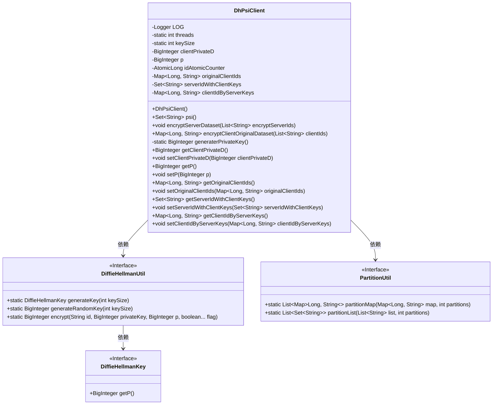
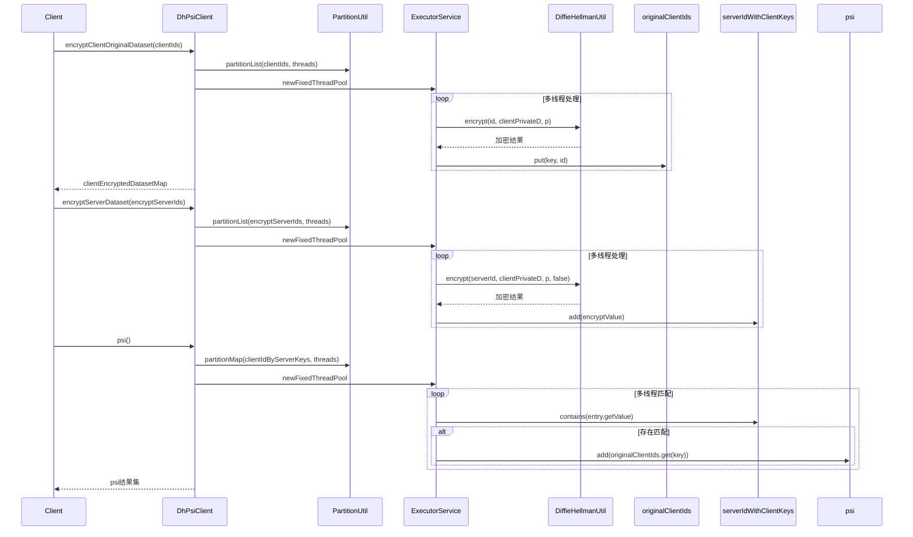

# 基础信息

|      |      |
|------|------|
| 名称 | DhPsiClient |
| 编码语言 | .java |
| 代码路径 | WeFe/mpc/mpc-psi/mpc-psi-sdk/src/main/java/com/welab/wefe/mpc/psi/sdk/dh/DhPsiClient.java |
| 包名 | com.welab.wefe.mpc.psi.sdk.dh |
| 依赖项 | ['java.math.BigInteger', 'java.util.List', 'java.util.Map', 'java.util.Set', 'java.util.concurrent.ConcurrentHashMap', 'java.util.concurrent.ExecutorService', 'java.util.concurrent.Executors', 'java.util.concurrent.TimeUnit', 'java.util.concurrent.atomic.AtomicLong', 'org.slf4j.Logger', 'org.slf4j.LoggerFactory', 'com.welab.wefe.mpc.key.DiffieHellmanKey', 'com.welab.wefe.mpc.psi.sdk.util.PartitionUtil', 'com.welab.wefe.mpc.util.DiffieHellmanUtil'] |
| 概述说明 | DhPsiClient类实现基于Diffie-Hellman的PSI协议，包含密钥生成、客户端/服务端数据加密及交集计算功能，支持多线程处理。 |

# 说明

DhPsiClient类实现了一个基于Diffie-Hellman密钥交换的隐私集合求交（PSI）客户端。它包含私钥生成、客户端ID加密、服务端ID加密和PSI计算四个核心步骤。类中使用线程池并行处理数据，通过ConcurrentHashMap保证线程安全，并维护原始ID、加密ID等映射关系。关键属性包括1024位密钥大小、素数p和客户端私钥，提供完整的PSI协议实现流程。

# 类列表 Class Summary

| 名称   | 类型  | 说明 |
|-------|------|-------------|
| DhPsiClient | class | DhPsiClient类实现基于Diffie-Hellman的隐私集合求交功能，包含客户端ID加密、服务端ID加密及PSI计算，支持多线程处理。 |

## 类 DhPsiClient

|      |      |
|------|------|
| 访问范围 | public |
| 类型 | class |
| 名称 | DhPsiClient |
| 说明 | DhPsiClient类实现基于Diffie-Hellman的隐私集合求交功能，包含客户端ID加密、服务端ID加密及PSI计算，支持多线程处理。 |

### UML类图

类图描述：DhPsiClient类实现基于Diffie-Hellman协议的隐私集合求交(PSI)客户端逻辑，包含密钥生成、数据集加密和PSI计算功能。通过DiffieHellmanUtil工具类进行加密操作，使用PartitionUtil进行数据分片处理。核心私有字段包括客户端私钥、素数p、原子计数器及三个数据集映射表，提供多线程加密和PSI计算能力。

### 内部方法调用关系图

```mermaid
graph TD
    A["类DhPsiClient"]
    B["属性: Logger LOG"]
    C["属性: int threads"]
    D["属性: int keySize"]
    E["属性: BigInteger clientPrivateD"]
    F["属性: BigInteger p"]
    G["属性: AtomicLong idAtomicCounter"]
    H["属性: Map<Long, String> originalClientIds"]
    I["属性: Set<String> serverIdWithClientKeys"]
    J["属性: Map<Long, String> clientIdByServerKeys"]
    K["构造方法: DhPsiClient()"]
    L["方法: Set<String> psi()"]
    M["方法: void encryptServerDataset(List<String>)"]
    N["方法: Map<Long, String> encryptClientOriginalDataset(List<String>)"]
    O["方法: BigInteger generaterPrivateKey()"]
    P["Getter/Setter方法"]

    A --> B
    A --> C
    A --> D
    A --> E
    A --> F
    A --> G
    A --> H
    A --> I
    A --> J
    A --> K
    A --> L
    A --> M
    A --> N
    A --> O
    A --> P
```

流程图展示了DhPsiClient类的结构，包含私有属性、构造方法和主要功能方法。该类实现了基于Diffie-Hellman密钥交换的PSI(私有集合交集)协议，通过多线程方式高效处理数据加密和匹配。时序图详细描述了三个核心步骤：客户端ID加密、服务端ID加密和PSI计算过程，展现了多线程分区处理和Diffie-Hellman加密的交互流程。整个设计注重线程安全和性能优化，适用于大规模数据集的安全求交场景。

### 字段列表 Field List

| 名称  | 类型  | 说明 |
|-------|-------|------|
| threads = Math.max(Runtime.getRuntime().availableProcessors(), 8) | int | 代码设置线程数为CPU核心数与8的较大值。 |
| originalClientIds | Map<Long, String> | 存储长整型键与字符串值的映射关系，用于记录原始客户端ID。 |
| LOG = LoggerFactory.getLogger(DhPsiClient.class) | Logger | DhPsiClient类中定义了一个静态不可变日志记录器LOG。 |
| p | BigInteger | 声明一个私有的大整数变量p。 |
| serverIdWithClientKeys | Set<String> | 存储包含客户端密钥的服务器ID集合。 |
| clientIdByServerKeys | Map<Long, String> | 存储服务器键与客户端ID的映射关系。 |
| idAtomicCounter | AtomicLong | 私有原子长整型计数器idAtomicCounter。 |
| clientPrivateD | BigInteger | 客户端私钥D值，用于加密或签名。 |
| keySize = 1024 | int | 定义私有静态整型变量keySize，初始值为1024。 |

### 方法列表

| 名称  | 类型  | 说明 |
|-------|-------|------|
| getServerIdWithClientKeys | Set<String> | 获取包含客户端密钥的服务器ID集合。 |
| getP | BigInteger | 方法返回BigInteger类型的私有变量p的值。 |
| setClientPrivateD | void | 这是一个Java方法，用于设置客户端私钥D的值，将传入的BigInteger类型参数赋值给类的成员变量clientPrivateD。 |
| getOriginalClientIds | Map<Long, String> | 获取原始客户端ID映射表，返回键为长整型、值为字符串的Map。 |
| setOriginalClientIds | void | 设置原始客户端ID映射，参数为键值对集合，键为长整型，值为字符串。 |
| setP | void | 设置p值的方法，参数为BigInteger类型。 |
| psi | Set<String> | 该方法使用多线程进行客户端与服务端数据比对，返回匹配的客户端ID集合。通过分片处理数据并利用线程池并行执行，最后等待所有任务完成。 |
| encryptServerDataset | void | 该方法使用多线程对服务端ID列表进行加密，采用DiffieHellman算法生成加密值并存储。线程池处理分区数据，完成后关闭线程池。 |
| encryptClientOriginalDataset | Map<Long, String> | 方法使用多线程加密客户端ID，生成键值对映射。通过分区处理ID列表，利用DiffieHellman算法加密，最终返回加密后的数据集。 |
| generaterPrivateKey | BigInteger | 生成私钥方法，调用DiffieHellmanUtil的随机密钥生成功能，指定密钥长度。 |
| getClientPrivateD | BigInteger | 获取客户端私钥D值的方法。 |
| setServerIdWithClientKeys | void | 设置服务器ID与客户端密钥集合的方法。 |
| getClientIdByServerKeys | Map<Long, String> | 该方法返回一个映射表，键为长整型，值为字符串，表示服务器键与客户端ID的对应关系。 |
| setClientIdByServerKeys | void | 方法setClientIdByServerKeys用于设置客户端ID与服务器键的映射关系，参数为Map类型。 |

