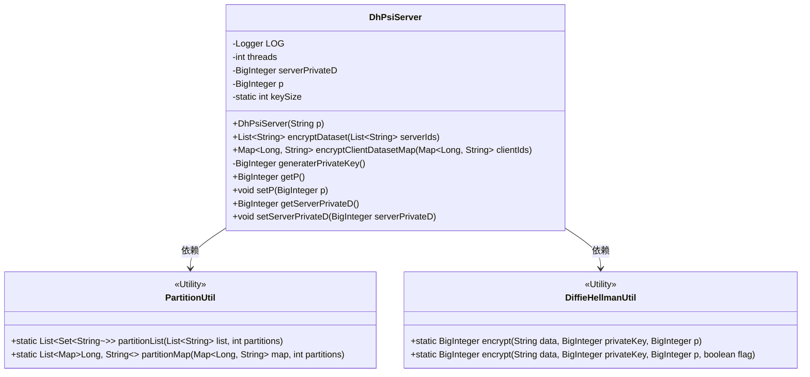
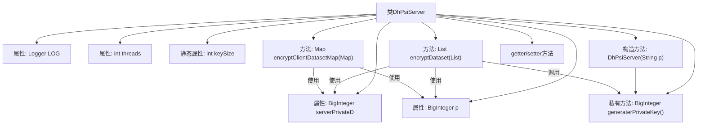

# 基础信息

|      |      |
|------|------|
| 名称 | DhPsiServer |
| 编码语言 | .java |
| 代码路径 | WeFe/mpc/mpc-psi/mpc-psi-sdk/src/main/java/com/welab/wefe/mpc/psi/sdk/dh/DhPsiServer.java |
| 包名 | com.welab.wefe.mpc.psi.sdk.dh |
| 依赖项 | ['java.math.BigInteger', 'java.util.List', 'java.util.Map', 'java.util.Random', 'java.util.Set', 'java.util.concurrent.ConcurrentHashMap', 'java.util.concurrent.CopyOnWriteArrayList', 'java.util.concurrent.ExecutorService', 'java.util.concurrent.Executors', 'java.util.concurrent.TimeUnit', 'org.slf4j.Logger', 'org.slf4j.LoggerFactory', 'com.welab.wefe.mpc.psi.sdk.util.PartitionUtil', 'com.welab.wefe.mpc.util.DiffieHellmanUtil'] |
| 概述说明 | DhPsiServer类实现基于Diffie-Hellman的PSI协议服务端功能，包含数据集加密、客户端数据加密及密钥生成方法，支持多线程处理。 |

# 说明

DhPsiServer类实现了基于Diffie-Hellman协议的服务器端PSI功能。核心功能包括：使用线程池并行处理数据加密，线程数默认为CPU核心数或8中的较大值；通过generaterPrivateKey方法生成1024位随机私钥；encryptDataset方法对服务器数据集进行加密，返回16进制字符串列表；encryptClientDatasetMap方法对客户端数据集进行加密，返回包含ID映射的并发哈希表。类中维护两个关键参数：服务器私钥serverPrivateD和大素数p，均使用BigInteger存储并提供getter/setter。所有加密操作均通过DiffieHellmanUtil工具类完成，并采用分区并行处理策略提升性能。

# 类列表 Class Summary

| 名称   | 类型  | 说明 |
|-------|------|-------------|
| DhPsiServer | class | DhPsiServer类实现基于Diffie-Hellman的PSI协议服务端功能，包含生成私钥、加密本地数据集和客户端数据集的方法，支持多线程处理。 |

## 类 DhPsiServer

|      |      |
|------|------|
| 访问范围 | public |
| 类型 | class |
| 名称 | DhPsiServer |
| 说明 | DhPsiServer类实现基于Diffie-Hellman的PSI协议服务端功能，包含生成私钥、加密本地数据集和客户端数据集的方法，支持多线程处理。 |

### UML类图

类图描述：DhPsiServer类实现了基于Diffie-Hellman密钥交换协议的PSI（Private Set Intersection）服务端逻辑，包含数据集加密、客户端数据加密等核心功能。通过PartitionUtil进行数据分片处理，利用DiffieHellmanUtil完成加密操作。类中包含线程池管理、大数运算等关键实现，私有成员包括服务器私钥和素数p，提供完整的加密流程控制。

### 内部方法调用关系图

流程图描述：该流程图展示了DhPsiServer类的结构和主要方法调用关系。类包含5个属性(LOG、threads、serverPrivateD、p、keySize)和4个核心方法(构造方法、encryptDataset、encryptClientDatasetMap、generaterPrivateKey)。关键流程是构造方法调用私钥生成器，两个加密方法都依赖私钥和素数p进行Diffie-Hellman加密操作，且都采用线程池并行处理数据分区。所有加密操作最终都会调用DiffieHellmanUtil工具类完成核心加密计算。

### 字段列表 Field List

| 名称  | 类型  | 说明 |
|-------|-------|------|
| p | BigInteger | 声明一个私有的大整数变量p。 |
| LOG = LoggerFactory.getLogger(DhPsiServer.class) | Logger | DhPsiServer类中定义了一个静态不可变的日志记录器实例LOG。 |
| keySize = 1024 | int | 定义了一个私有静态整型变量keySize，初始值为1024。 |
| serverPrivateD | BigInteger | 服务器私钥D值，BigInteger类型，用于加密或签名。 |
| threads = Math.max(Runtime.getRuntime().availableProcessors(), 8) | int | 设置线程数为CPU核心数与8的较大值。 |

### 方法列表

| 名称  | 类型  | 说明 |
|-------|-------|------|
| setServerPrivateD | void | 这是一个Java方法，用于设置服务器私钥D的值，将传入的BigInteger类型参数赋值给类的成员变量serverPrivateD。 |
| encryptDataset | List<String> | 该方法使用多线程加密数据集，将输入ID列表分区后并行加密，采用DiffieHellman算法，最终返回加密结果集合。 |
| generaterPrivateKey | BigInteger | 生成指定长度的随机大整数作为私钥。 |
| getP | BigInteger | 方法返回BigInteger类型的私有变量p的值。 |
| encryptClientDatasetMap | Map<Long, String> | 该方法使用多线程加密客户端数据集，将输入Map分区后并行处理，采用DiffieHellman算法加密值，最终返回加密后的ConcurrentHashMap。 |
| setP | void | 设置大整数p的值。 |
| getServerPrivateD | BigInteger | 获取服务器私钥D的方法，返回BigInteger类型值。 |

