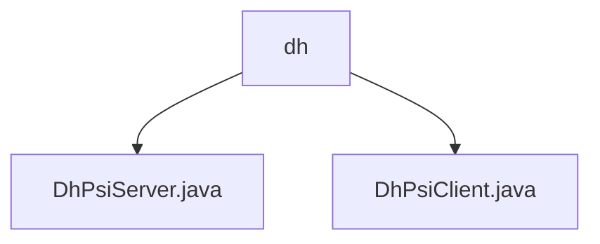

# 基础信息

|      |      |
|------|------|
| 名称 | dh |
| 编码语言 | .java |
| 代码路径 | WeFe/mpc/mpc-psi/mpc-psi-sdk/src/main/java/com/welab/wefe/mpc/psi/sdk/dh |
| 包名 | docs.mpc.mpc-psi.mpc-psi-sdk.src.main.java.com.welab.wefe.mpc.psi.sdk.dh |
| 概述说明 | DhPsiServer类实现基于Diffie-Hellman的服务器端PSI，支持多线程加密数据集，维护私钥和大素数。DhPsiClient类实现客户端PSI，包含密钥生成、ID加密和PSI计算，使用线程池和并发哈希表保证安全。 |

# 说明

## 概述  
该模块实现基于Diffie-Hellman协议的隐私集合求交(PSI)功能，包含服务端(DhPsiServer)和客户端(DhPsiClient)组件。核心职责包括并行化数据加密（例如使用线程池处理数据集）、密钥管理（例如生成1024位私钥）和PSI协议流程执行。关键数据结构包含BigInteger存储的私钥/大素数、ConcurrentHashMap维护的ID映射关系。依赖项涉及多线程并发控制、Diffie-Hellman加密算法，类似安全多方计算中的密钥交换模式。

## 主要业务场景  
典型流程分为服务端加密（例如encryptDataset生成16进制密文）和客户端交互（例如encryptClientDatasetMap建立ID映射）两个阶段。采用分区并行策略提升性能，例如线程数动态适配CPU核心数。完整PSI协议包含密钥生成、双向加密和结果比对，通过线程安全设计（如并发哈希表）保障数据一致性。API类型涵盖密钥操作、数据集加密和PSI计算，适用于跨机构数据安全匹配场景。

### 包内部结构视图

该流程图展示了WeFe项目中MPC-PSI-SDK模块下的DH协议相关代码结构。根节点为dh目录，包含两个Java实现文件：DhPsiServer.java（服务端逻辑）和DhPsiClient.java（客户端逻辑），共同构成基于DH算法的隐私保护集合求交功能实现。

# 文件列表

| 名称   | 类型  | 说明 |
|-------|------|-------------|
| [DhPsiServer.java](DhPsiServer.md) | file | DhPsiServer类实现基于Diffie-Hellman的PSI协议服务端功能，包含数据集加密、客户端数据加密及密钥生成方法，支持多线程处理。 |
| [DhPsiClient.java](DhPsiClient.md) | file | DhPsiClient类实现基于Diffie-Hellman的PSI协议，包含密钥生成、客户端/服务端数据加密及交集计算功能，支持多线程处理。 |

