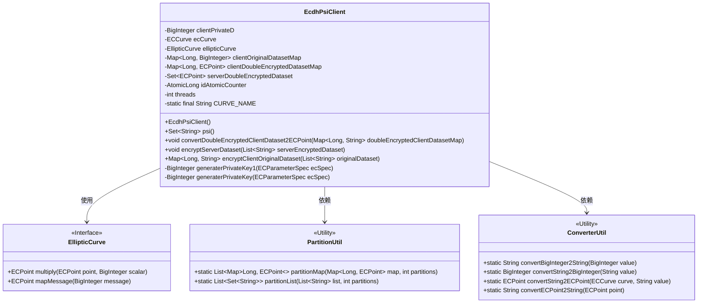

# 基础信息

|      |      |
|------|------|
| 名称 | EcdhPsiClient |
| 编码语言 | .java |
| 代码路径 | WeFe/mpc/mpc-psi/mpc-psi-sdk/src/main/java/com/welab/wefe/mpc/psi/sdk/ecdh/EcdhPsiClient.java |
| 包名 | com.welab.wefe.mpc.psi.sdk.ecdh |
| 依赖项 | ['java.math.BigInteger', 'java.security.InvalidAlgorithmParameterException', 'java.security.KeyPair', 'java.security.KeyPairGenerator', 'java.security.NoSuchAlgorithmException', 'java.security.NoSuchProviderException', 'java.security.SecureRandom', 'java.security.Security', 'java.util.List', 'java.util.Map', 'java.util.Set', 'java.util.concurrent.ConcurrentHashMap', 'java.util.concurrent.ExecutorService', 'java.util.concurrent.Executors', 'java.util.concurrent.TimeUnit', 'java.util.concurrent.atomic.AtomicLong', 'org.bouncycastle.jce.ECNamedCurveTable', 'org.bouncycastle.jce.interfaces.ECPrivateKey', 'org.bouncycastle.jce.provider.BouncyCastleProvider', 'org.bouncycastle.jce.spec.ECParameterSpec', 'org.bouncycastle.math.ec.ECCurve', 'org.bouncycastle.math.ec.ECPoint', 'org.slf4j.Logger', 'org.slf4j.LoggerFactory', 'com.welab.wefe.mpc.psi.sdk.util.ConverterUtil', 'com.welab.wefe.mpc.psi.sdk.util.PartitionUtil'] |
| 概述说明 | EcdhPsiClient类实现基于椭圆曲线的PSI协议，包含私钥生成、数据集加密、求交等功能，支持多线程处理。 |

# 说明

EcdhPsiClient是一个基于椭圆曲线加密的客户端PSI（私有集合求交）实现类。该类使用prime256v1椭圆曲线，包含客户端私钥、椭圆曲线参数和三个核心数据集映射表。主要功能包括：生成私钥、加密原始数据集、加密服务端数据集、转换二次加密数据集为椭圆曲线点、执行PSI求交操作。采用多线程处理数据，线程数默认为CPU核心数或8中的较大值。通过ECDH协议实现安全的两方PSI计算，最终返回交集结果。

# 类列表 Class Summary

| 名称   | 类型  | 说明 |
|-------|------|-------------|
| EcdhPsiClient | class | EcdhPsiClient类实现基于椭圆曲线的PSI协议客户端，包含密钥生成、数据集加密转换及求交功能，支持多线程处理。 |

## 类 EcdhPsiClient

|      |      |
|------|------|
| 访问范围 | public |
| 类型 | class |
| 名称 | EcdhPsiClient |
| 说明 | EcdhPsiClient类实现基于椭圆曲线的PSI协议客户端，包含密钥生成、数据集加密转换及求交功能，支持多线程处理。 |

### UML类图

类图描述：
EcdhPsiClient类实现了一个基于椭圆曲线密码学的隐私集合求交(PSI)客户端，包含密钥生成、数据加密和求交等核心功能。它依赖于EllipticCurve接口进行椭圆曲线运算，使用PartitionUtil进行数据分片处理，并通过ConverterUtil完成数据类型转换。类中维护了多个并发集合用于存储不同处理阶段的数据，并采用多线程方式提高处理效率。

### 内部方法调用关系图

```mermaid
graph TD
    A["类EcdhPsiClient"]
    B["属性: Logger LOG"]
    C["属性: BigInteger clientPrivateD"]
    D["属性: ECCurve ecCurve"]
    E["属性: EllipticCurve ellipticCurve"]
    F["属性: Map<Long,BigInteger> clientOriginalDatasetMap"]
    G["属性: Map<Long,ECPoint> clientDoubleEncryptedDatasetMap"]
    H["属性: Set<ECPoint> serverDoubleEncryptedDataset"]
    I["属性: AtomicLong idAtomicCounter"]
    J["属性: int threads"]
    K["构造方法: EcdhPsiClient()"]
    L["方法: Set<String> psi()"]
    M["方法: convertDoubleEncryptedClientDataset2ECPoint(Map<Long,String>)"]
    N["方法: encryptServerDataset(List<String>)"]
    O["方法: encryptClientOriginalDataset(List<String>)"]
    P["私有方法: generaterPrivateKey1(ECParameterSpec)"]
    Q["私有方法: generaterPrivateKey(ECParameterSpec)"]

    A --> B
    A --> C
    A --> D
    A --> E
    A --> F
    A --> G
    A --> H
    A --> I
    A --> J
    A --> K
    A --> L
    A --> M
    A --> N
    A --> O
    A -.-> P
    A -.-> Q
```

这段代码实现了一个基于ECDH(椭圆曲线迪菲-赫尔曼)的PSI(私有集合求交)客户端，主要用于安全地计算两个集合的交集而不泄露额外信息。流程图展示了类的主要结构和关键方法：包括初始化构造函数、PSI求交核心方法psi()、数据转换方法convertDoubleEncryptedClientDataset2ECPoint()、服务端数据集加密方法encryptServerDataset()、客户端原始数据集加密方法encryptClientOriginalDataset()，以及两个私钥生成方法。类通过多线程处理大数据集，使用ConcurrentHashMap保证线程安全，实现了完整的PSI协议流程。

### 字段列表 Field List

| 名称  | 类型  | 说明 |
|-------|-------|------|
| LOG = LoggerFactory.getLogger(EcdhPsiClient.class) | Logger | 定义EcdhPsiClient类的私有静态日志常量LOG。 |
| clientPrivateD | BigInteger | 客户端私钥D，BigInteger类型。 |
| CURVE_NAME = "prime256v1" | String | 定义了一个私有静态常量字符串CURVE_NAME，值为椭圆曲线名称"prime256v1"。 |
| ecCurve | ECCurve | 私有成员变量，类型为ECCurve，表示椭圆曲线。 |
| clientDoubleEncryptedDatasetMap | Map<Long, ECPoint> | 私有映射，键为长整型，值为椭圆曲线点，存储客户端双重加密数据集。 |
| serverDoubleEncryptedDataset | Set<ECPoint> | 私有集合，存储服务器双重加密数据点。 |
| clientOriginalDatasetMap | Map<Long, BigInteger> | 存储客户端原始数据集的映射，键为长整型，值为大整数。 |
| threads = Math.max(Runtime.getRuntime().availableProcessors(), 8) | int | 代码设置线程数为CPU核心数与8中的较大值。 |
| idAtomicCounter | AtomicLong | 原子长整型计数器，用于线程安全的ID生成。 |
| ellipticCurve | EllipticCurve | 椭圆曲线私有成员变量 |

### 方法列表

| 名称  | 类型  | 说明 |
|-------|-------|------|
| convertDoubleEncryptedClientDataset2ECPoint | void | 该方法将双重加密的客户端数据集转换为椭圆曲线点。若目标映射非空则直接返回。遍历输入映射，使用工具类将字符串转为椭圆曲线点并存入目标映射。记录开始和结束日志。 |
| generaterPrivateKey | BigInteger | 生成EC私钥：基于EC参数规范，使用安全随机数创建小于N的随机数k作为私钥。 |
| encryptServerDataset | void | 客户端使用多线程加密服务器数据集，将字符串转换为椭圆曲线点并乘以私钥，结果存入并发集合。 |
| encryptClientOriginalDataset | Map<Long, String> | 该方法使用多线程加密客户端原始数据集，将数据分区后并发处理，转换为BigInteger并利用椭圆曲线加密，最终返回加密后的数据集映射。 |
| psi | Set<String> | 该方法使用多线程进行客户端与服务端数据集的隐私求交（PSI），将客户端数据分片后并行匹配服务端加密数据，最终返回交集结果。 |
| generaterPrivateKey1 | BigInteger | 废弃方法generaterPrivateKey1：使用BouncyCastle生成EC私钥，返回BigInteger类型密钥值。含异常处理和日志记录。 |

