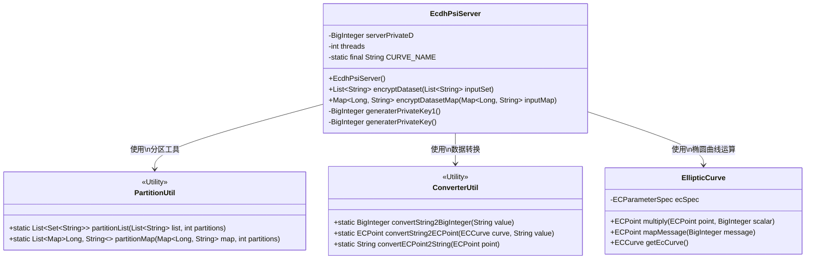
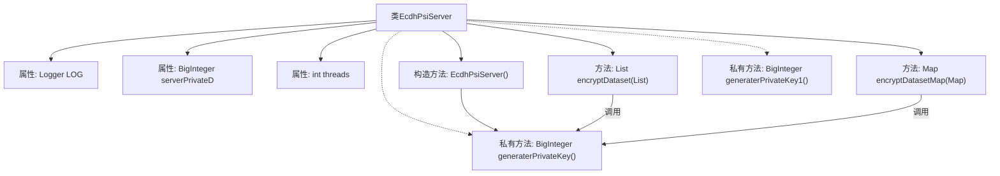
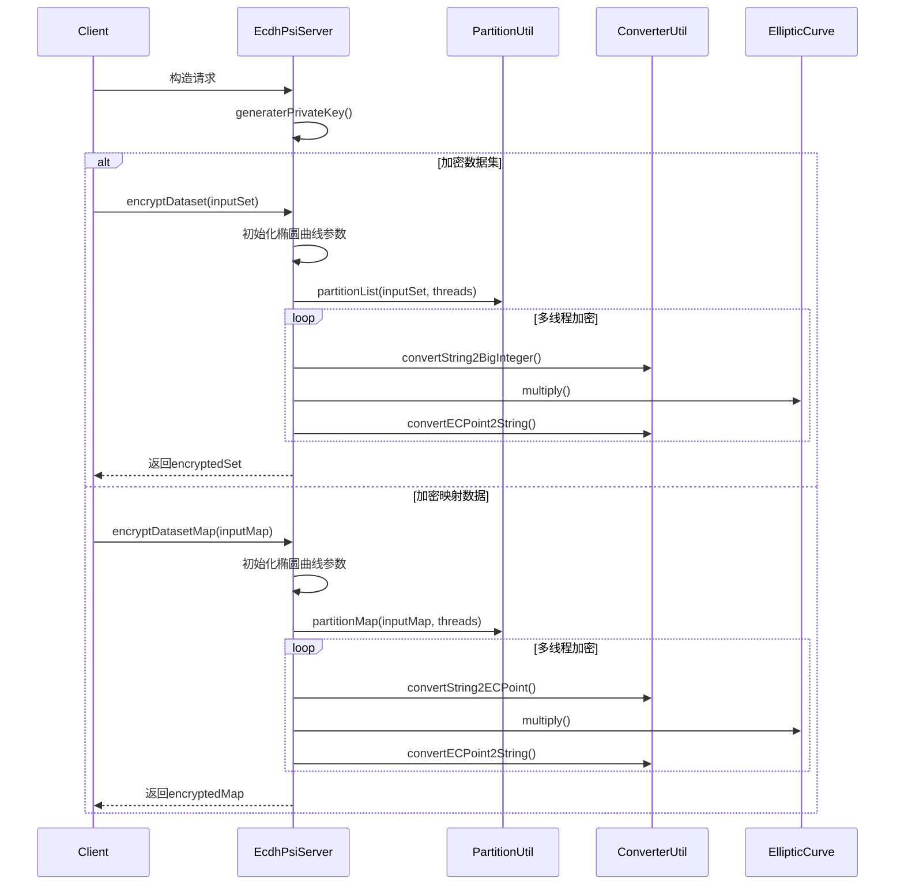

# 基础信息

|      |      |
|------|------|
| 名称 | EcdhPsiServer |
| 编码语言 | .java |
| 代码路径 | WeFe/mpc/mpc-psi/mpc-psi-sdk/src/main/java/com/welab/wefe/mpc/psi/sdk/ecdh/EcdhPsiServer.java |
| 包名 | com.welab.wefe.mpc.psi.sdk.ecdh |
| 依赖项 | ['java.math.BigInteger', 'java.security.InvalidAlgorithmParameterException', 'java.security.KeyPair', 'java.security.KeyPairGenerator', 'java.security.NoSuchAlgorithmException', 'java.security.NoSuchProviderException', 'java.security.SecureRandom', 'java.security.Security', 'java.util.List', 'java.util.Map', 'java.util.Set', 'java.util.concurrent.ConcurrentHashMap', 'java.util.concurrent.CopyOnWriteArrayList', 'java.util.concurrent.ExecutorService', 'java.util.concurrent.Executors', 'java.util.concurrent.TimeUnit', 'org.bouncycastle.jce.ECNamedCurveTable', 'org.bouncycastle.jce.interfaces.ECPrivateKey', 'org.bouncycastle.jce.provider.BouncyCastleProvider', 'org.bouncycastle.jce.spec.ECParameterSpec', 'org.bouncycastle.math.ec.ECCurve', 'org.bouncycastle.math.ec.ECPoint', 'org.slf4j.Logger', 'org.slf4j.LoggerFactory', 'com.welab.wefe.mpc.psi.sdk.util.ConverterUtil', 'com.welab.wefe.mpc.psi.sdk.util.PartitionUtil'] |
| 概述说明 | EcdhPsiServer类实现基于椭圆曲线的隐私集合求交服务端逻辑，包含数据集加密、客户端数据加密及私钥生成功能，使用多线程优化性能。 |

# 说明

EcdhPsiServer类实现了基于椭圆曲线加密的服务器端私有集合求交功能。该类包含三个核心方法：generaterPrivateKey生成随机私钥；encryptDataset使用私钥加密本地数据集，将字符串转换为椭圆曲线点并乘以私钥；encryptDatasetMap对客户端输入数据进行类似加密操作。加密过程采用多线程并行处理，线程数默认为CPU核心数与8的较大值。使用prime256v1椭圆曲线参数，包含完整的线程池管理和错误处理机制。废弃的generaterPrivateKey1方法展示了旧版密钥生成方式。

# 类列表 Class Summary

| 名称   | 类型  | 说明 |
|-------|------|-------------|
| EcdhPsiServer | class | EcdhPsiServer类实现基于椭圆曲线的隐私集合求交服务端逻辑，包含私钥生成、数据集加密和客户端数据加密功能，使用多线程优化性能。 |

## 类 EcdhPsiServer

|      |      |
|------|------|
| 访问范围 | public |
| 类型 | class |
| 名称 | EcdhPsiServer |
| 说明 | EcdhPsiServer类实现基于椭圆曲线的隐私集合求交服务端逻辑，包含私钥生成、数据集加密和客户端数据加密功能，使用多线程优化性能。 |

### UML类图

该图展示了ECDH-PSI（椭圆曲线迪菲-赫尔曼私有集合交集）服务端的核心结构。EcdhPsiServer通过椭圆曲线加密实现私有数据比对，包含密钥生成、数据集加密和客户端数据加密功能。依赖三个工具类：PartitionUtil用于数据分片并行处理，ConverterUtil处理数据类型转换，EllipticCurve封装椭圆曲线数学运算。系统采用线程池并行处理，支持大规模数据集加密，通过ECPoint实现基于椭圆曲线的加密点运算。

### 内部方法调用关系图

流程图展示了EcdhPsiServer类的结构，包含属性、构造方法和主要功能方法。时序图详细描述了两种加密流程：数据集加密和映射数据加密，均采用多线程处理并调用相同的私钥生成和椭圆曲线加密操作。整个流程体现了基于ECDH的PSI协议服务端实现，通过线程池并行处理数据，最后返回加密结果。

### 字段列表 Field List

| 名称  | 类型  | 说明 |
|-------|-------|------|
| threads = Math.max(Runtime.getRuntime().availableProcessors(), 8) | int | 代码设置线程数为CPU核心数与8的较大值。 |
| CURVE_NAME = "prime256v1" | String | 定义常量CURVE_NAME，值为椭圆曲线名称"prime256v1"。 |
| LOG = LoggerFactory.getLogger(EcdhPsiServer.class) | Logger | EcdhPsiServer类中定义了一个静态不可变的日志记录器实例LOG。 |
| serverPrivateD | BigInteger | 服务器私钥D值，BigInteger类型。 |

### 方法列表

| 名称  | 类型  | 说明 |
|-------|-------|------|
| encryptDataset | List<String> | 方法encryptDataset使用多线程和椭圆曲线加密算法对输入数据集进行加密处理，返回加密后的数据集。 |
| encryptDatasetMap | Map<Long, String> | 该方法使用椭圆曲线加密算法并行加密输入Map中的字符串值。初始化椭圆曲线参数后，将输入Map分区并多线程处理，每个线程将字符串转为椭圆曲线点并用私钥加密，最后合并结果返回加密后的Map。 |
| generaterPrivateKey1 | BigInteger | 废弃方法generaterPrivateKey1，使用BouncyCastle生成EC私钥，基于prime256v1曲线，异常时抛出运行时错误。 |
| generaterPrivateKey | BigInteger | 生成ECDSA私钥：使用prime256v1曲线，基于安全随机数创建小于曲线阶数n的大整数k。 |

