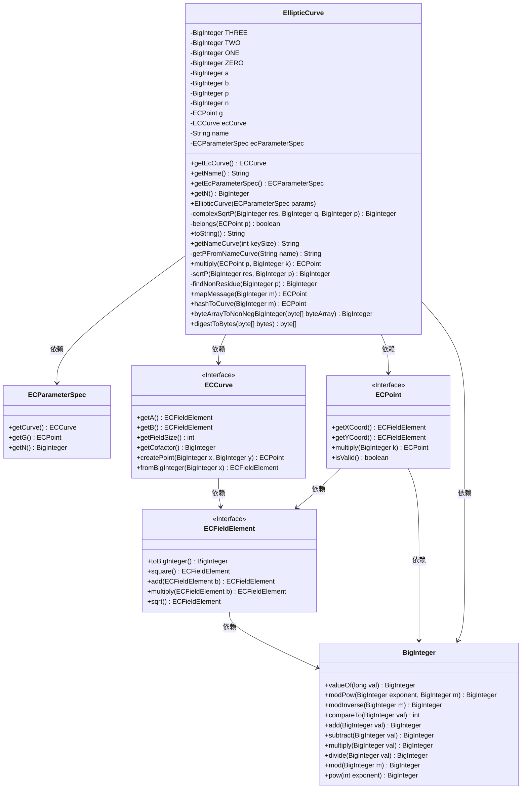
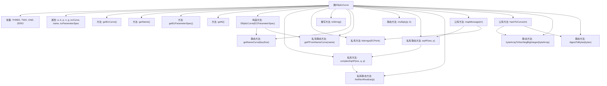

# 基础信息

|      |      |
|------|------|
| 名称 | EllipticCurve |
| 编码语言 | .java |
| 代码路径 | WeFe/mpc/mpc-psi/mpc-psi-sdk/src/main/java/com/welab/wefe/mpc/psi/sdk/ecdh/EllipticCurve.java |
| 包名 | com.welab.wefe.mpc.psi.sdk.ecdh |
| 依赖项 | ['java.math.BigInteger', 'java.security.MessageDigest', 'java.util.Objects', 'org.bouncycastle.jce.spec.ECParameterSpec', 'org.bouncycastle.math.ec.ECCurve', 'org.bouncycastle.math.ec.ECFieldElement', 'org.bouncycastle.math.ec.ECPoint'] |
| 概述说明 | 椭圆曲线类，包含参数初始化、点映射、哈希转换及模平方根计算等功能，支持多种标准曲线。 |

# 说明

该代码定义了一个椭圆曲线类EllipticCurve，包含曲线参数a、b、p、n和基点G等属性。提供了构造方法初始化曲线参数，支持获取曲线名称、参数规格和阶数n。实现了点乘运算、消息映射到曲线点的功能，包含两种方法：mapMessage通过尝试计算坐标点，hashToCurve通过哈希生成有效点。还提供了模p平方根计算、非二次剩余查找等辅助方法，以及验证点是否在曲线上的belongs方法。类中定义了常见椭圆曲线名称与参数的映射关系，支持160到521位密钥尺寸的曲线选择。

# 类列表 Class Summary

| 名称   | 类型  | 说明 |
|-------|------|-------------|
| EllipticCurve | class | 椭圆曲线类，包含参数初始化、点映射、哈希转换及数学运算功能，支持多种标准曲线如secp160r2、secp256v1等。 |

## 类 EllipticCurve

|      |      |
|------|------|
| 访问范围 | public |
| 类型 | class |
| 名称 | EllipticCurve |
| 说明 | 椭圆曲线类，包含参数初始化、点映射、哈希转换及数学运算功能，支持多种标准曲线如secp160r2、secp256v1等。 |

### UML类图

这段代码定义了一个椭圆曲线类`EllipticCurve`，用于处理椭圆曲线密码学相关操作。类中包含多个私有BigInteger常量，以及椭圆曲线参数a、b、p、n等。主要功能包括：通过ECParameterSpec初始化曲线参数、计算平方根、检查点是否在曲线上、映射消息到曲线点、哈希到曲线等操作。类与ECPoint、ECCurve、ECFieldElement等接口有依赖关系，共同实现椭圆曲线密码学功能。代码还包含多个辅助方法用于处理大整数运算和曲线参数转换。

### 内部方法调用关系图

这段代码实现了一个椭圆曲线类(EllipticCurve)，包含椭圆曲线的基本参数和操作。主要功能包括：通过ECParameterSpec初始化曲线参数、计算模平方根、验证点是否在曲线上、消息映射到曲线点、哈希到曲线点等。类中定义了多个静态工具方法用于处理大整数运算和曲线参数转换，核心算法涉及模运算和椭圆曲线点运算。流程图展示了类成员之间的调用关系，特别是mapMessage和hashToCurve这两个核心方法如何依赖其他辅助方法完成功能。

### 字段列表 Field List

| 名称  | 类型  | 说明 |
|-------|-------|------|
| b | BigInteger | 声明一个私有的大整数变量b。 |
| g | ECPoint | 椭圆曲线点g的私有声明。 |
| a | BigInteger | 私有的大整数变量a。 |
| ZERO = BigInteger.valueOf(0) | BigInteger | 定义静态常量ZERO，值为BigInteger类型的0。 |
| n | BigInteger | 私有的大整数变量n。 |
| p | BigInteger | 声明一个私有的大整数变量p。 |
| ecParameterSpec | ECParameterSpec | 私有椭圆曲线参数规范变量ecParameterSpec。 |
| ecCurve | ECCurve | 椭圆曲线密码学中的曲线对象。 |
| TWO = BigInteger.valueOf(2) | BigInteger | 定义了一个私有静态不可变的BigInteger常量TWO，值为2。 |
| THREE = BigInteger.valueOf(3) | BigInteger | 定义不可变常量THREE，值为BigInteger类型的3。 |
| name | String | 私有字符串变量name |
| ONE = BigInteger.valueOf(1) | BigInteger | 定义了一个私有静态常量ONE，值为BigInteger类型的1。 |

### 方法列表

| 名称  | 类型  | 说明 |
|-------|-------|------|
| getNameCurve | String | 根据密钥长度返回对应椭圆曲线名称，不支持则抛出异常。支持160/224/256/384/512/521。 |
| toString | String | 椭圆曲线参数：A、B、P、N、G。 |
| getN | BigInteger | 获取BigInteger类型的n值的方法。 |
| getEcParameterSpec | ECParameterSpec | 获取当前椭圆曲线参数规范对象。 |
| digestToBytes | byte[] | 将输入的字节数组转为字符串后计算其MD5哈希值，返回哈希字节数组。异常时抛出运行时异常。 |
| getEcCurve | ECCurve | 方法getEcCurve返回当前对象的ecCurve属性值。 |
| getName | String | 该方法返回对象的名称属性值。 |
| multiply | ECPoint | 静态方法multiply接收ECPoint和BigInteger参数，调用ECPoint的multiply方法并返回结果。 |
| mapMessage | ECPoint | 该方法将消息m映射为椭圆曲线上的点。通过循环尝试k次，计算x和y值，验证y是否为模p的平方剩余。若找到有效点则返回，否则抛出异常。 |
| sqrtP | BigInteger | 该方法计算模平方根：若res的q次方模p不为1，调用complexSqrtP；否则返回res的(q+1)/2次方模p。q初始为(p-1)/2并不断除2直至奇数。 |
| findNonResidue | BigInteger | 该方法通过递增测试整数a，寻找满足模p二次非剩余条件的数，若找不到则返回null。 |
| belongs | boolean | 检查点p是否在椭圆曲线上，通过验证y² ≡ x³ + a·x + b (mod p)是否成立。 |
| getPFromNameCurve | String | 根据曲线名称返回对应的参数P值，不支持的曲线抛出异常。 |
| byteArrayToNonNegBigInteger | BigInteger | 将字节数组转换为非负大整数，使用BigInteger构造函数并指定符号为正。 |
| complexSqrtP | BigInteger | 该方法计算模p下的复数平方根，通过寻找非剩余数a，调整指数t和q，最终组合逆元和模幂结果得到根值。 |
| hashToCurve | ECPoint | 哈希消息生成椭圆曲线点：循环哈希消息，尝试构造x和y坐标，验证有效性后返回清除余因子的点。 |

