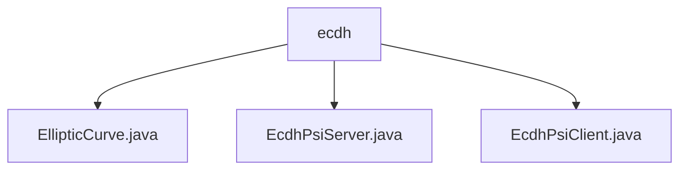

# 基础信息

|      |      |
|------|------|
| 名称 | ecdh |
| 编码语言 | .java |
| 代码路径 | WeFe/mpc/mpc-psi/mpc-psi-sdk/src/main/java/com/welab/wefe/mpc/psi/sdk/ecdh |
| 包名 | docs.mpc.mpc-psi.mpc-psi-sdk.src.main.java.com.welab.wefe.mpc.psi.sdk.ecdh |
| 概述说明 | EllipticCurve类定义椭圆曲线参数和运算方法，支持点乘、哈希映射和验证。EcdhPsiServer实现服务器端PSI，含私钥生成、数据集加密和多线程处理。EcdhPsiClient实现客户端PSI，支持私钥生成、数据加密和ECDH协议求交。均使用prime256v1曲线和多线程优化。 |

# 说明

## 概述  
该模块实现基于椭圆曲线加密(ECDH)的私有集合求交(PSI)功能，包含曲线参数管理、点运算和加解密核心逻辑。EllipticCurve类封装了secp256r1(prime256v1)等标准曲线参数，提供点乘、哈希映射等基础操作，类似密码学工具包。EcdhPsiServer和EcdhPsiClient分别实现服务端与客户端的PSI协议流程，通过多线程并行处理数据集加密与求交。例如客户端通过hashToCurve将数据映射为曲线点，服务端使用generaterPrivateKey生成临时密钥进行加密。

关键数据结构包括椭圆曲线参数(a/b/p/n/G)、加密数据集映射表。外部依赖仅涉及Java标准库和椭圆曲线标准参数。模块支持160-521位密钥尺寸，默认采用256位曲线，线程池规模动态适配CPU核心数。例如废弃的generaterPrivateKey1方法保留了兼容性设计。

## 主要业务场景  
完整PSI流程分为三阶段：1)双方生成临时私钥；2)客户端加密本地数据并发送，服务端加密双方数据集；3)交换二次加密结果求交。类似密钥协商模式，通过ECDH实现双向加密。例如encryptDatasetMap方法将字符串转为曲线点后执行标量乘法。  

典型应用包括安全用户匹配，如在不暴露原始数据前提下计算双方交集。交互模式采用"客户端-服务端"架构，API类型涵盖密钥生成(如generaterPrivateKey)、数据集加密(如encryptDataset)和结果求交。线程池优化处理大规模数据，例如默认线程数为max(CPU核心数,8)。模块通过belongs方法验证点有效性，确保协议安全性。

### 包内部结构视图

该流程图展示了ecdh目录下的三个Java文件：EllipticCurve.java、EcdhPsiServer.java和EcdhPsiClient.java。这些文件都属于椭圆曲线密钥交换(ECDH)相关的PSI(隐私保护集合求交)功能实现，其中包含椭圆曲线基础类、服务端和客户端实现，构成了一个完整的ECDH-PSI功能模块。

# 文件列表

| 名称   | 类型  | 说明 |
|-------|------|-------------|
| [EllipticCurve.java](EllipticCurve.md) | file | 椭圆曲线类，包含参数初始化、点映射、哈希转换及模平方根计算等功能，支持多种标准曲线。 |
| [EcdhPsiServer.java](EcdhPsiServer.md) | file | EcdhPsiServer类实现基于椭圆曲线的隐私集合求交服务端逻辑，包含数据集加密、客户端数据加密及私钥生成功能，使用多线程优化性能。 |
| [EcdhPsiClient.java](EcdhPsiClient.md) | file | EcdhPsiClient类实现基于椭圆曲线的PSI协议，包含私钥生成、数据集加密、求交等功能，支持多线程处理。 |

