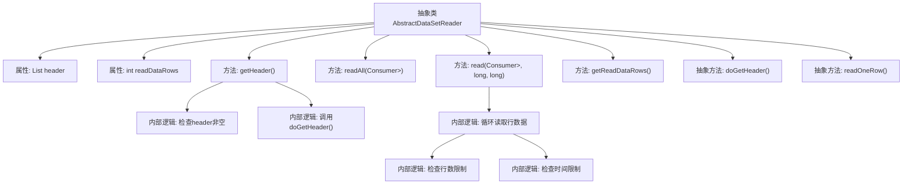

# 基础信息

|      |      |
|------|------|
| 名称 | AbstractDataSetReader |
| 编码语言 | .java |
| 代码路径 | WeFe/mpc/mpc-psi/mpc-psi-sdk/src/main/java/com/welab/wefe/mpc/psi/sdk/excel/AbstractDataSetReader.java |
| 包名 | com.welab.wefe.mpc.psi.sdk.excel |
| 依赖项 | ['java.io.Closeable', 'java.util.LinkedHashMap', 'java.util.List', 'java.util.Map', 'java.util.function.Consumer'] |
| 概述说明 | 抽象类AbstractDataSetReader实现Closeable接口，提供读取数据集功能，含获取表头、读取数据行方法，支持行数和时间限制。 |

# 说明

AbstractDataSetReader是一个抽象类，实现了Closeable接口，用于读取数据集。它包含保护字段header存储列头信息，readDataRows记录已读取行数。提供getHeader方法获取列头，若未加载则调用抽象方法doGetHeader实现。readAll方法读取所有数据行，通过Consumer处理每行数据。read方法支持限制最大读取行数和时间，内部调用抽象方法readOneRow逐行读取数据。子类需实现doGetHeader和readOneRow来完成具体数据读取逻辑。

# 类列表 Class Summary

| 名称   | 类型  | 说明 |
|-------|------|-------------|
| AbstractDataSetReader | class | 抽象类AbstractDataSetReader实现Closeable接口，提供读取数据集功能，包含获取表头、读取数据行等方法，支持行数和时间限制。需子类实现具体读取逻辑。 |


## 类 AbstractDataSetReader

|      |      |
|------|------|
| 访问范围 | public abstract |
| 类型 | class |
| 名称 | AbstractDataSetReader |
| 说明 | 抽象类AbstractDataSetReader实现Closeable接口，提供读取数据集功能，包含获取表头、读取数据行等方法，支持行数和时间限制。需子类实现具体读取逻辑。 |


### UML类图

```mermaid
classDiagram
    class AbstractDataSetReader {
        <<abstract>>
        -List~String~ header
        -int readDataRows
        +getHeader() List~String~
        +readAll(Consumer~Map~String,Object~~ dataRowConsumer)
        +read(Consumer~Map~String,Object~~ dataRowConsumer, long maxReadRows, long maxReadTimeInMs)
        +getReadDataRows() int
        #doGetHeader() List~String~
        #readOneRow() LinkedHashMap~String,Object~
    }
    AbstractDataSetReader ..|> Closeable : 实现

    interface Closeable {
        <<Interface>>
        +close()
    }
```

这段代码定义了一个抽象类`AbstractDataSetReader`，它实现了`Closeable`接口，主要用于读取数据集。该类提供了获取表头(`getHeader`)、读取数据行(`readAll`和`read`)的功能，并跟踪已读取的行数(`readDataRows`)。其中`doGetHeader`和`readOneRow`是抽象方法，需要子类实现具体的数据读取逻辑。类设计采用了模板方法模式，通过抽象方法让子类实现具体的数据读取细节，而父类控制整体读取流程。该类支持限制读取行数和读取时间的功能，适合处理大规模数据集。


### 内部方法调用关系图



该流程图展示了AbstractDataSetReader抽象类的结构和主要方法调用关系。类包含2个属性和5个方法，其中2个是抽象方法。核心逻辑集中在数据读取流程，包括header获取和行数据循环读取，其中read方法实现了双重限制检查（行数和时间）。抽象方法doGetHeader和readOneRow需要子类实现具体数据源操作。

### 字段列表 Field List

| 名称  | 类型  | 说明 |
|-------|-------|------|
| readDataRows = 0 | int | 变量readDataRows记录已读取的数据行数，类型为受保护的整型。 |
| header | List<String> | 声明一个受保护的类型为字符串列表的变量header。 |

### 方法列表

| 名称  | 类型  | 说明 |
|-------|-------|------|
| readAll | void | 定义方法readAll，接受一个处理Map数据的Consumer参数，调用read方法并传入-1作为参数，可能抛出异常。 |
| getHeader | List<String> | 该方法获取header列表，若已存在则直接返回；否则调用doGetHeader()获取，失败抛出异常，成功则缓存并返回结果。 |
| read | void | 该方法逐行读取数据，每行传递给消费者处理。支持限制读取行数和时间，超限时停止读取。 |
| getReadDataRows | int | 这是一个Java方法，返回整型变量readDataRows的值。 |
| doGetHeader | List<String> | 抽象方法，返回字符串列表，可能抛出异常。 |
| readOneRow | LinkedHashMap<String, Object> | 抽象方法readOneRow，返回LinkedHashMap<String, Object>，可能抛出异常。 |


