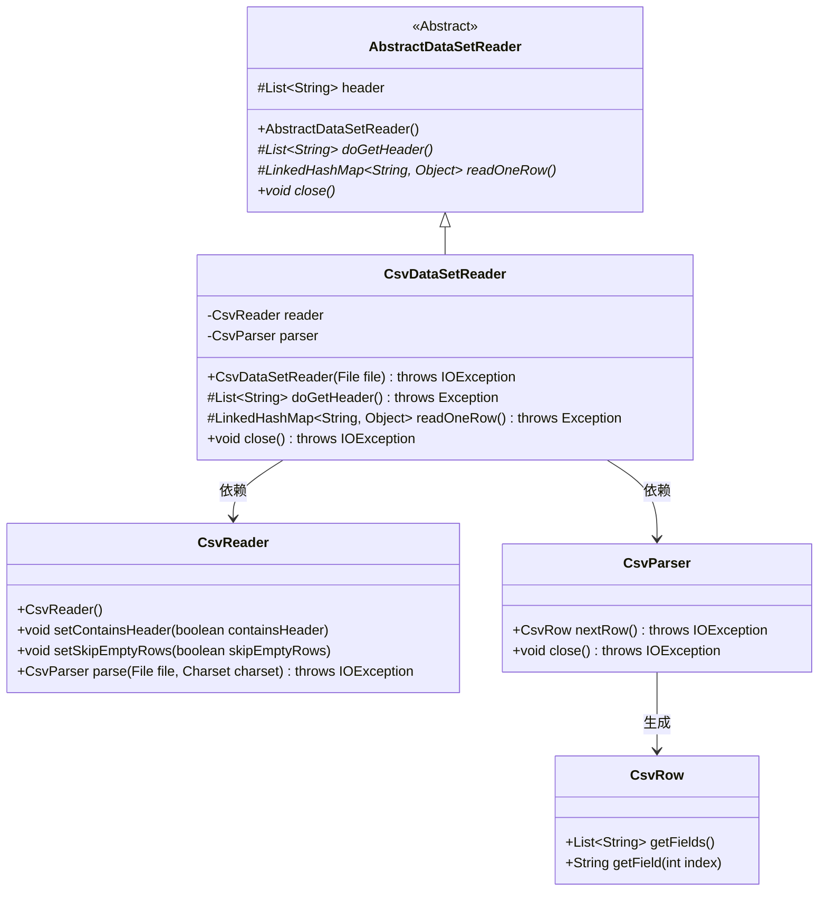
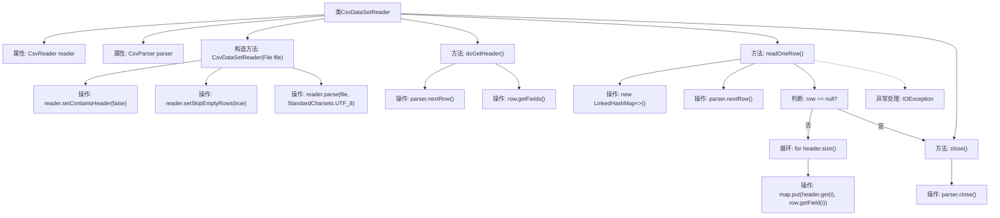

# 基础信息

|      |      |
|------|------|
| 名称 | CsvDataSetReader |
| 编码语言 | .java |
| 代码路径 | WeFe/mpc/mpc-psi/mpc-psi-sdk/src/main/java/com/welab/wefe/mpc/psi/sdk/excel/CsvDataSetReader.java |
| 包名 | com.welab.wefe.mpc.psi.sdk.excel |
| 依赖项 | ['de.siegmar.fastcsv.reader.CsvParser', 'de.siegmar.fastcsv.reader.CsvReader', 'de.siegmar.fastcsv.reader.CsvRow', 'java.io.File', 'java.io.IOException', 'java.nio.charset.StandardCharsets', 'java.util.LinkedHashMap', 'java.util.List'] |
| 概述说明 | CsvDataSetReader类继承AbstractDataSetReader，通过CsvReader解析CSV文件，支持无表头、跳过空行，提供读取表头和逐行数据功能，最后关闭解析器。 |

# 说明

CsvDataSetReader类继承自AbstractDataSetReader，用于读取CSV文件数据。初始化时配置CsvReader不包含表头且跳过空行，使用UTF-8编码解析文件。doGetHeader方法获取首行作为表头，readOneRow方法逐行读取数据并映射为键值对，键为表头字段，值为对应数据。读取完毕或出错时返回null或抛出异常。close方法关闭解析器释放资源。

# 类列表 Class Summary

| 名称   | 类型  | 说明 |
|-------|------|-------------|
| CsvDataSetReader | class | CsvDataSetReader类继承AbstractDataSetReader，通过CsvReader解析CSV文件，提供获取表头和逐行读取数据功能，最后关闭解析器。 |

## 类 CsvDataSetReader

|      |      |
|------|------|
| 访问范围 | public |
| 类型 | class |
| 名称 | CsvDataSetReader |
| 说明 | CsvDataSetReader类继承AbstractDataSetReader，通过CsvReader解析CSV文件，提供获取表头和逐行读取数据功能，最后关闭解析器。 |

### UML类图

类图描述：该图展示了CSV数据集读取器的类结构。CsvDataSetReader继承自抽象类AbstractDataSetReader，实现了读取CSV文件的核心功能。它依赖CsvReader进行基础解析操作，并通过CsvParser逐行处理数据。CsvRow类封装单行数据字段的访问逻辑。整体设计遵循模板方法模式，父类定义算法骨架，子类实现具体步骤。

### 内部方法调用关系图

该流程图展示了CsvDataSetReader类的结构和主要方法调用关系。从构造函数初始化reader和parser开始，到doGetHeader()读取CSV文件头，readOneRow()逐行处理数据，最后通过close()关闭解析器。重点描述了readOneRow()中的空行判断、字段映射和异常处理逻辑，体现了CSV数据读取的完整流程和错误处理机制。

### 字段列表 Field List

| 名称  | 类型  | 说明 |
|-------|-------|------|
| reader = new CsvReader() | CsvReader | 声明一个私有CsvReader对象reader并实例化。 |
| parser | CsvParser | 私有成员变量parser，类型为CsvParser。 |

### 方法列表

| 名称  | 类型  | 说明 |
|-------|-------|------|
| close | void | 该方法重写close()，调用parser.close()并可能抛出IOException。 |
| doGetHeader | List<String> | 重写doGetHeader方法，从CSV解析器获取下一行数据并返回字段列表。 |
| readOneRow | LinkedHashMap<String, Object> | 该方法读取CSV文件的一行数据，转换为键值对映射。若读取失败或数据结束返回null，成功则返回包含表头与对应值的LinkedHashMap。异常时抛出错误信息。 |

