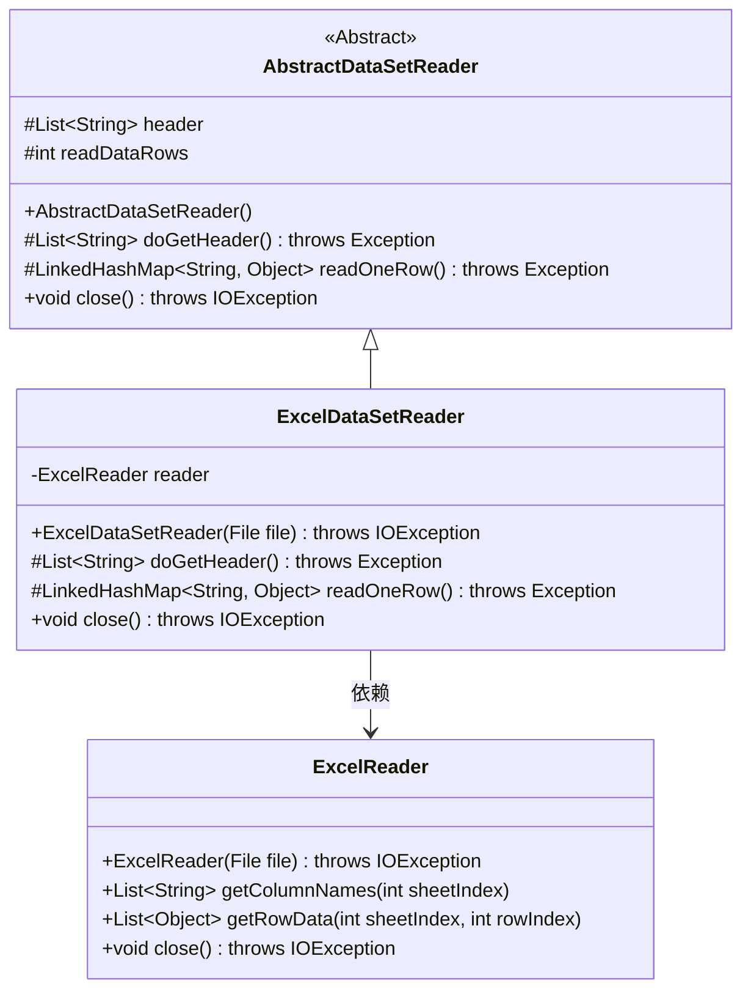
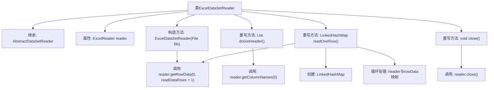

# 基础信息

|      |      |
|------|------|
| 名称 | ExcelDataSetReader |
| 编码语言 | .java |
| 代码路径 | WeFe/mpc/mpc-psi/mpc-psi-sdk/src/main/java/com/welab/wefe/mpc/psi/sdk/excel/ExcelDataSetReader.java |
| 包名 | com.welab.wefe.mpc.psi.sdk.excel |
| 依赖项 | ['java.io.File', 'java.io.IOException', 'java.util.LinkedHashMap', 'java.util.List'] |
| 概述说明 | Excel数据集读取类，继承抽象类，通过ExcelReader读取文件，提供获取表头、逐行读取数据及关闭资源功能。 |

# 说明

ExcelDataSetReader是一个继承自AbstractDataSetReader的类，用于读取Excel文件数据。它通过ExcelReader实例处理文件输入，提供获取表头、逐行读取数据及关闭资源的功能。获取表头时读取首行列名，读取行数据时将每行内容映射到表头对应的键值对中，不足的列补NULL，最后通过close方法释放资源。

# 类列表 Class Summary

| 名称   | 类型  | 说明 |
|-------|------|-------------|
| ExcelDataSetReader | class | ExcelDataSetReader类继承AbstractDataSetReader，通过ExcelReader读取文件数据，提供获取表头、逐行读取数据及关闭资源的功能。 |

## 类 ExcelDataSetReader

|      |      |
|------|------|
| 访问范围 | public |
| 类型 | class |
| 名称 | ExcelDataSetReader |
| 说明 | ExcelDataSetReader类继承AbstractDataSetReader，通过ExcelReader读取文件数据，提供获取表头、逐行读取数据及关闭资源的功能。 |

### UML类图

这段代码展示了一个Excel数据集读取器的实现。ExcelDataSetReader继承自抽象类AbstractDataSetReader，通过ExcelReader来读取Excel文件内容。主要功能包括获取表头(doGetHeader)、逐行读取数据(readOneRow)和关闭资源(close)。类图中清晰地展示了继承关系和依赖关系，ExcelDataSetReader作为具体实现类，依赖于ExcelReader来完成底层Excel文件操作。抽象基类定义了核心数据结构和抽象方法，子类实现了具体的Excel文件处理逻辑。

### 内部方法调用关系图

该流程图展示了ExcelDataSetReader类的继承关系和核心方法调用链。作为AbstractDataSetReader的子类，它通过ExcelReader实现Excel文件操作，包含构造方法初始化、三处重写方法（获取表头、读取单行数据、关闭资源），其中readOneRow()方法包含数据行读取、空值处理和LinkedHashMap构建等关键步骤。各方法通过reader实例与底层ExcelReader交互，形成完整的Excel数据读取流程。

### 字段列表 Field List

| 名称  | 类型  | 说明 |
|-------|-------|------|
| reader | ExcelReader | 私有Excel读取器实例。 |

### 方法列表

| 名称  | 类型  | 说明 |
|-------|-------|------|
| doGetHeader | List<String> | 方法重写，返回表格首行的列名列表。 |
| readOneRow | LinkedHashMap<String, Object> | 方法readOneRow读取一行数据，若数据为空返回null，否则将数据与表头映射为键值对，不足字段补NULL。 |
| close | void | Java方法重写，调用reader.close()关闭资源，可能抛出IOException。 |

