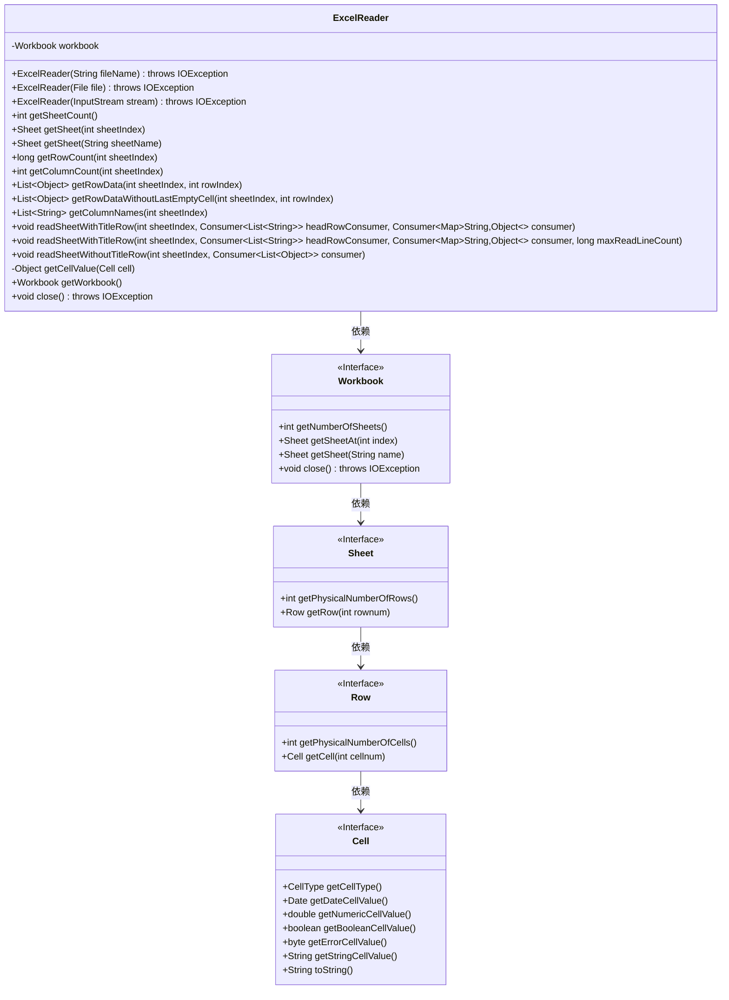
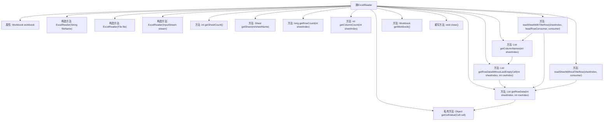
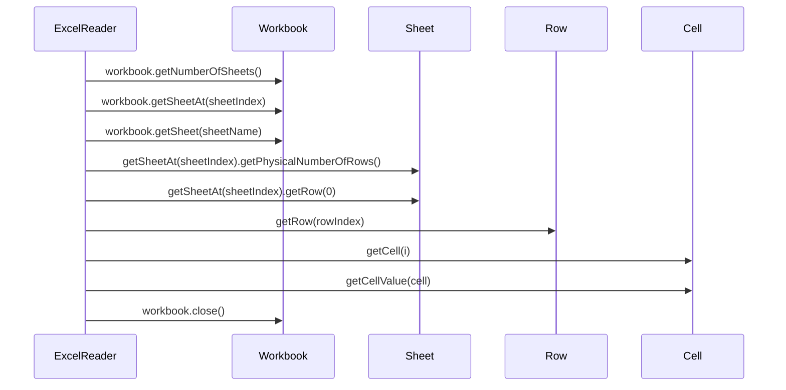

# 基础信息

|      |      |
|------|------|
| 名称 | ExcelReader |
| 编码语言 | .java |
| 代码路径 | WeFe/mpc/mpc-psi/mpc-psi-sdk/src/main/java/com/welab/wefe/mpc/psi/sdk/excel/ExcelReader.java |
| 包名 | com.welab.wefe.mpc.psi.sdk.excel |
| 依赖项 | ['com.alibaba.fastjson.util.TypeUtils', 'org.apache.commons.lang3.StringUtils', 'org.apache.poi.ss.usermodel', 'java.io.Closeable', 'java.io.File', 'java.io.IOException', 'java.io.InputStream', 'java.util.ArrayList', 'java.util.LinkedHashMap', 'java.util.List', 'java.util.Map', 'java.util.function.Consumer', 'java.util.stream.Collectors'] |
| 概述说明 | ExcelReader类用于读取Excel文件，支持多种构造方式，提供获取工作表数量、行数、列数、行数据等功能，可处理带标题行或无标题行的数据遍历，并实现Closeable接口以关闭资源。 |

# 说明

ExcelReader是一个实现了Closeable接口的类，用于读取Excel文件数据。它支持通过文件名、文件对象或输入流初始化工作簿。主要功能包括获取工作表数量、获取指定工作表、获取行数和列数、读取行数据（支持排除末尾空列）、获取列标题、遍历带标题行或无标题行的工作表数据。内部方法getCellValue处理不同类型单元格数据（数值、日期、布尔值、字符串等）。类还提供关闭工作簿的方法，确保资源释放。

# 类列表 Class Summary

| 名称   | 类型  | 说明 |
|-------|------|-------------|
| ExcelReader | class | ExcelReader类用于读取Excel文件，支持从文件、文件名或输入流初始化。提供获取工作表数量、行数列数、行数据及遍历工作表功能，支持带标题行和无标题行读取，自动处理空单元格和数据类型转换。实现Closeable接口确保资源释放。 |

## 类 ExcelReader

|      |      |
|------|------|
| 访问范围 | public |
| 类型 | class |
| 名称 | ExcelReader |
| 说明 | ExcelReader类用于读取Excel文件，支持从文件、文件名或输入流初始化。提供获取工作表数量、行数列数、行数据及遍历工作表功能，支持带标题行和无标题行读取，自动处理空单元格和数据类型转换。实现Closeable接口确保资源释放。 |

### UML类图

类图描述：该图展示了ExcelReader类的结构及其与相关接口的关系。ExcelReader封装了Workbook操作，提供多种构造方法和读取Excel数据的功能，包括获取工作表数量、行数、列数、单元格值等。通过Workbook、Sheet、Row和Cell接口层级关系，实现了对Excel文件的逐层解析。类图中清晰地标注了公有/私有成员和方法参数类型，体现了数据处理的完整流程。

### 内部方法调用关系图

该流程图展示了ExcelReader类的完整结构，包含3种构造方法、11个核心方法和1个私有方法。类通过Workbook对象操作Excel文件，主要功能包括获取工作表数量、读取行列数据、处理单元格值以及带标题行的表格遍历。时序图重点描述了核心方法间的调用链，如getRowData()通过逐层调用Sheet/Row/Cell对象获取数据，而close()直接操作Workbook释放资源。类设计支持多种数据源（文件/流）和灵活的数据处理方式（带/不带标题行）。

### 字段列表 Field List

| 名称  | 类型  | 说明 |
|-------|-------|------|
| workbook | Workbook | 私有Workbook对象。 |

### 方法列表

| 名称  | 类型  | 说明 |
|-------|-------|------|
| getRowData | List<Object> | 该方法从Excel工作簿的指定工作表行中提取数据，返回包含该行所有单元格值的列表。若行不存在则返回null。 |
| getSheet | Sheet | 获取指定名称的工作表。 |
| getSheetCount | int | 获取工作簿中的工作表数量。 |
| readSheetWithTitleRow | void | 读取Excel表数据，处理标题行和每行数据，支持最大行数限制。标题行通过headRowConsumer处理，每行数据转为Map后通过consumer处理。 |
| getRowDataWithoutLastEmptyCell | List<Object> | 该方法获取指定工作表行数据并移除末尾空单元格，返回处理后的列表。 |
| getSheet | Sheet | 获取指定索引的工作表，返回Sheet对象。 |
| readSheetWithTitleRow | void | 方法readSheetWithTitleRow读取指定索引的工作表，处理标题行和数据行，支持自定义行数限制。参数包括工作表索引、标题行处理函数和数据行处理函数，默认处理所有行。 |
| getWorkbook | Workbook | 获取当前工作簿对象的方法。 |
| getColumnNames | List<String> | 方法getColumnNames获取指定sheet索引的表头列名列表，通过首行数据转换字符串并过滤末尾空单元格后返回。 |
| readSheetWithoutTitleRow | void | 读取指定工作表数据（无标题行），逐行处理并传递给消费者。 |
| getRowCount | long | 获取指定工作表行数的方法，返回实际行数。 |
| getColumnCount | int | 该方法返回指定工作表索引的第一行的单元格数量，即列数。 |
| getCellValue | Object | 方法getCellValue根据单元格类型返回对应值：空单元格返回null；公式或数值类型检查是否为日期，否则返回整数或浮点数；布尔、错误、字符串类型返回对应值；空白返回null；其他返回字符串形式。 |
| close | void | 该方法重写close()，调用workbook.close()并可能抛出IOException。 |

