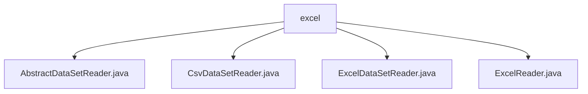

# 基础信息

|      |      |
|------|------|
| 名称 | excel |
| 编码语言 | .java |
| 代码路径 | WeFe/mpc/mpc-psi/mpc-psi-sdk/src/main/java/com/welab/wefe/mpc/psi/sdk/excel |
| 包名 | docs.mpc.mpc-psi.mpc-psi-sdk.src.main.java.com.welab.wefe.mpc.psi.sdk.excel |
| 概述说明 | AbstractDataSetReader是读取数据集的抽象基类，含列头处理和行读取逻辑。CsvDataSetReader和ExcelDataSetReader分别实现CSV和Excel文件读取，均继承AbstractDataSetReader。ExcelReader提供Excel文件解析功能，支持多种数据格式和资源管理。 |

# 说明

## 概述  
该模块核心职责是提供统一的数据集读取框架，支持CSV和Excel格式文件解析。采用抽象类+具体实现模式，AbstractDataSetReader定义基础接口规范（如获取表头、逐行读取），子类CsvDataSetReader和ExcelDataSetReader分别实现对应格式解析，类似适配器模式。关键数据结构包括header（存储列头）和readDataRows（记录读取行数）。外部依赖仅涉及文件IO和Excel解析库。例如CsvReader处理CSV编码，ExcelReader解析单元格类型。

## 主要业务场景  
模块适用于批量数据导入场景，如多方安全计算前的数据预处理。典型流程为：初始化读取器→加载表头→逐行消费数据→资源释放。交互模式统一通过Consumer回调处理行数据，支持限制读取行数/时间。例如ExcelDataSetReader将每行映射为表头键值对，不足列补NULL。集成案例包括CSV UTF-8解析和Excel多工作表遍历，均遵循"打开-读取-关闭"范式确保资源安全。

### 包内部结构视图

该流程图展示了WeFe项目中PSI SDK的Excel数据处理模块结构。根节点"excel"包含四个Java文件，其中AbstractDataSetReader是抽象基类，CsvDataSetReader和ExcelDataSetReader是具体实现类，ExcelReader提供基础Excel读取功能。这些类共同构成了PSI SDK的数据读取能力。

# 文件列表

| 名称   | 类型  | 说明 |
|-------|------|-------------|
| [AbstractDataSetReader.java](AbstractDataSetReader.md) | file | 抽象类AbstractDataSetReader实现Closeable接口，提供读取数据集功能，含获取表头、读取数据行方法，支持行数和时间限制。 |
| [CsvDataSetReader.java](CsvDataSetReader.md) | file | CsvDataSetReader类继承AbstractDataSetReader，通过CsvReader解析CSV文件，支持无表头、跳过空行，提供读取表头和逐行数据功能，最后关闭解析器。 |
| [ExcelDataSetReader.java](ExcelDataSetReader.md) | file | Excel数据集读取类，继承抽象类，通过ExcelReader读取文件，提供获取表头、逐行读取数据及关闭资源功能。 |
| [ExcelReader.java](ExcelReader.md) | file | ExcelReader类用于读取Excel文件，支持多种构造方式，提供获取工作表数量、行数、列数、行数据等功能，可处理带标题行或无标题行的数据遍历，并实现Closeable接口以关闭资源。 |

