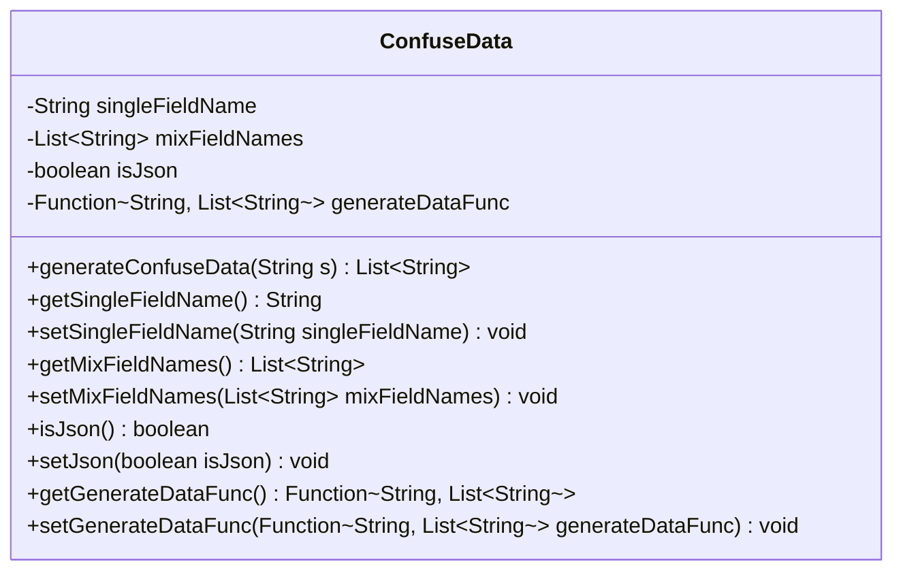

# 基础信息

|      |      |
|------|------|
| 名称 | ConfuseData |
| 编码语言 | .java |
| 代码路径 | WeFe/mpc/mpc-psi/mpc-psi-sdk/src/main/java/com/welab/wefe/mpc/psi/sdk/model/ConfuseData.java |
| 包名 | com.welab.wefe.mpc.psi.sdk.model |
| 依赖项 | ['java.util.ArrayList', 'java.util.List', 'java.util.function.Function'] |
| 概述说明 | ConfuseData类用于生成混淆数据，包含字段名、JSON标识和生成函数，提供相关getter和setter方法。 |

# 说明

ConfuseData类用于生成混淆数据，包含四个主要属性：singleFieldName存储单个字段名，mixFieldNames存储混合字段名列表，isJson标识是否为JSON格式，generateDataFunc是生成数据的函数。提供generateConfuseData方法，根据输入字符串使用预设函数生成数据列表，若无函数则返回空列表。包含各属性的getter和setter方法。

# 类列表 Class Summary

| 名称   | 类型  | 说明 |
|-------|------|-------------|
| ConfuseData | class | ConfuseData类用于生成混淆数据，包含单字段名、混合字段名列表、JSON标识和生成数据的函数。提供getter和setter方法。 |

## 类 ConfuseData

|      |      |
|------|------|
| 访问范围 | public |
| 类型 | class |
| 名称 | ConfuseData |
| 说明 | ConfuseData类用于生成混淆数据，包含单字段名、混合字段名列表、JSON标识和生成数据的函数。提供getter和setter方法。 |

### UML类图

该代码定义了一个名为ConfuseData的类，主要用于生成混淆数据。类中包含四个私有字段：singleFieldName（字符串类型）、mixFieldNames（字符串列表）、isJson（布尔类型）和generateDataFunc（函数接口）。提供了对这些字段的getter和setter方法，以及一个核心方法generateConfuseData，该方法根据传入的字符串参数，通过函数接口生成混淆数据列表。整体设计体现了数据封装和函数式编程的思想。

### 内部方法调用关系图

```mermaid
graph TD
    A["类ConfuseData"]
    B["属性: String singleFieldName"]
    C["属性: List<String> mixFieldNames"]
    D["属性: boolean isJson"]
    E["属性: Function<String, List<String>> generateDataFunc"]
    F["方法: generateConfuseData(String s)"]
    G["方法: getSingleFieldName()"]
    H["方法: setSingleFieldName(String)"]
    I["方法: getMixFieldNames()"]
    J["方法: setMixFieldNames(List<String>)"]
    K["方法: isJson()"]
    L["方法: setJson(boolean)"]
    M["方法: getGenerateDataFunc()"]
    N["方法: setGenerateDataFunc(Function)"]

    A --> B
    A --> C
    A --> D
    A --> E
    A --> F
    A --> G
    A --> H
    A --> I
    A --> J
    A --> K
    A --> L
    A --> M
    A --> N
```

该流程图展示了ConfuseData类的结构和功能。类包含4个私有属性：singleFieldName、mixFieldNames、isJson和generateDataFunc，分别用于存储单个字段名、混合字段名列表、JSON标识和数据生成函数。类提供了8个公共方法，包括生成混淆数据的主方法generateConfuseData，以及各属性的getter和setter方法。generateConfuseData方法会根据是否设置了generateDataFunc来决定是调用函数生成数据还是返回空列表。

### 字段列表 Field List

| 名称  | 类型  | 说明 |
|-------|-------|------|
| singleFieldName | String | 私有字符串类型变量singleFieldName。 |
| isJson = false | boolean | 变量isJson标记是否为JSON格式，初始值为false。 |
| mixFieldNames = new ArrayList<>() | List<String> | 声明一个私有字符串列表变量mixFieldNames，初始化为空ArrayList。 |
| generateDataFunc | Function<String, List<String>> | 定义函数变量generateDataFunc，输入String，输出List<String>。 |

### 方法列表

| 名称  | 类型  | 说明 |
|-------|-------|------|
| generateConfuseData | List<String> | 方法根据输入字符串生成混淆数据，若生成函数存在则调用，否则返回空列表。 |
| setMixFieldNames | void | 设置混合字段名列表的方法，将输入参数赋值给类的同名成员变量。 |
| setSingleFieldName | void | 设置单个字段名称的方法，将输入参数赋值给类成员变量。 |
| getMixFieldNames | List<String> | 获取混合字段名称列表的方法，返回mixFieldNames变量。 |
| getSingleFieldName | String | 获取单字段名称的方法，返回变量singleFieldName的值。 |
| isJson | boolean | 方法isJson返回布尔值isJson，表示是否为JSON格式。 |
| setJson | void | 这是一个Java方法，用于设置布尔类型的成员变量isJson的值。方法名为setJson，接受一个布尔参数isJson。 |
| getGenerateDataFunc | Function<String, List<String>> | 方法返回生成数据的函数，输入字符串，输出字符串列表。 |
| setGenerateDataFunc | void | 该方法用于设置生成数据的函数，接收一个返回字符串列表的函数作为参数。 |

