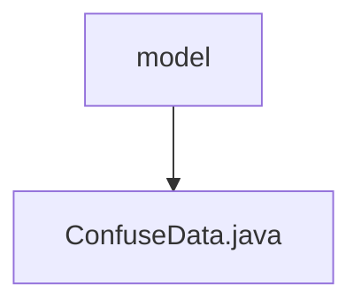

# 基础信息

|      |      |
|------|------|
| 名称 | model |
| 编码语言 | .java |
| 代码路径 | WeFe/mpc/mpc-psi/mpc-psi-sdk/src/main/java/com/welab/wefe/mpc/psi/sdk/model |
| 包名 | docs.mpc.mpc-psi.mpc-psi-sdk.src.main.java.com.welab.wefe.mpc.psi.sdk.model |
| 概述说明 | ConfuseData类用于生成混淆数据，包含字段名、JSON标识和生成函数，提供相关getter和setter方法。 |

# 说明

ConfuseData类用于生成混淆数据，包含四个主要属性：singleFieldName存储单个字段名，mixFieldNames存储混合字段名列表，isJson标识是否为JSON格式，generateDataFunc是生成数据的函数。提供generateConfuseData方法，根据输入字符串使用预设函数生成数据列表，若无函数则返回空列表。包含各属性的getter和setter方法。

### 包内部结构视图

该流程图展示了WeFe项目中PSI SDK模型目录的层级关系。根节点"model"表示模型目录，其下包含一个Java文件"ConfuseData.java"。这是一个简单的单层结构，描述了混淆数据模型在项目中的位置关系。

# 文件列表

| 名称   | 类型  | 说明 |
|-------|------|-------------|
| [ConfuseData.java](ConfuseData.md) | file | ConfuseData类用于生成混淆数据，包含字段名、JSON标识和生成函数，提供相关getter和setter方法。 |

