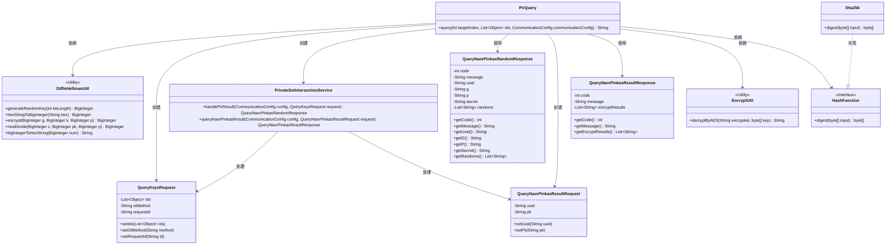
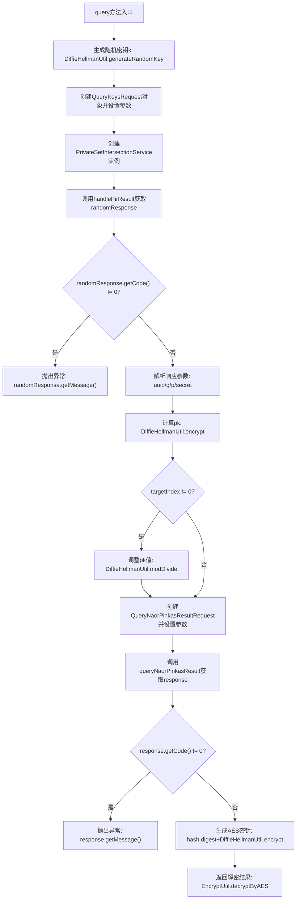

# 基础信息

|      |      |
|------|------|
| 名称 | PirQuery |
| 编码语言 | .java |
| 代码路径 | WeFe/mpc/mpc-psi/mpc-psi-sdk/src/main/java/com/welab/wefe/mpc/psi/sdk/pir/PirQuery.java |
| 包名 | com.welab.wefe.mpc.psi.sdk.pir |
| 依赖项 | ['java.math.BigInteger', 'java.util.List', 'java.util.UUID', 'com.welab.wefe.mpc.commom.Constants', 'com.welab.wefe.mpc.config.CommunicationConfig', 'com.welab.wefe.mpc.pir.protocol.ro.hf.HashFunction', 'com.welab.wefe.mpc.pir.protocol.ro.hf.Sha256', 'com.welab.wefe.mpc.pir.request.QueryKeysRequest', 'com.welab.wefe.mpc.pir.request.naor.QueryNaorPinkasRandomResponse', 'com.welab.wefe.mpc.pir.request.naor.QueryNaorPinkasResultRequest', 'com.welab.wefe.mpc.pir.request.naor.QueryNaorPinkasResultResponse', 'com.welab.wefe.mpc.psi.sdk.service.PrivateSetIntersectionService', 'com.welab.wefe.mpc.util.DiffieHellmanUtil', 'com.welab.wefe.mpc.util.EncryptUtil'] |
| 概述说明 | PirQuery类通过NaorPinkas OT方法实现私有信息检索，生成随机密钥处理查询请求，使用Diffie-Hellman加密和AES解密返回目标索引结果。 |

# 说明

PirQuery类中的query方法实现了基于Naor-Pinkas不经意传输协议的私有信息检索功能。该方法接收目标索引、ID列表和通信配置参数，首先生成随机密钥k，构建随机查询请求并获取响应。验证响应后，提取UUID、Diffie-Hellman参数g、p和secret。接着计算公钥pk，处理目标索引相关参数后构建结果查询请求。获取响应后，使用SHA256哈希和AES解密最终返回目标索引对应的解密结果。整个过程涉及Diffie-Hellman密钥交换、哈希计算和对称加密操作。

# 类列表 Class Summary

| 名称   | 类型  | 说明 |
|-------|------|-------------|
| PirQuery | class | PirQuery类实现私有信息检索功能，通过Diffie-Hellman密钥交换和AES加密，安全查询目标索引数据。包含随机请求生成、密钥计算、结果解密等步骤。 |

## 类 PirQuery

|      |      |
|------|------|
| 访问范围 | public |
| 类型 | class |
| 名称 | PirQuery |
| 说明 | PirQuery类实现私有信息检索功能，通过Diffie-Hellman密钥交换和AES加密，安全查询目标索引数据。包含随机请求生成、密钥计算、结果解密等步骤。 |

### UML类图

这段代码展示了一个私有信息检索(PIR)查询的实现流程，主要涉及Diffie-Hellman密钥交换、Naor-Pinkas混淆传输协议和AES加密解密过程。核心类PirQuery通过协调多个工具类和服务类完成安全查询，包括密钥生成、加密计算、请求处理和结果解密等步骤。类图清晰地展示了各组件间的依赖关系，特别是加密工具类和服务类之间的交互，以及接口HashFunction与其实现类Sha256的继承关系。整个设计体现了模块化的安全计算流程。

### 内部方法调用关系图

该流程图展示了PIR查询的完整流程：首先生成随机密钥并创建初始请求，通过服务获取响应后验证状态码；成功则解析参数并计算加密值，根据目标索引调整参数后发起最终查询请求；最后生成AES密钥解密指定索引的结果。整个过程包含两次服务调用和多次加密操作，严格处理了错误情况和条件分支。

### 字段列表 Field List

| 名称  | 类型  | 说明 |
|-------|-------|------|

### 方法列表

| 名称  | 类型  | 说明 |
|-------|-------|------|
| query | String | 该方法通过Naor-Pinkas不经意传输协议查询目标索引数据，生成随机密钥处理请求，验证响应后解密返回结果。 |

