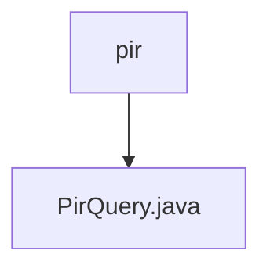

# 基础信息

|      |      |
|------|------|
| 名称 | pir |
| 编码语言 | .java |
| 代码路径 | WeFe/mpc/mpc-psi/mpc-psi-sdk/src/main/java/com/welab/wefe/mpc/psi/sdk/pir |
| 包名 | docs.mpc.mpc-psi.mpc-psi-sdk.src.main.java.com.welab.wefe.mpc.psi.sdk.pir |
| 概述说明 | PirQuery类通过NaorPinkas OT方法实现私有信息检索，生成随机密钥处理查询请求，使用Diffie-Hellman加密和AES解密返回目标索引结果。 |

# 说明

PirQuery类中的query方法实现了基于Naor-Pinkas不经意传输协议的私有信息检索功能。该方法接收目标索引、ID列表和通信配置参数，首先生成随机密钥k，构建随机查询请求并获取响应。验证响应后，提取UUID、Diffie-Hellman参数g、p和secret。接着计算公钥pk，处理目标索引相关参数后构建结果查询请求。获取响应后，使用SHA256哈希和AES解密最终返回目标索引对应的解密结果。整个过程涉及Diffie-Hellman密钥交换、哈希计算和对称加密操作。

### 包内部结构视图

该流程图展示了mpc-psi-sdk项目中PIR（私有信息检索）模块的简单结构。根节点"pir"表示路径中的最终目录，其下包含一个Java文件"PirQuery.java"，这可能是实现PIR查询功能的核心类。这种简洁的结构表明该模块功能聚焦，可能用于处理隐私保护的数据查询操作。

# 文件列表

| 名称   | 类型  | 说明 |
|-------|------|-------------|
| [PirQuery.java](PirQuery.md) | file | PirQuery类通过NaorPinkas OT方法实现私有信息检索，生成随机密钥处理查询请求，使用Diffie-Hellman加密和AES解密返回目标索引结果。 |

