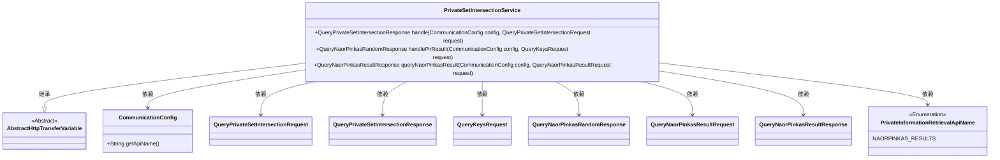
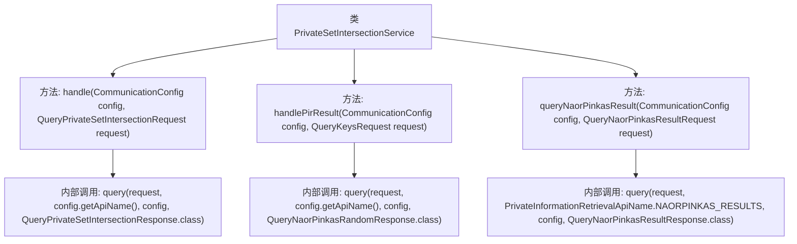

# 基础信息

|      |      |
|------|------|
| 名称 | PrivateSetIntersectionService |
| 编码语言 | .java |
| 代码路径 | WeFe/mpc/mpc-psi/mpc-psi-sdk/src/main/java/com/welab/wefe/mpc/psi/sdk/service/PrivateSetIntersectionService.java |
| 包名 | com.welab.wefe.mpc.psi.sdk.service |
| 依赖项 | ['com.welab.wefe.mpc.config.CommunicationConfig', 'com.welab.wefe.mpc.pir.PrivateInformationRetrievalApiName', 'com.welab.wefe.mpc.pir.request.QueryKeysRequest', 'com.welab.wefe.mpc.pir.request.naor.QueryNaorPinkasRandomResponse', 'com.welab.wefe.mpc.pir.request.naor.QueryNaorPinkasResultRequest', 'com.welab.wefe.mpc.pir.request.naor.QueryNaorPinkasResultResponse', 'com.welab.wefe.mpc.psi.request.QueryPrivateSetIntersectionRequest', 'com.welab.wefe.mpc.psi.request.QueryPrivateSetIntersectionResponse', 'com.welab.wefe.mpc.trasfer.AbstractHttpTransferVariable'] |
| 概述说明 | PrivateSetIntersectionService类提供私有集合交集查询、PIR结果处理和NaorPinkas结果查询功能，基于配置和请求参数调用query方法返回响应。 |

# 说明

PrivateSetIntersectionService类继承自AbstractHttpTransferVariable，提供私有集合交集查询服务。包含三个方法：handle处理私有集合交集查询请求，返回QueryPrivateSetIntersectionResponse；handlePirResult处理PIR结果查询请求，返回QueryNaorPinkasRandomResponse；queryNaorPinkasResult查询NaorPinkas算法结果，返回QueryNaorPinkasResultResponse。所有方法均基于CommunicationConfig配置和对应请求对象实现查询功能。

# 类列表 Class Summary

| 名称   | 类型  | 说明 |
|-------|------|-------------|
| PrivateSetIntersectionService | class | PrivateSetIntersectionService类处理私有集交集查询和Naor-Pinkas随机查询，提供三种方法分别处理不同请求并返回相应结果。 |

## 类 PrivateSetIntersectionService

|      |      |
|------|------|
| 访问范围 | public |
| 类型 | class |
| 名称 | PrivateSetIntersectionService |
| 说明 | PrivateSetIntersectionService类处理私有集交集查询和Naor-Pinkas随机查询，提供三种方法分别处理不同请求并返回相应结果。 |

### UML类图

这段代码展示了一个私有集合交集服务类，继承自抽象HTTP传输变量类，提供了三种不同的查询处理方法。该类通过CommunicationConfig获取API配置，处理不同类型的请求并返回相应的响应对象，包括普通集合交集查询、PIR结果查询和Naor-Pinkas算法结果查询。设计上体现了对多种私有信息检索协议的支持，通过泛化的query方法实现请求的统一处理。

### 内部方法调用关系图

该流程图展示了PrivateSetIntersectionService类的三个主要方法及其内部调用关系。每个公共方法（handle、handlePirResult、queryNaorPinkasResult）都调用了底层的query方法，但传入的参数类型和返回类型各不相同。其中queryNaorPinkasResult方法使用了特定的API名称常量NAORPINKAS_RESULTS，而其他两个方法则通过config对象获取API名称。所有方法都遵循相似的调用模式，体现了代码的复用性和一致性。

### 字段列表 Field List

| 名称  | 类型  | 说明 |
|-------|-------|------|

### 方法列表

| 名称  | 类型  | 说明 |
|-------|-------|------|
| handlePirResult | QueryNaorPinkasRandomResponse | 处理PIR查询结果的方法，接收配置和请求参数，调用查询接口并返回随机响应。 |
| handle | QueryPrivateSetIntersectionResponse | 处理私有集合交集查询请求，返回响应。调用query方法，传入请求、API名称、配置和响应类。 |
| queryNaorPinkasResult | QueryNaorPinkasResultResponse | 该方法通过给定配置和请求参数查询NaorPinkas结果，返回查询响应。 |

