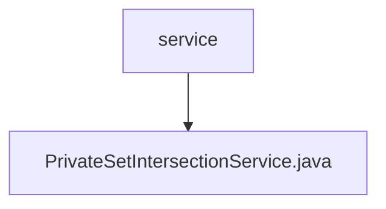

# 基础信息

|      |      |
|------|------|
| 名称 | service |
| 编码语言 | .java |
| 代码路径 | WeFe/mpc/mpc-psi/mpc-psi-sdk/src/main/java/com/welab/wefe/mpc/psi/sdk/service |
| 包名 | docs.mpc.mpc-psi.mpc-psi-sdk.src.main.java.com.welab.wefe.mpc.psi.sdk.service |
| 概述说明 | PrivateSetIntersectionService类提供私有集合交集查询、PIR结果处理和NaorPinkas结果查询功能，基于配置和请求参数调用query方法返回响应。 |

# 说明

PrivateSetIntersectionService类继承自AbstractHttpTransferVariable，提供私有集合交集查询服务。包含三个方法：handle处理私有集合交集查询请求，返回QueryPrivateSetIntersectionResponse；handlePirResult处理PIR结果查询请求，返回QueryNaorPinkasRandomResponse；queryNaorPinkasResult查询NaorPinkas算法结果，返回QueryNaorPinkasResultResponse。所有方法均基于CommunicationConfig配置和对应请求对象实现查询功能。

### 包内部结构视图

该流程图展示了mpc-psi-sdk项目中service目录与PrivateSetIntersectionService.java文件的层级关系。service作为父节点，包含一个具体的服务实现文件PrivateSetIntersectionService.java，体现了PSI（隐私集合求交）SDK中的核心服务接口实现结构。

# 文件列表

| 名称   | 类型  | 说明 |
|-------|------|-------------|
| [PrivateSetIntersectionService.java](PrivateSetIntersectionService.md) | file | PrivateSetIntersectionService类提供私有集合交集查询、PIR结果处理和NaorPinkas结果查询功能，基于配置和请求参数调用query方法返回响应。 |

