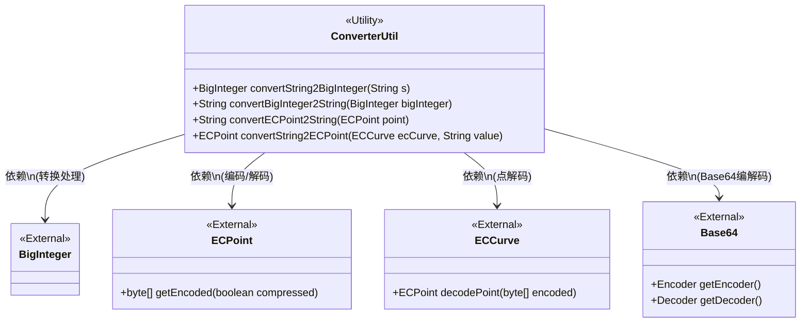
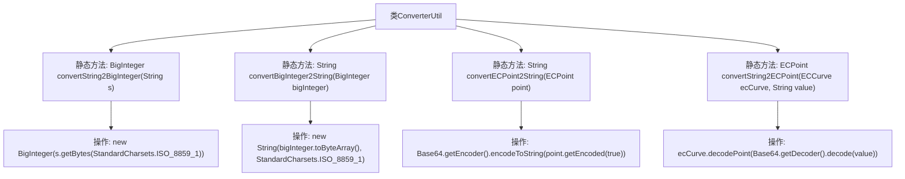

# 基础信息

|      |      |
|------|------|
| 名称 | ConverterUtil |
| 编码语言 | .java |
| 代码路径 | WeFe/mpc/mpc-psi/mpc-psi-sdk/src/main/java/com/welab/wefe/mpc/psi/sdk/util/ConverterUtil.java |
| 包名 | com.welab.wefe.mpc.psi.sdk.util |
| 依赖项 | ['java.math.BigInteger', 'java.nio.charset.StandardCharsets', 'java.util.Base64', 'org.bouncycastle.math.ec.ECCurve', 'org.bouncycastle.math.ec.ECPoint'] |
| 概述说明 | ConverterUtil类提供字符串与BigInteger、ECPoint间的转换方法，使用ISO_8859_1编码和Base64编解码。 |

# 说明

ConverterUtil类提供了四种静态方法用于数据类型转换。包含字符串与BigInteger互转方法：convertString2BigInteger将字符串按ISO-8859-1编码转为BigInteger，convertBigInteger2String执行反向操作。另提供椭圆曲线点与字符串互转方法：convertECPoint2String将ECPoint对象编码为Base64字符串，convertString2ECPoint则通过Base64解码还原ECPoint对象，需传入ECCurve参数。注释显示曾考虑使用ISO-8859-1编码替代Base64的方案。

# 类列表 Class Summary

| 名称   | 类型  | 说明 |
|-------|------|-------------|
| ConverterUtil | class | ConverterUtil类提供字符串与BigInteger、ECPoint的相互转换方法，使用ISO_8859_1编码和Base64编解码。 |

## 类 ConverterUtil

|      |      |
|------|------|
| 访问范围 | public |
| 类型 | class |
| 名称 | ConverterUtil |
| 说明 | ConverterUtil类提供字符串与BigInteger、ECPoint的相互转换方法，使用ISO_8859_1编码和Base64编解码。 |

### UML类图

该图展示了ConverterUtil工具类与外部类的关系，包含四种静态方法实现字符串与BigInteger/ECPoint的相互转换。关键依赖包括BigInteger的字节处理、ECPoint的压缩编码、ECCurve的解码功能以及Base64的编解码支持。所有方法均采用ISO_8859_1字符集和Base64标准处理数据转换。

### 内部方法调用关系图

这段代码流程图展示了ConverterUtil工具类的四个核心静态方法之间的调用关系。该类专注于不同类型数据之间的转换，包括字符串与BigInteger互转、ECPoint与Base64字符串互转。每个方法都通过特定的编码处理（ISO_8859_1字符集或Base64）实现数据格式转换，其中ECPoint相关方法还涉及椭圆曲线密码学的点编解码操作。流程图清晰呈现了各方法内部的关键操作步骤及其数据流向。

### 字段列表 Field List

| 名称  | 类型  | 说明 |
|-------|-------|------|

### 方法列表

| 名称  | 类型  | 说明 |
|-------|-------|------|
| convertString2BigInteger | BigInteger | 将字符串按ISO-8859-1编码转为字节数组后创建BigInteger对象。 |
| convertBigInteger2String | String | 将BigInteger转换为ISO-8859-1编码的字符串，通过字节数组实现。 |
| convertECPoint2String | String | 将椭圆曲线点转换为Base64编码字符串，压缩格式输出。 |
| convertString2ECPoint | ECPoint | 该方法将字符串转换为椭圆曲线点，使用Base64解码后通过ECCurve解码生成ECPoint对象。 |

