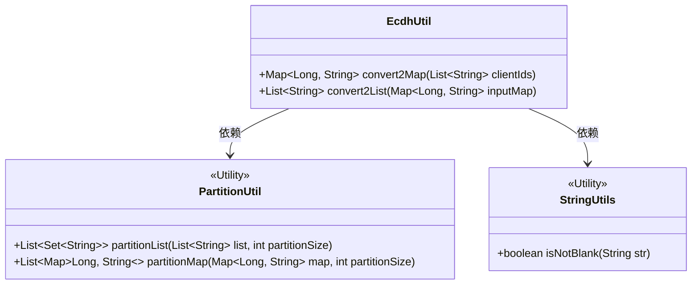
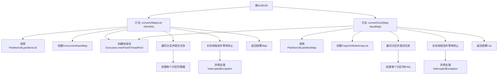

# 基础信息

|      |      |
|------|------|
| 名称 | EcdhUtil |
| 编码语言 | .java |
| 代码路径 | WeFe/mpc/mpc-psi/mpc-psi-sdk/src/main/java/com/welab/wefe/mpc/psi/sdk/util/EcdhUtil.java |
| 包名 | com.welab.wefe.mpc.psi.sdk.util |
| 依赖项 | ['java.util.List', 'java.util.Map', 'java.util.Set', 'java.util.concurrent.ConcurrentHashMap', 'java.util.concurrent.CopyOnWriteArrayList', 'java.util.concurrent.ExecutorService', 'java.util.concurrent.Executors', 'java.util.concurrent.TimeUnit', 'org.apache.commons.lang3.StringUtils'] |
| 概述说明 | EcdhUtil类提供两个多线程方法：convert2Map将含#分隔的字符串列表转为键值对映射，convert2List将键值对映射转为#拼接的字符串列表。均使用分区和线程池提升处理效率。 |

# 说明

EcdhUtil类提供了两个静态方法用于数据转换。convert2Map方法将包含特定格式字符串的列表转换为键值对映射，使用多线程处理分区数据。convert2List方法将键值对映射转换为特定格式字符串列表，同样采用多线程分区处理。两个方法都使用固定线程池，确保任务完成后关闭线程池，并设置10分钟超时等待。转换过程中会检查字符串有效性，处理包含分隔符的数据。

# 类列表 Class Summary

| 名称   | 类型  | 说明 |
|-------|------|-------------|
| EcdhUtil | class | EcdhUtil类提供两个方法：convert2Map将含#分隔符的字符串列表转为键值对映射，convert2List将映射转回字符串列表，均使用多线程分区处理以提高效率。 |

## 类 EcdhUtil

|      |      |
|------|------|
| 访问范围 | public |
| 类型 | class |
| 名称 | EcdhUtil |
| 说明 | EcdhUtil类提供两个方法：convert2Map将含#分隔符的字符串列表转为键值对映射，convert2List将映射转回字符串列表，均使用多线程分区处理以提高效率。 |

### UML类图

这段代码展示了一个工具类EcdhUtil，它提供了两个主要方法：convert2Map和convert2List，用于在List<String>和Map<Long, String>之间进行转换。这两个方法都使用了多线程处理来提高性能，通过PartitionUtil将输入数据分割成多个分区，然后使用线程池并行处理每个分区。代码中使用了ConcurrentHashMap和CopyOnWriteArrayList来保证线程安全，并正确处理了线程池的关闭和异常情况。整体设计体现了高效、线程安全和容错性的特点。

### 内部方法调用关系图

这段代码流程图展示了EcdhUtil类的两个核心方法：convert2Map和convert2List。这两个方法都采用了多线程分区处理模式，通过PartitionUtil将输入数据分割成多个分区，创建线程池并行处理每个分区，最终合并结果。convert2Map将包含特殊格式字符串的列表转换为Map，而convert2List则执行反向操作。两个方法都包含线程池的优雅关闭机制和异常处理，确保资源释放和任务完成。

### 字段列表 Field List

| 名称  | 类型  | 说明 |
|-------|-------|------|

### 方法列表

| 名称  | 类型  | 说明 |
|-------|-------|------|
| convert2List | List<String> | 将Map分片后多线程转换为List，格式为key#value，使用线程池处理并等待完成。 |
| convert2Map | Map<Long, String> | 将字符串列表按4分区并行处理，提取以#分隔的键值对转为Map，键为分割后首段转Long，值为次段，使用线程池确保高效处理。 |

