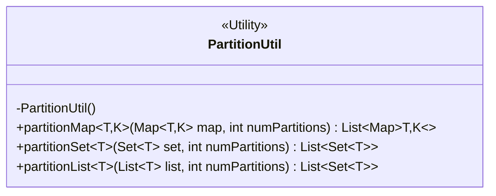
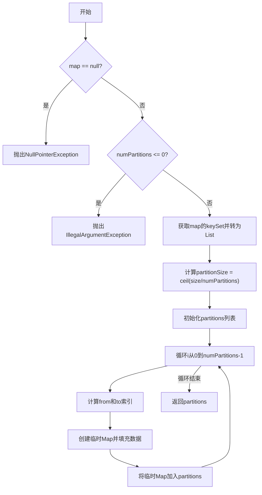
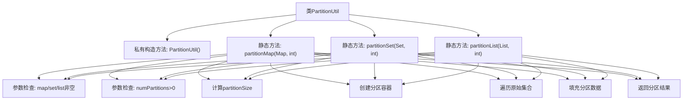

# 基础信息

|      |      |
|------|------|
| 名称 | PartitionUtil |
| 编码语言 | .java |
| 代码路径 | WeFe/mpc/mpc-psi/mpc-psi-sdk/src/main/java/com/welab/wefe/mpc/psi/sdk/util/PartitionUtil.java |
| 包名 | com.welab.wefe.mpc.psi.sdk.util |
| 依赖项 | ['java.util'] |
| 概述说明 | PartitionUtil类提供静态方法将Map、Set或List按指定分区数均匀分片，支持空检查和非法参数校验。 |

# 说明

PartitionUtil是一个工具类，提供三种分片方法：partitionMap将Map按指定分区数分割为多个子Map；partitionSet将Set均匀分配到指定数量的子Set中；partitionList将List均匀分配到指定数量的子Set中。所有方法都检查输入非空且分区数大于0，通过计算分区大小并循环分配元素实现均匀分片。

# 类列表 Class Summary

| 名称   | 类型  | 说明 |
|-------|------|-------------|
| PartitionUtil | class | PartitionUtil类提供三个静态方法，将Map、Set或List按指定分区数均匀分片，分区数需大于0，输入不能为空。 |

## 类 PartitionUtil

|      |      |
|------|------|
| 访问范围 | public |
| 类型 | class |
| 名称 | PartitionUtil |
| 说明 | PartitionUtil类提供三个静态方法，将Map、Set或List按指定分区数均匀分片，分区数需大于0，输入不能为空。 |

### UML类图

PartitionUtil是一个工具类，提供静态方法用于将Map、Set或List分片成指定数量的子集合。类中包含三个泛型方法：partitionMap将Map按key分片，partitionSet和partitionList分别将Set和List均匀分片。所有方法都会检查输入参数的有效性，并在参数不合法时抛出异常。分片算法采用均分策略，通过计算每个分片的大小并循环填充数据实现。

### 内部方法调用关系图

这段代码实现了三种集合类型(Map/Set/List)的分区功能，通过numPartitions参数将大集合均匀分割成多个子集合。每个方法都包含参数校验、分区大小计算、分区容器初始化、数据遍历填充等步骤。流程图展示了类结构和方法间的共性处理逻辑，三种分区方法采用相似的处理流程，区别仅在于输入集合类型不同。

### 字段列表 Field List

| 名称  | 类型  | 说明 |
|-------|-------|------|

### 方法列表

| 名称  | 类型  | 说明 |
|-------|-------|------|
| partitionSet | List<Set<T>> | 将集合均匀分割为指定数量的子集，检查空值和分区数有效性，返回子集列表。 |
| partitionMap | List<Map<T, K>> | 静态方法partitionMap将输入Map按指定分区数分割成多个子Map，检查非空和分区数有效性后，均匀分配键值对到各分区并返回列表。 |
| partitionList | List<Set<T>> | 将列表按指定分区数分割为多个集合，每个集合大小尽量均匀。检查输入有效性，空列表或非正分区数抛出异常。 |

