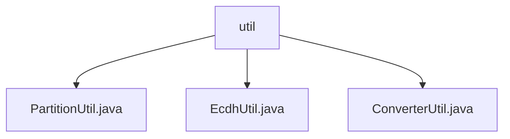

# 基础信息

|      |      |
|------|------|
| 名称 | util |
| 编码语言 | .java |
| 代码路径 | WeFe/mpc/mpc-psi/mpc-psi-sdk/src/main/java/com/welab/wefe/mpc/psi/sdk/util |
| 包名 | docs.mpc.mpc-psi.mpc-psi-sdk.src.main.java.com.welab.wefe.mpc.psi.sdk.util |
| 概述说明 | PartitionUtil提供Map/Set/List分片方法。EcdhUtil提供数据格式转换方法，支持多线程处理。ConverterUtil实现字符串与BigInteger、ECPoint的互转。 |

# 说明

## 概述  
该模块是MPC-PSI SDK的核心工具集，提供数据分片、格式转换和加密数据类型处理功能。接口规范包含三类：分片方法（如partitionMap）、数据转换方法（如convert2Map）和加密数据类型互转方法（如convertECPoint2String）。关键数据结构涉及Map/Set/List分片、键值对映射和椭圆曲线点(ECPoint)。外部依赖包括Java线程池、Base64编解码和椭圆曲线加密库。例如PartitionUtil实现均匀分片，EcdhUtil处理键值对转换，ConverterUtil支持BigInteger与ECPoint转换。

## 主要业务场景  
模块主要服务于安全多方计算场景下的数据预处理。完整流程包括数据分片→格式转换→加密处理，类似流水线模式。例如先通过partitionList分片数据，再用convert2Map转换格式，最终转为ECPoint进行加密计算。典型交互模式为多线程分区处理，如EcdhUtil使用固定线程池加速转换。API覆盖集合操作（分片）、数据序列化（Base64）和密码学类型转换（ECPoint），形成完整的数据准备链条。

### 包内部结构视图

该流程图展示了WeFe项目中mpc-psi-sdk工具类的层级结构。根节点"util"包含三个工具类文件：PartitionUtil.java用于数据分区处理，EcdhUtil.java实现ECDH加密算法，ConverterUtil.java提供数据转换功能。这些工具类共同支撑了MPC-PSI-SDK的核心功能实现。

# 文件列表

| 名称   | 类型  | 说明 |
|-------|------|-------------|
| [PartitionUtil.java](PartitionUtil.md) | file | PartitionUtil类提供静态方法将Map、Set或List按指定分区数均匀分片，支持空检查和非法参数校验。 |
| [EcdhUtil.java](EcdhUtil.md) | file | EcdhUtil类提供两个多线程方法：convert2Map将含#分隔的字符串列表转为键值对映射，convert2List将键值对映射转为#拼接的字符串列表。均使用分区和线程池提升处理效率。 |
| [ConverterUtil.java](ConverterUtil.md) | file | ConverterUtil类提供字符串与BigInteger、ECPoint间的转换方法，使用ISO_8859_1编码和Base64编解码。 |

