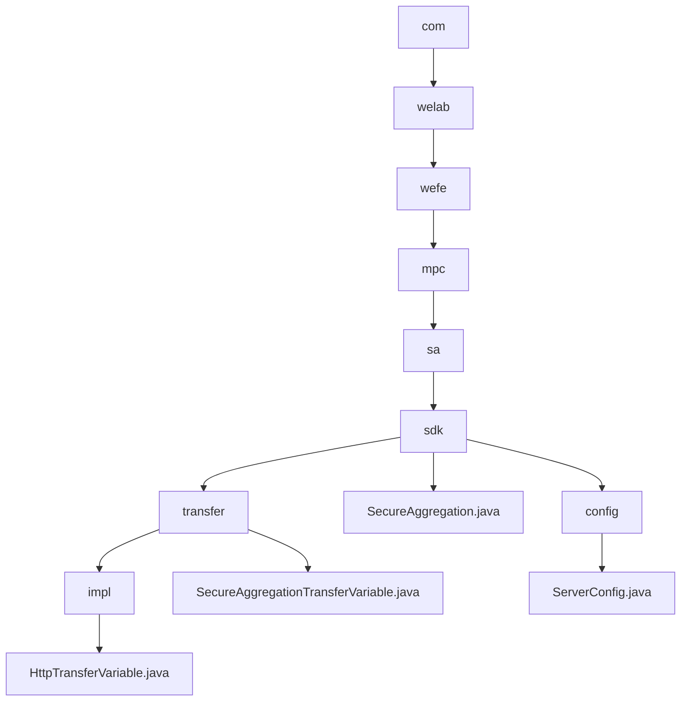

# 基础信息

|      |      |
|------|------|
| 名称 | com |
| 编码语言 | .java |
| 代码路径 | WeFe/mpc/mpc-sa/mpc-sa-sdk/src/main/java/com |
| 包名 | docs.mpc.mpc-sa.mpc-sa-sdk.src.main.java.com |
| 概述说明 | 该模块通过HTTP协议实现安全数据传输，支持Diffie-Hellman密钥交换和结果查询，适用于联邦学习等场景。核心接口包括密钥协商和结果获取，依赖HTTP服务器配置。 |

# 说明

## 概述  
该模块实现多方安全计算中的隐私保护数据传输，通过Diffie-Hellman密钥交换和HTTP聚合查询确保通信安全。统一接口包含`queryDiffieHellmanKey`（密钥协商）和`queryResult`（结果获取），采用类似RPC的请求-响应模式。核心数据结构为`QueryDiffieHellmanKeyRequest/Response`和`QuerySAResultRequest/Response`，外部依赖仅HTTP服务器配置（如`ServerConfig`）。例如`SecureAggregation`类通过UUID和密钥管理实现安全聚合，`ServerConfig`则定义服务URL、操作类型等参数。

## 主要业务场景  
典型流程分两阶段：先通过Diffie-Hellman协议协商密钥，再发起混淆结果查询。交互采用同步HTTP调用，如客户端请求公钥后服务端响应。功能完整支持联邦学习等场景，`SecureAggregation`类演示完整实现：遍历服务器配置发起密钥请求，再收集计算结果累加返回。API为查询类接口，支持ADD/SUB操作和权重配置，异常处理保障可靠性。

### 包内部结构视图

该流程图展示了从com到ServerConfig.java的完整层级路径，共包含11个节点。路径从顶层com开始，逐级深入到welab、wefe、mpc、sa等目录，最终到达具体的Java文件节点。图中清晰呈现了sdk目录下的三个分支：transfer、SecureAggregation.java和config，以及它们各自的子节点关系。

# 文件列表

| 名称   | 类型  | 说明 |
|-------|------|-------------|
| [welab](welab/_module.md) | package | 该模块通过HTTP协议实现安全数据传输，支持Diffie-Hellman密钥交换和结果查询，适用于联邦学习等场景。核心接口包括密钥协商和结果获取，依赖HTTP服务器配置。 |

