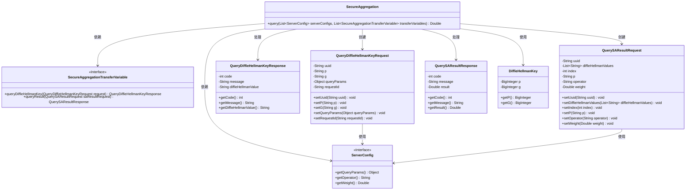
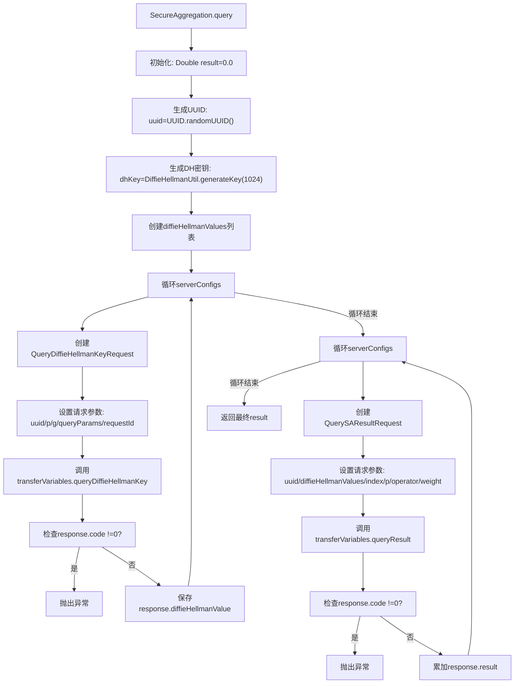

# 基础信息

|      |      |
|------|------|
| 名称 | SecureAggregation |
| 编码语言 | .java |
| 代码路径 | WeFe/mpc/mpc-sa/mpc-sa-sdk/src/main/java/com/welab/wefe/mpc/sa/sdk/SecureAggregation.java |
| 包名 | com.welab.wefe.mpc.sa.sdk |
| 依赖项 | ['com.welab.wefe.mpc.key.DiffieHellmanKey', 'com.welab.wefe.mpc.sa.request.QueryDiffieHellmanKeyRequest', 'com.welab.wefe.mpc.sa.request.QueryDiffieHellmanKeyResponse', 'com.welab.wefe.mpc.sa.request.QuerySAResultRequest', 'com.welab.wefe.mpc.sa.request.QuerySAResultResponse', 'com.welab.wefe.mpc.sa.sdk.config.ServerConfig', 'com.welab.wefe.mpc.sa.sdk.transfer.SecureAggregationTransferVariable', 'com.welab.wefe.mpc.util.DiffieHellmanUtil', 'java.util.ArrayList', 'java.util.List', 'java.util.UUID'] |
| 概述说明 | SecureAggregation类通过Diffie-Hellman密钥交换安全查询多个服务器数据并聚合结果。生成UUID和密钥后，分两阶段请求：先获取各服务器密钥值，再查询并累加结果。异常时抛出错误。 |

# 说明

SecureAggregation类实现了一个安全聚合查询功能。该方法首先生成UUID和DiffieHellman密钥，然后遍历服务器配置列表，为每个服务器创建DiffieHellman密钥请求并获取响应值。随后再次遍历服务器配置，构建安全聚合结果请求，收集各服务器的计算结果并累加返回最终结果。整个过程包含异常处理机制，确保操作安全可靠。

# 类列表 Class Summary

| 名称   | 类型  | 说明 |
|-------|------|-------------|
| SecureAggregation | class | SecureAggregation类通过Diffie-Hellman密钥交换和服务器配置列表，安全聚合多个服务器的查询结果并返回总和。 |

## 类 SecureAggregation

|      |      |
|------|------|
| 访问范围 | public |
| 类型 | class |
| 名称 | SecureAggregation |
| 说明 | SecureAggregation类通过Diffie-Hellman密钥交换和服务器配置列表，安全聚合多个服务器的查询结果并返回总和。 |

### UML类图

该类图展示了安全聚合(SecureAggregation)的核心结构，主要包含一个执行聚合查询的主类和多个辅助类/接口。SecureAggregation通过两个主要步骤实现安全计算：首先与多个服务器交换Diffie-Hellman密钥，然后基于这些密钥执行安全聚合计算。系统依赖ServerConfig接口获取服务器配置，通过SecureAggregationTransferVariable接口与远程服务交互。整个流程涉及密钥生成、请求/响应对象传递和结果汇总，实现了分布式环境下的隐私保护聚合计算。

### 内部方法调用关系图

该流程图展示了安全聚合查询的执行流程：首先生成UUID和DH密钥，然后分两阶段与多个服务器交互。第一阶段获取各服务器的DH参数，第二阶段使用这些参数聚合计算结果。每个阶段都包含请求构建、远程调用和错误检查，最终返回聚合结果。整个过程实现了分布式环境下的安全数据聚合计算。

### 字段列表 Field List

| 名称  | 类型  | 说明 |
|-------|-------|------|

### 方法列表

| 名称  | 类型  | 说明 |
|-------|-------|------|
| query | Double | 该方法通过Diffie-Hellman密钥交换协议与多个服务器安全交互，汇总各服务器返回的加密计算结果并返回总和。 |

