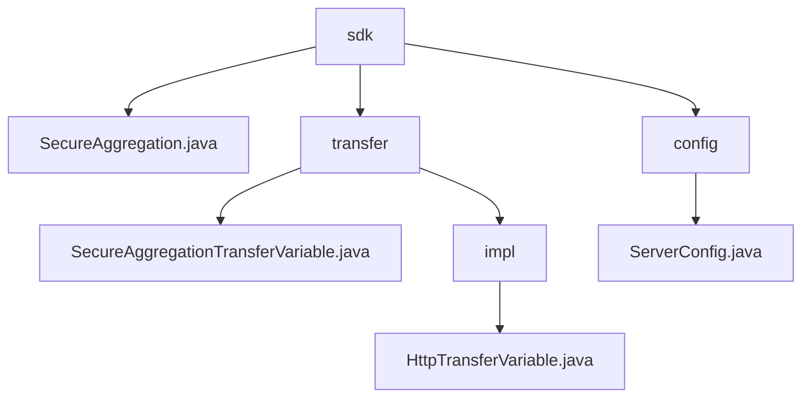

# 基础信息

|      |      |
|------|------|
| 名称 | sdk |
| 编码语言 | .java |
| 代码路径 | WeFe/mpc/mpc-sa/mpc-sa-sdk/src/main/java/com/welab/wefe/mpc/sa/sdk |
| 包名 | docs.mpc.mpc-sa.mpc-sa-sdk.src.main.java.com.welab.wefe.mpc.sa.sdk |
| 概述说明 | 该模块通过HTTP协议实现安全数据传输，支持Diffie-Hellman密钥交换和结果查询，适用于联邦学习等场景。核心接口包括密钥协商和结果获取，依赖HTTP服务器配置。 |

# 说明

## 概述  
该模块实现多方安全计算中的隐私保护数据传输，通过Diffie-Hellman密钥交换和HTTP聚合查询确保通信安全。统一接口包含`queryDiffieHellmanKey`（密钥协商）和`queryResult`（结果获取），采用类似RPC的请求-响应模式。核心数据结构为`QueryDiffieHellmanKeyRequest/Response`和`QuerySAResultRequest/Response`，外部依赖仅HTTP服务器配置（如`ServerConfig`）。例如`SecureAggregation`类通过UUID和密钥管理实现安全聚合，`ServerConfig`则定义服务URL、操作类型等参数。

## 主要业务场景  
典型流程分两阶段：先通过Diffie-Hellman协议协商密钥，再发起混淆结果查询。交互采用同步HTTP调用，如客户端请求公钥后服务端响应。功能完整支持联邦学习等场景，`SecureAggregation`类演示完整实现：遍历服务器配置发起密钥请求，再收集计算结果累加返回。API为查询类接口，支持ADD/SUB操作和权重配置，异常处理保障可靠性。

### 包内部结构视图

该流程图展示了MPC安全聚合SDK的代码结构，根节点为sdk目录，包含核心类SecureAggregation.java、传输模块transfer和配置模块config。传输模块下又分为接口定义和impl实现层，其中实现层包含Http传输实现类。配置模块仅包含服务器配置类，整体结构清晰体现了SDK的功能划分。

# 文件列表

| 名称   | 类型  | 说明 |
|-------|------|-------------|
| [transfer](transfer/_module.md) | package | HttpTransferVariable类继承AbstractHttpTransferVariable并实现SecureAggregationTransferVariable接口，用于HTTP传输变量处理。构造函数初始化服务器配置，提供查询Diffie-Hellman密钥和安全聚合结果的方法。SecureAggregationTransferVariable接口定义了这两个关键方法，用于安全聚合传输场景。 |
| [SecureAggregation.java](SecureAggregation.md) | file | SecureAggregation类通过Diffie-Hellman密钥交换安全查询多个服务器数据并聚合结果。生成UUID和密钥后，分两阶段请求：先获取各服务器密钥值，再查询并累加结果。异常时抛出错误。 |
| [config](config/_module.md) | package | ServerConfig类包含服务名称、URL、操作方法、权重、查询参数和通信配置等属性及其getter/setter方法。 |

