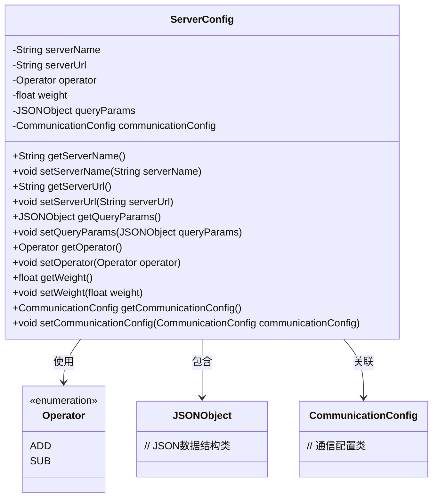

# 基础信息

|      |      |
|------|------|
| 名称 | ServerConfig |
| 编码语言 | .java |
| 代码路径 | WeFe/mpc/mpc-sa/mpc-sa-sdk/src/main/java/com/welab/wefe/mpc/sa/sdk/config/ServerConfig.java |
| 包名 | com.welab.wefe.mpc.sa.sdk.config |
| 依赖项 | ['com.alibaba.fastjson.JSONObject', 'com.welab.wefe.mpc.commom.Operator', 'com.welab.wefe.mpc.config.CommunicationConfig'] |
| 概述说明 | ServerConfig类包含服务名称、URL、操作方法、权重、查询参数和通信配置等属性及其getter/setter方法。 |

# 说明

ServerConfig类定义了服务器配置信息，包含服务名称、URL、操作方法（ADD加法或SUB减法）、权重（默认1.0）、查询参数JSON对象及通信配置对象。提供各属性的getter和setter方法，用于获取和设置这些配置参数。

# 类列表 Class Summary

| 名称   | 类型  | 说明 |
|-------|------|-------------|
| ServerConfig | class | ServerConfig类包含服务名称、URL、操作方法（ADD/SUB）、权重、查询参数及通信配置，提供getter/setter方法。 |

## 类 ServerConfig

|      |      |
|------|------|
| 访问范围 | public |
| 类型 | class |
| 名称 | ServerConfig |
| 说明 | ServerConfig类包含服务名称、URL、操作方法（ADD/SUB）、权重、查询参数及通信配置，提供getter/setter方法。 |

### UML类图

这段代码描述了一个服务器配置类`ServerConfig`，包含服务名称、URL、操作类型、权重等核心属性，并通过聚合关系关联了`CommunicationConfig`通信配置类。其中`Operator`是枚举类型，定义了ADD和SUB两种操作类型。类中所有字段均通过getter/setter方法进行封装，体现了良好的面向对象设计原则。该类主要用于存储和管理服务端的配置信息，支持动态修改参数，权重字段可用于负载均衡等场景。

### 内部方法调用关系图

```mermaid
graph TD
    A["类ServerConfig"]
    B["属性: String serverName"]
    C["属性: String serverUrl"]
    D["属性: Operator operator = Operator.ADD"]
    E["属性: float weight = 1.0f"]
    F["属性: JSONObject queryParams"]
    G["属性: CommunicationConfig communicationConfig"]
    H["方法: String getServerName()"]
    I["方法: void setServerName(String)"]
    J["方法: String getServerUrl()"]
    K["方法: void setServerUrl(String)"]
    L["方法: JSONObject getQueryParams()"]
    M["方法: void setQueryParams(JSONObject)"]
    N["方法: Operator getOperator()"]
    O["方法: void setOperator(Operator)"]
    P["方法: float getWeight()"]
    Q["方法: void setWeight(float)"]
    R["方法: CommunicationConfig getCommunicationConfig()"]
    S["方法: void setCommunicationConfig(CommunicationConfig)"]

    A --> B
    A --> C
    A --> D
    A --> E
    A --> F
    A --> G
    A --> H
    A --> I
    A --> J
    A --> K
    A --> L
    A --> M
    A --> N
    A --> O
    A --> P
    A --> Q
    A --> R
    A --> S
```

这段代码定义了一个ServerConfig类，用于配置服务器相关参数。类中包含6个私有属性：serverName(服务名称)、serverUrl(服务URL)、operator(操作方法，默认为ADD)、weight(服务权重，默认为1.0)、queryParams(查询参数)和communicationConfig(通信配置)。为每个属性都提供了对应的getter和setter方法，用于获取和设置属性值。这个类主要用于存储和管理服务器配置信息，通过方法可以灵活地修改和获取配置参数。

### 字段列表 Field List

| 名称  | 类型  | 说明 |
|-------|-------|------|
| queryParams | JSONObject | 私有JSONObject类型变量queryParams，用于存储查询参数。 |
| weight = 1.0f | float | 定义一个私有浮点变量weight，初始值为1.0。 |
| operator = Operator.ADD | Operator | 私有变量operator初始化为加法操作符。 |
| communicationConfig | CommunicationConfig | 私有通信配置对象实例。 |
| serverName | String | 私有字符串变量serverName |
| serverUrl | String | 声明一个私有字符串变量serverUrl。 |

### 方法列表

| 名称  | 类型  | 说明 |
|-------|-------|------|
| getServerUrl | String | 方法返回服务器URL字符串。 |
| setOperator | void | 设置操作员方法，将传入的operator参数赋值给当前对象的operator属性。 |
| getQueryParams | JSONObject | 获取查询参数的JSON对象方法。 |
| setServerUrl | void | 设置服务器URL的方法，将输入参数赋值给类的serverUrl成员变量。 |
| setQueryParams | void | 这是一个Java方法，用于设置类的queryParams属性，参数类型为JSONObject。 |
| getOperator | Operator | 获取当前操作符实例的方法。 |
| setServerName | void | 这是一个Java方法，用于设置类中的serverName属性值。方法接收一个字符串参数serverName，并将其赋值给当前对象的同名属性。 |
| getServerName | String | 获取服务器名称的方法，返回字符串类型变量serverName。 |
| getWeight | float | 获取当前对象的重量值并返回。 |
| setWeight | void | 设置对象重量属性的方法，参数为浮点数weight。 |
| getCommunicationConfig | CommunicationConfig | 获取通信配置对象的方法，返回类型为CommunicationConfig。 |
| setCommunicationConfig | void | 设置通信配置参数。 |

