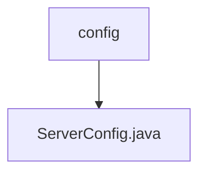

# 基础信息

|      |      |
|------|------|
| 名称 | config |
| 编码语言 | .java |
| 代码路径 | WeFe/mpc/mpc-sa/mpc-sa-sdk/src/main/java/com/welab/wefe/mpc/sa/sdk/config |
| 包名 | docs.mpc.mpc-sa.mpc-sa-sdk.src.main.java.com.welab.wefe.mpc.sa.sdk.config |
| 概述说明 | ServerConfig类包含服务名称、URL、操作方法、权重、查询参数和通信配置等属性及其getter/setter方法。 |

# 说明

ServerConfig类定义了服务器配置信息，包含服务名称、URL、操作方法（ADD加法或SUB减法）、权重（默认1.0）、查询参数JSON对象及通信配置对象。提供各属性的getter和setter方法，用于获取和设置这些配置参数。

### 包内部结构视图

该流程图展示了WeFe项目中MPC安全聚合SDK的配置模块结构。根节点"config"代表配置目录，其下包含一个具体的配置文件"ServerConfig.java"。这种简洁的层级关系体现了SDK配置模块的最小化设计，仅包含必要的服务器配置类文件。

# 文件列表

| 名称   | 类型  | 说明 |
|-------|------|-------------|
| [ServerConfig.java](ServerConfig.md) | file | ServerConfig类包含服务名称、URL、操作方法、权重、查询参数和通信配置等属性及其getter/setter方法。 |

