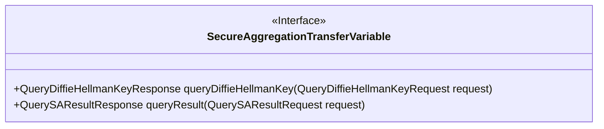
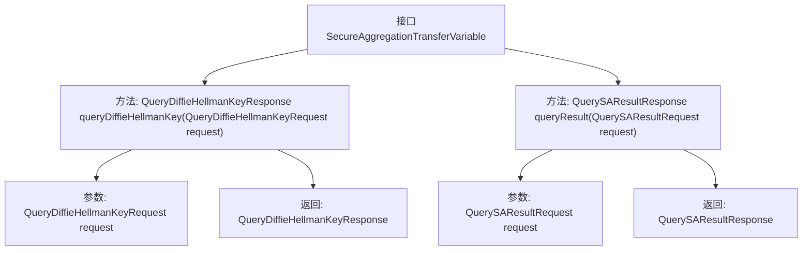

# 基础信息

|      |      |
|------|------|
| 名称 | SecureAggregationTransferVariable |
| 编码语言 | .java |
| 代码路径 | WeFe/mpc/mpc-sa/mpc-sa-sdk/src/main/java/com/welab/wefe/mpc/sa/sdk/transfer/SecureAggregationTransferVariable.java |
| 包名 | com.welab.wefe.mpc.sa.sdk.transfer |
| 依赖项 | ['com.welab.wefe.mpc.sa.request.QueryDiffieHellmanKeyRequest', 'com.welab.wefe.mpc.sa.request.QueryDiffieHellmanKeyResponse', 'com.welab.wefe.mpc.sa.request.QuerySAResultRequest', 'com.welab.wefe.mpc.sa.request.QuerySAResultResponse'] |
| 概述说明 | SecureAggregationTransferVariable接口定义了两个方法：queryDiffieHellmanKey用于获取服务器Diffie hellman值，queryResult用于获取混淆结果数据。 |

# 说明

SecureAggregationTransferVariable接口定义了两个关键方法：queryDiffieHellmanKey用于获取服务器的Diffie-Hellman密钥交换值，接收QueryDiffieHellmanKeyRequest参数并返回QueryDiffieHellmanKeyResponse；queryResult用于获取混淆结果数据，接收QuerySAResultRequest参数并返回QuerySAResultResponse。该接口主要用于安全聚合传输场景。

# 类列表 Class Summary

| 名称   | 类型  | 说明 |
|-------|------|-------------|
| SecureAggregationTransferVariable | interface | SecureAggregationTransferVariable接口定义了两个方法：queryDiffieHellmanKey用于获取服务器Diffie hellman值，queryResult用于获取混淆结果数据。 |

## 类 SecureAggregationTransferVariable

|      |      |
|------|------|
| 访问范围 | public |
| 类型 | interface |
| 名称 | SecureAggregationTransferVariable |
| 说明 | SecureAggregationTransferVariable接口定义了两个方法：queryDiffieHellmanKey用于获取服务器Diffie hellman值，queryResult用于获取混淆结果数据。 |

### UML类图

该类图展示了一个名为`SecureAggregationTransferVariable`的接口，定义了安全聚合传输过程中的两个核心方法：`queryDiffieHellmanKey`用于获取服务器Diffie-Hellman密钥，`queryResult`用于查询混淆后的聚合结果。接口采用<<Interface>>标记明确其抽象性质，两个方法均接收特定请求对象并返回对应响应对象，体现了安全多方计算中密钥交换和结果查询的标准交互模式。

### 内部方法调用关系图

这段代码定义了一个名为`SecureAggregationTransferVariable`的接口，包含两个核心方法：`queryDiffieHellmanKey`用于获取服务器Diffie-Hellman密钥，`queryResult`用于获取安全聚合的混淆结果数据。流程图展示了接口与方法的层级关系，以及每个方法的输入参数和返回类型，清晰地反映了该接口在安全聚合通信中的数据传输功能。

### 字段列表 Field List

| 名称  | 类型  | 说明 |
|-------|-------|------|

### 方法列表

| 名称  | 类型  | 说明 |
|-------|-------|------|
| queryResult | QuerySAResultResponse | 查询SAResult的响应方法，接收请求参数并返回结果。 |
| queryDiffieHellmanKey | QueryDiffieHellmanKeyResponse | 查询Diffie-Hellman密钥交换响应，输入为请求参数。 |

