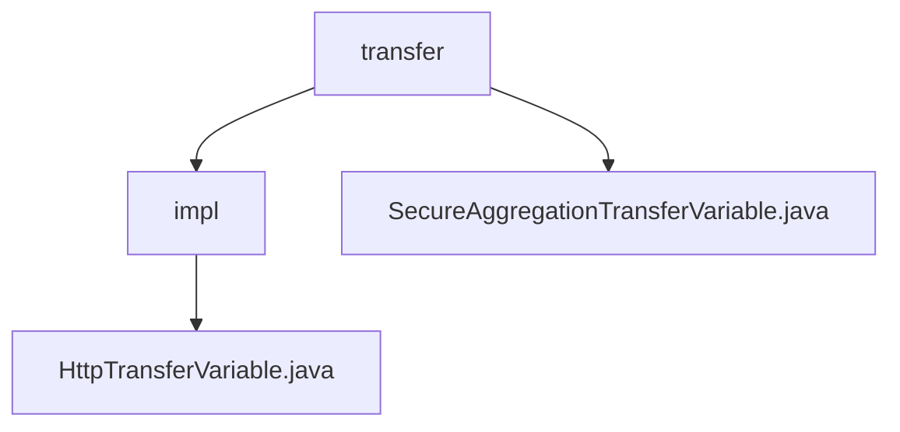

# 基础信息

|      |      |
|------|------|
| 名称 | transfer |
| 编码语言 | .java |
| 代码路径 | WeFe/mpc/mpc-sa/mpc-sa-sdk/src/main/java/com/welab/wefe/mpc/sa/sdk/transfer |
| 包名 | docs.mpc.mpc-sa.mpc-sa-sdk.src.main.java.com.welab.wefe.mpc.sa.sdk.transfer |
| 概述说明 | HttpTransferVariable类继承AbstractHttpTransferVariable并实现SecureAggregationTransferVariable接口，用于HTTP传输变量处理。构造函数初始化服务器配置，提供查询Diffie-Hellman密钥和安全聚合结果的方法。SecureAggregationTransferVariable接口定义了这两个关键方法，用于安全聚合传输场景。 |

# 说明

## 概述  
该模块核心职责是实现基于HTTP协议的安全聚合传输功能，通过Diffie-Hellman密钥交换和结果查询机制保障数据传输安全。接口规范统一提供`queryDiffieHellmanKey`和`queryResult`方法，分别对应密钥协商与聚合结果获取，采用请求-响应模式（类似RPC调用）。关键数据结构包括`QueryDiffieHellmanKeyRequest/Response`和`QuerySAResultRequest/Response`，封装了通信参数与结果。外部依赖仅为HTTP服务器配置（如ServerConfig）。例如，`HttpTransferVariable`通过私有`query`方法复用网络请求逻辑。

## 主要业务场景  
典型应用为多方安全计算中的隐私保护数据传输，业务流程包含密钥协商阶段（通过Diffie-Hellman协议）和混淆结果获取阶段。交互模式采用同步HTTP调用，例如客户端发起`queryDiffieHellmanKey`请求后，服务端返回包含公钥的响应。功能完整性体现在同时支持密钥交换与结果拉取，适用于联邦学习等场景。API类型为典型的查询类接口，集成案例可见`HttpTransferVariable`对接口的具体实现。

### 包内部结构视图

该流程图展示了MPC安全聚合SDK中传输模块的层级结构。顶层是transfer目录，包含两个子节点：impl实现目录和SecureAggregationTransferVariable接口文件。impl目录下包含具体的HttpTransferVariable实现类。整个结构清晰地反映了安全聚合传输变量的抽象与实现关系。

# 文件列表

| 名称   | 类型  | 说明 |
|-------|------|-------------|
| [SecureAggregationTransferVariable.java](SecureAggregationTransferVariable.md) | file | SecureAggregationTransferVariable接口定义了两个方法：queryDiffieHellmanKey用于获取服务器Diffie hellman值，queryResult用于获取混淆结果数据。 |
| [impl](impl/_module.md) | package | HttpTransferVariable类继承AbstractHttpTransferVariable，实现SecureAggregationTransferVariable接口，包含配置初始化和查询方法，支持DiffieHellman密钥和SA结果查询。 |

