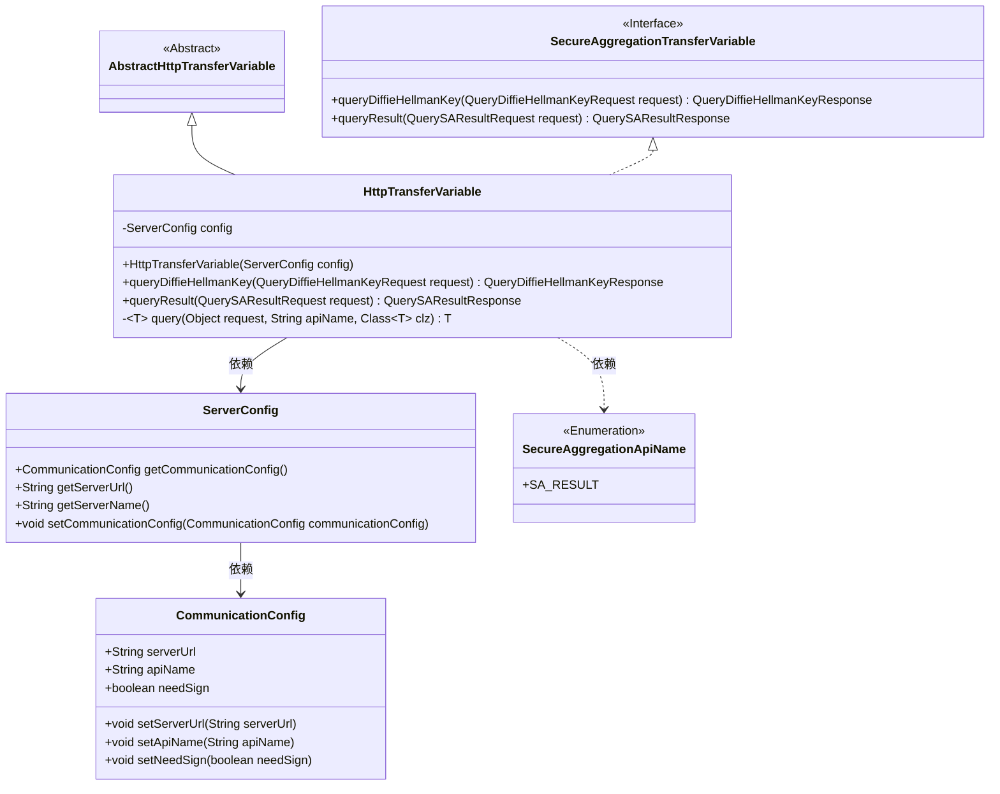
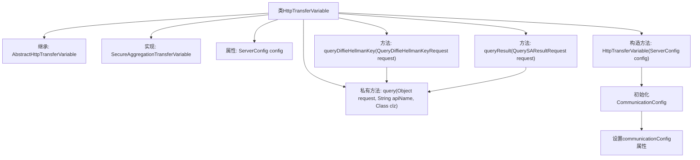

# 基础信息

|      |      |
|------|------|
| 名称 | HttpTransferVariable |
| 编码语言 | .java |
| 代码路径 | WeFe/mpc/mpc-sa/mpc-sa-sdk/src/main/java/com/welab/wefe/mpc/sa/sdk/transfer/impl/HttpTransferVariable.java |
| 包名 | com.welab.wefe.mpc.sa.sdk.transfer.impl |
| 依赖项 | ['com.welab.wefe.mpc.config.CommunicationConfig', 'com.welab.wefe.mpc.sa.SecureAggregationApiName', 'com.welab.wefe.mpc.sa.request.QueryDiffieHellmanKeyRequest', 'com.welab.wefe.mpc.sa.request.QueryDiffieHellmanKeyResponse', 'com.welab.wefe.mpc.sa.request.QuerySAResultRequest', 'com.welab.wefe.mpc.sa.request.QuerySAResultResponse', 'com.welab.wefe.mpc.sa.sdk.config.ServerConfig', 'com.welab.wefe.mpc.sa.sdk.transfer.SecureAggregationTransferVariable', 'com.welab.wefe.mpc.trasfer.AbstractHttpTransferVariable'] |
| 概述说明 | HttpTransferVariable类继承AbstractHttpTransferVariable，实现SecureAggregationTransferVariable接口，包含配置初始化和查询方法，支持DiffieHellman密钥和SA结果查询。 |

# 说明

HttpTransferVariable类继承AbstractHttpTransferVariable并实现SecureAggregationTransferVariable接口，用于处理HTTP传输变量。构造函数接收ServerConfig参数，初始化通信配置，包括服务器URL、API名称和签名需求。提供queryDiffieHellmanKey和queryResult方法，分别查询Diffie-Hellman密钥和安全聚合结果，内部通过私有query方法实现通用查询逻辑。

# 类列表 Class Summary

| 名称   | 类型  | 说明 |
|-------|------|-------------|
| HttpTransferVariable | class | HttpTransferVariable类继承AbstractHttpTransferVariable，实现SecureAggregationTransferVariable接口，用于安全聚合通信。构造函数初始化通信配置，提供查询Diffie-Hellman密钥和SA结果的方法。 |

## 类 HttpTransferVariable

|      |      |
|------|------|
| 访问范围 | public |
| 类型 | class |
| 名称 | HttpTransferVariable |
| 说明 | HttpTransferVariable类继承AbstractHttpTransferVariable，实现SecureAggregationTransferVariable接口，用于安全聚合通信。构造函数初始化通信配置，提供查询Diffie-Hellman密钥和SA结果的方法。 |

### UML类图

类图描述：HttpTransferVariable类继承自AbstractHttpTransferVariable抽象类并实现了SecureAggregationTransferVariable接口，用于处理安全聚合传输变量。它通过ServerConfig配置通信参数，包含查询Diffie-Hellman密钥和查询结果的核心方法，内部使用泛型query方法实现具体查询逻辑。CommunicationConfig类存储通信配置信息，SecureAggregationApiName是包含API名称的枚举类。

### 内部方法调用关系图

这段代码流程图展示了HttpTransferVariable类的结构，该类继承自AbstractHttpTransferVariable并实现了SecureAggregationTransferVariable接口。核心逻辑包括：1) 构造函数初始化ServerConfig时会检查并创建CommunicationConfig对象；2) 提供了两个公开API(queryDiffieHellmanKey和queryResult)都调用内部私有query方法；3) 私有query方法作为统一查询入口。流程图清晰呈现了类继承关系、属性配置流程和主要方法调用链，特别是通信配置的初始化过程和处理请求的统一查询机制。

### 字段列表 Field List

| 名称  | 类型  | 说明 |
|-------|-------|------|
| config | ServerConfig | 声明一个名为config的ServerConfig类型变量。 |

### 方法列表

| 名称  | 类型  | 说明 |
|-------|-------|------|
| queryDiffieHellmanKey | QueryDiffieHellmanKeyResponse | 该方法处理Diffie-Hellman密钥查询请求，调用通用查询方法并返回响应结果。 |
| queryResult | QuerySAResultResponse | 该方法用于查询安全聚合结果，接收请求对象并返回响应，内部调用通用查询接口。 |
| query | T | 私有泛型方法query，接收请求对象、API名称和目标类，调用重载方法并返回结果。 |

