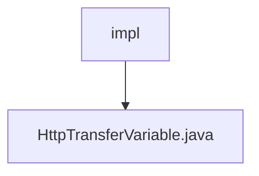

# 基础信息

|      |      |
|------|------|
| 名称 | impl |
| 编码语言 | .java |
| 代码路径 | WeFe/mpc/mpc-sa/mpc-sa-sdk/src/main/java/com/welab/wefe/mpc/sa/sdk/transfer/impl |
| 包名 | docs.mpc.mpc-sa.mpc-sa-sdk.src.main.java.com.welab.wefe.mpc.sa.sdk.transfer.impl |
| 概述说明 | HttpTransferVariable类继承AbstractHttpTransferVariable，实现SecureAggregationTransferVariable接口，包含配置初始化和查询方法，支持DiffieHellman密钥和SA结果查询。 |

# 说明

HttpTransferVariable类继承AbstractHttpTransferVariable并实现SecureAggregationTransferVariable接口，用于处理HTTP传输变量。构造函数接收ServerConfig参数，初始化通信配置，包括服务器URL、API名称和签名需求。提供queryDiffieHellmanKey和queryResult方法，分别查询Diffie-Hellman密钥和安全聚合结果，内部通过私有query方法实现通用查询逻辑。

### 包内部结构视图

该流程图展示了MPC安全聚合SDK中传输实现模块的简单结构。impl文件夹作为父节点，包含一个具体的实现文件HttpTransferVariable.java。这表示在安全多方计算的安全聚合SDK中，HTTP传输变量的具体实现被组织在transfer/impl目录下，体现了模块化的代码组织结构。

# 文件列表

| 名称   | 类型  | 说明 |
|-------|------|-------------|
| [HttpTransferVariable.java](HttpTransferVariable.md) | file | HttpTransferVariable类继承AbstractHttpTransferVariable，实现SecureAggregationTransferVariable接口，包含配置初始化和查询方法，支持DiffieHellman密钥和SA结果查询。 |

