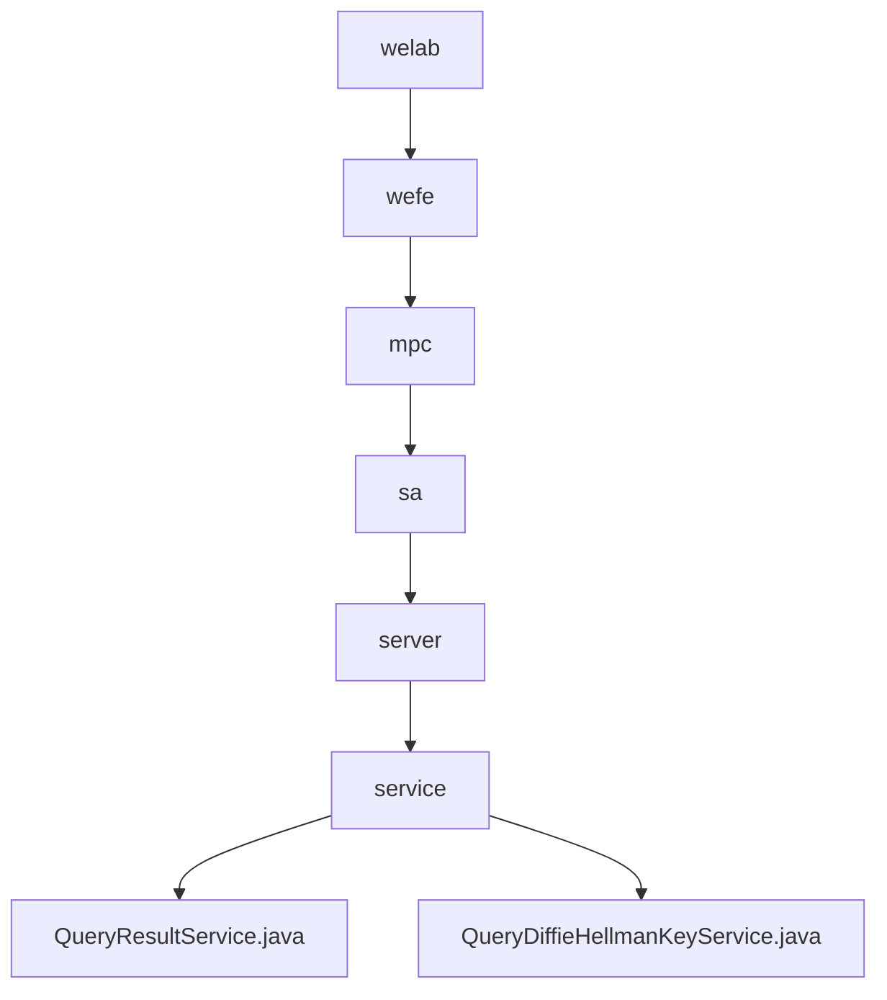

# 基础信息

|      |      |
|------|------|
| 名称 | welab |
| 编码语言 | .java |
| 代码路径 | WeFe/mpc/mpc-sa/mpc-sa-server/src/main/java/com/welab |
| 包名 | docs.mpc.mpc-sa.mpc-sa-server.src.main.java.com.welab |
| 概述说明 | QueryResultService处理查询请求，提供两种handle方法，涉及缓存获取、加密计算和结果调整，返回处理结果和UUID。QueryDiffieHellmanKeyService处理密钥交换请求，生成随机密钥，进行加密计算并缓存，返回加密结果和UUID。 |

# 说明

## 概述  
该模块核心职责是实现安全多方计算中的查询结果处理和Diffie-Hellman密钥交换功能，包含加密计算和缓存管理。接口规范包括两种查询结果处理方法（固定因子和自定义因子）以及密钥生成与加密接口。关键数据结构涉及DiffieHellman值列表、16进制参数p/g和UUID响应对象。外部依赖项主要为缓存系统（如CacheOperationFactory）。例如QueryResultService通过跳过当前索引项实现差分隐私，QueryDiffieHellmanKeyService使用1024位随机密钥确保安全性。

## 主要业务场景  
模块支持两种典型流程：查询结果处理类似事件总线模式，通过调整符号和随机种子累加结果；密钥交换流程则类似TLS握手，生成随机密钥并基于p/g参数进行加密。完整功能包括缓存读写、参数校验、加密运算和响应构建。例如处理查询时自动跳过当前索引，密钥交换时强制转换16进制数据。API类型涵盖结果查询（带因子参数）和密钥生成（需p/g参数）两类集成场景。

### 包内部结构视图

该流程图展示了从welab到最终服务文件的完整层级关系，共包含7个节点。路径从welab开始，逐级深入到wefe、mpc、sa、server和service目录，最后分解出两个服务类文件：QueryResultService和QueryDiffieHellmanKeyService。整个结构清晰地呈现了Java包路径的组织方式。

# 文件列表

| 名称   | 类型  | 说明 |
|-------|------|-------------|
| [wefe](wefe/_module.md) | package | QueryResultService处理查询请求，提供两种handle方法，涉及缓存获取、加密计算和结果调整，返回处理结果和UUID。QueryDiffieHellmanKeyService处理密钥交换请求，生成随机密钥，进行加密计算并缓存，返回加密结果和UUID。 |

