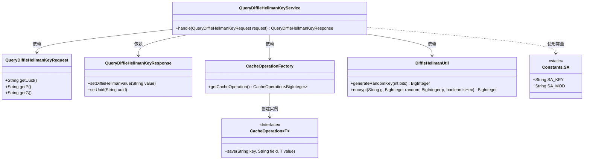
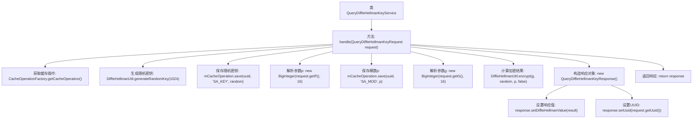

# 基础信息

|      |      |
|------|------|
| 名称 | QueryDiffieHellmanKeyService |
| 编码语言 | .java |
| 代码路径 | WeFe/mpc/mpc-sa/mpc-sa-server/src/main/java/com/welab/wefe/mpc/sa/server/service/QueryDiffieHellmanKeyService.java |
| 包名 | com.welab.wefe.mpc.sa.server.service |
| 依赖项 | ['com.welab.wefe.mpc.cache.intermediate.CacheOperation', 'com.welab.wefe.mpc.cache.intermediate.CacheOperationFactory', 'com.welab.wefe.mpc.commom.Constants', 'com.welab.wefe.mpc.sa.request.QueryDiffieHellmanKeyRequest', 'com.welab.wefe.mpc.sa.request.QueryDiffieHellmanKeyResponse', 'com.welab.wefe.mpc.util.DiffieHellmanUtil', 'java.math.BigInteger'] |
| 概述说明 | 处理Diffie-Hellman密钥请求，生成随机密钥并加密，保存到缓存后返回响应。 |

# 说明

QueryDiffieHellmanKeyService类处理Diffie-Hellman密钥交换请求。它通过CacheOperationFactory获取缓存操作实例，生成1024位随机密钥并存入缓存。从请求中提取16进制参数p和g，将p存入缓存。使用g、随机密钥和p进行加密计算，结果转为16进制字符串。最后构建响应对象，包含加密结果和请求UUID。整个过程实现了密钥生成、缓存存储和加密计算的核心功能。

# 类列表 Class Summary

| 名称   | 类型  | 说明 |
|-------|------|-------------|
| QueryDiffieHellmanKeyService | class | QueryDiffieHellmanKeyService类处理密钥请求，生成随机密钥并缓存，使用Diffie-Hellman算法加密后返回响应。 |

## 类 QueryDiffieHellmanKeyService

|      |      |
|------|------|
| 访问范围 | public |
| 类型 | class |
| 名称 | QueryDiffieHellmanKeyService |
| 说明 | QueryDiffieHellmanKeyService类处理密钥请求，生成随机密钥并缓存，使用Diffie-Hellman算法加密后返回响应。 |

### UML类图

这段代码实现了一个Diffie-Hellman密钥交换服务，主要处理密钥生成、缓存存储和加密计算。核心类QueryDiffieHellmanKeyService通过依赖CacheOperationFactory获取缓存操作接口，调用DiffieHellmanUtil进行随机数生成和加密运算，最终返回包含加密结果的响应对象。整个流程涉及请求参数解析、密钥存储、模数运算和响应封装等步骤，体现了典型的密钥交换协议实现。

### 内部方法调用关系图

这段代码实现了Diffie-Hellman密钥交换服务，主要流程包括：获取缓存操作实例、生成随机密钥、保存密钥和模数参数、执行加密计算、构造并返回响应对象。代码通过缓存操作确保密钥材料的安全存储，使用16进制字符串处理加密参数，最终返回包含加密结果和会话标识的响应对象。整个过程严格遵循密钥交换协议的安全规范。

### 字段列表 Field List

| 名称  | 类型  | 说明 |
|-------|-------|------|

### 方法列表

| 名称  | 类型  | 说明 |
|-------|-------|------|
| handle | QueryDiffieHellmanKeyResponse | 处理Diffie-Hellman密钥请求：生成随机密钥，保存到缓存，计算加密结果并返回响应。 |

